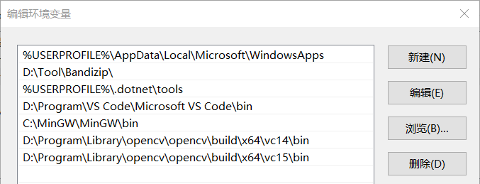
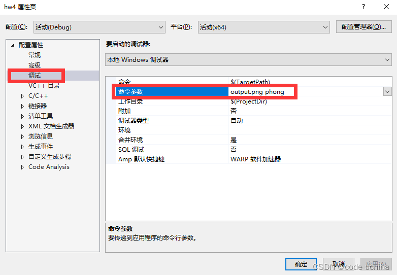

# 库文件的安装

[**Eigen库下载**](https://gitlab.com/libeigen/eigen/-/archive/3.4.0/eigen-3.4.0.zip)：解压路径如下

> D:\Program\Library\eigen-3.4.0

**opencv库下载**：解压路径如下

> D:\Program\Library\opencv

# 将opencv添加到环境变量中

在**Path**中添加：

> D:\Program\Library\opencv\opencv\build\x64\vc14\bin
>
> D:\Program\Library\opencv\opencv\build\x64\vc15\bin



# 修改VS的项目设置

1. 【VC++目录】

   1. 【包含目录】：添加如下项

      > D:\Program\Library\eigen-3.4.0\Eigen
      >
      > D:\Program\Library\opencv\opencv\build\include

   2. 【库目录】：添加如下项

      > D:\Program\Library\opencv\opencv\build\x64\vc14\lib

2. 【C/C++】【常规】【附加包含目录】：添加如下项

   > D:\Program\Library\opencv\opencv\build\include

3. 【链接器】【输入】【附加依赖项】：添加如下项

   1. 带d的为Debug环境，不带d的为Release环境

   > opencv_world460d.lib

4. 将所有代码中，有关Eigen库的引用，修改为：

   ```c++
   #include <Eigen>
   ```

5. 【配置属性】【调试】【命令参数】中，可以输入传递给main函数的参数

   1. 如作业3中，需要输入的是`./Rasterizer output.png phong`
   2. 那么我们就可以在此输入`output.png phong`

   