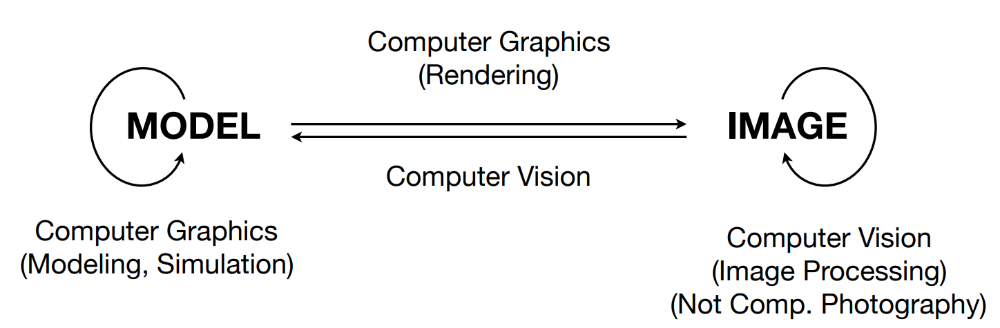

[TOC]

# VirtualBox挂载

```shell
sudo mount -t vboxsf Share share_dir
```

# 第1课	计算机图形学概览

1. **光栅化**：将三维空间的几何形体显示在屏幕上

2. **实时**：每秒钟能够生成30幅画面/30帧/30fps；否则称为离线

3. **计算机图形学** 与 **计算机视觉** 的区别：

   

   