[TOC]

# 十、几何1：介绍

## 10.1	隐式表示 Implicit

1. **f(x,y,z) = 0**：表示一定的关系，并不直接给出实际点

2. 优点：便于判断某个**点与面**的关系

   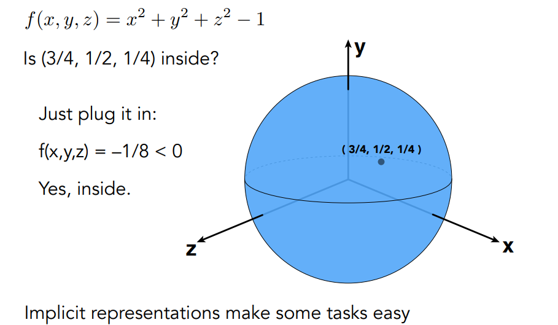

3. 缺点：无法直接判断出**形状**/找到所有在这个面上的点

   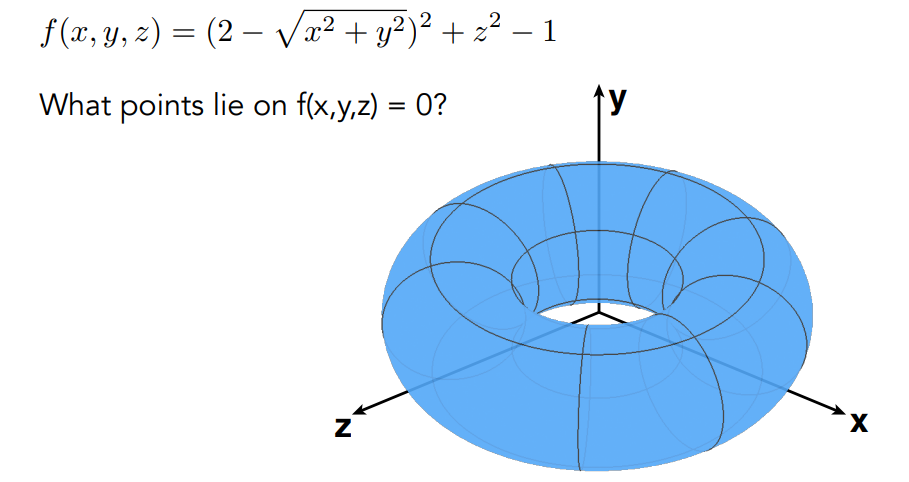

## 10.2	显示表示 Explicit

1. 显示表示：直接用三角形表示 / 通过参数映射给出

   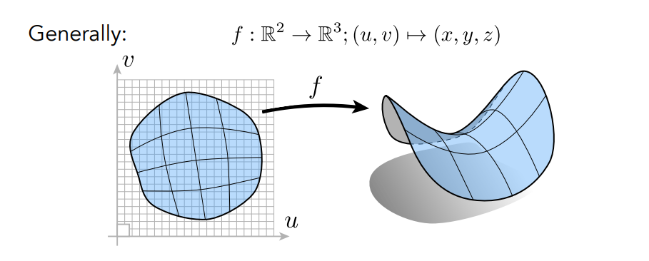

2. 优点：便于**取样**，判断形状

   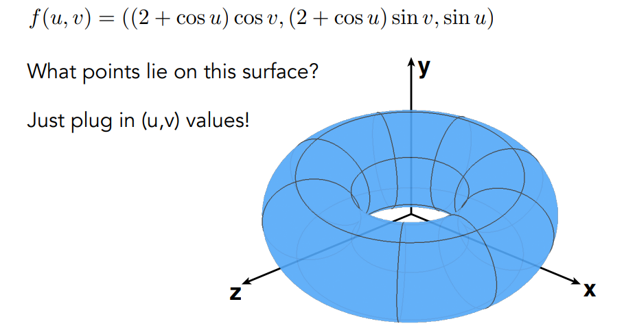

3. 缺点：难以判断某个**点和面**的关系

   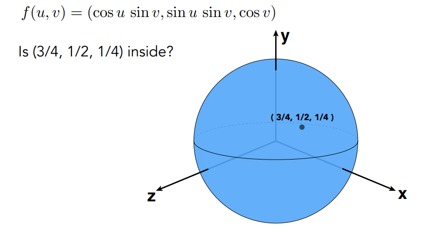

## 10.3	CG中的隐式几何表示

### 10.3.1	数学公式表述

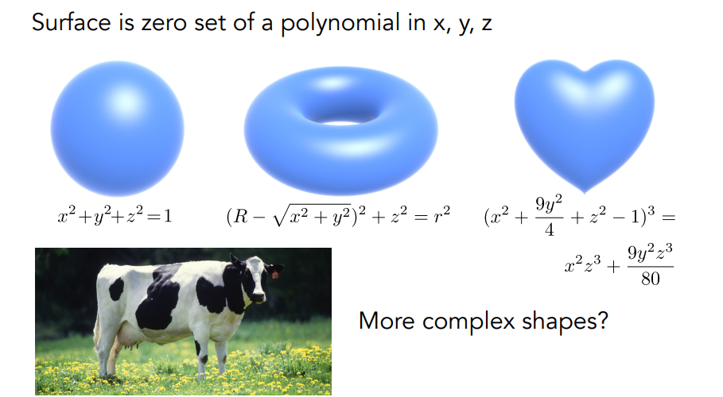

### 10.3.2	构造几何CSG：Constructive Solid Geometry

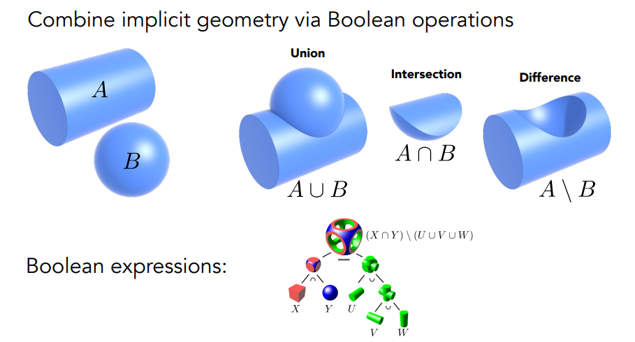

### 10.3.3	距离函数 Distance Functions

1. 描述空间中的任何一个点，到该表面的最近距离
   1. 如果在物体外，则为正数
   2. 如果在物体内，则为负数
   3. SDF：有向距离函数
2. 优点：便于做两个物体的**边界融合**

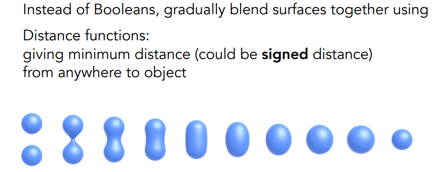

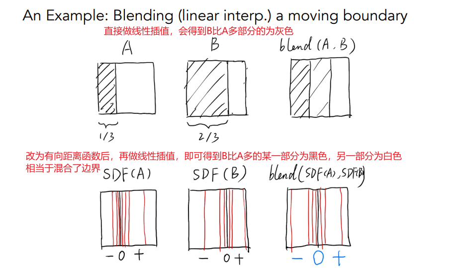

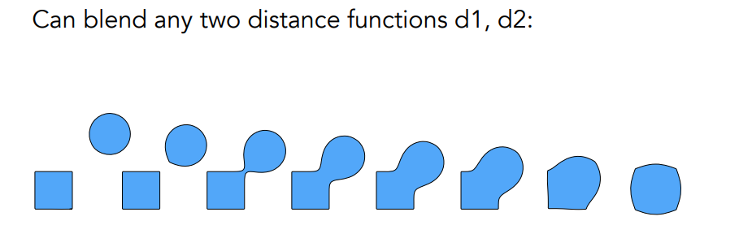

### 10.3.4	水平集函数

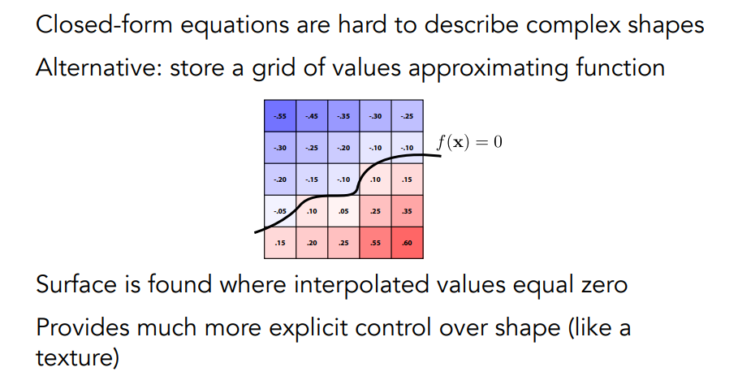

### 10.3.5	分型 Fractal

**分型 <=> 自相似**

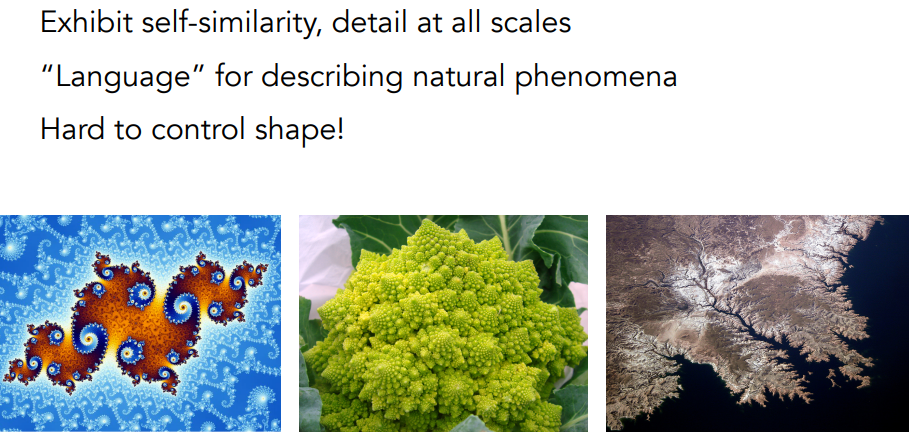

## 10.4	CG中的显示几何表示

### 10.4.1	点云

1. 通过特别多的点，表示一个模型
2. 通常为三维扫描的输出

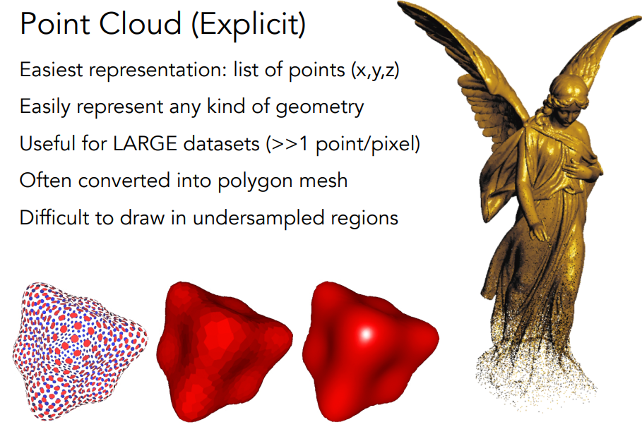

### 10.4.2	多边形面

1. 通常为三角形 & 四边形

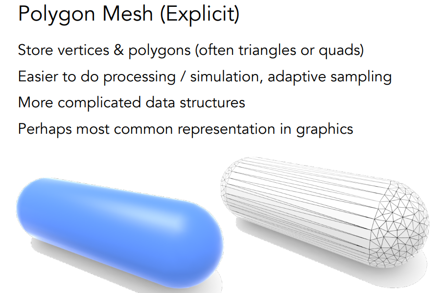

### 10.4.3	The Wavefront Object File Format

1. `v`：点的坐标
2. `vt`：纹理坐标
3. `vn`：法向
4. `f`：连接关系，同一行内为三角形的三个点，每个点的格式为`v/vt/vn`，表示该点的坐标/纹理坐标/法向

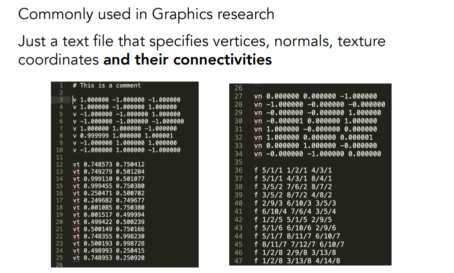