[TOC]

# 十一、几何2：曲线和曲面

## 11.1	贝塞尔曲线 Bezier Curve

1. 定义四个控制点`p0,p1,p2,p3`，要求曲线的起始切线方向为`p1-p0`，终止切线方向为`p3-p2`
2. 曲线不一定经过控制点

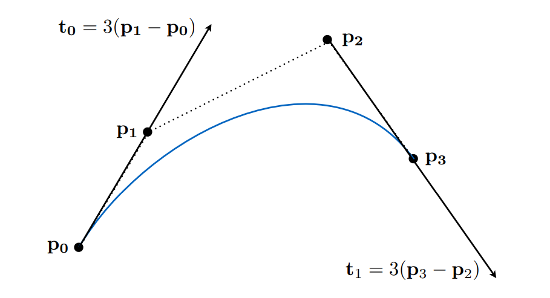

### 11.1.1	de Casteljau算法

#### 11.1.1.1	二次贝塞尔曲线：三个控制点

1. `b0`为起点，`b2`为终点，`b1`控制曲线弯曲
2. 实际上是：对于每一个时间`t`，找到当前时刻对应的点的坐标
   1. 第一步：
      1. 在$b_0b_1$上，设$b_0$为时间`0`，$b_1$为时间`1`，线性插值找到$b_0^1$
      2. 在$b_1b_2$上，设$b_1$为时间`0`，$b_2$为时间`1`，线性插值找到$b_1^1$
   2. 第二步：
      1. 在$b_0^1b_1^1$上，设$b_0^1$为时间`0`，$b_1^1$为时间`1`，线性插值找到$b_0^2$
   3. 则$b_0^2$记为贝塞尔曲线，在时间`t`所在的位置

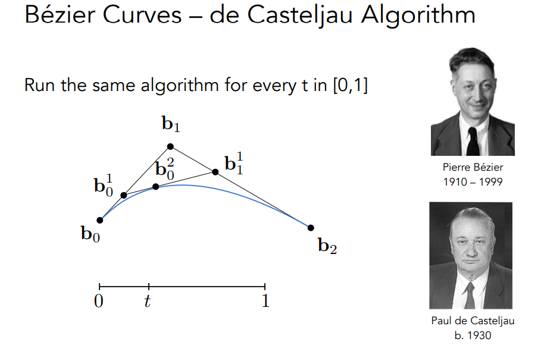

#### 11.1.1.2	四个控制点

1. `b0`为起点，`b3`为终点，`b1,b2`控制曲线弯曲
2. 实际上是：对于每一个时间`t`，找到当前时刻对应的点的坐标
   1. 第一步：
      1. 在$b_0b_1$上，设$b_0$为时间`0`，$b_1$为时间`1`，线性插值找到$b_0^1$
      2. 在$b_1b_2$上，设$b_1$为时间`0`，$b_2$为时间`1`，线性插值找到$b_1^1$
      3. 在$b_2b_3$上，设$b_2$为时间`0`，$b_3$为时间`1`，线性插值找到$b_2^1$
   2. 第二步：
      1. 在$b_0^1b_1^1$上，设$b_0^1$为时间`0`，$b_1^1$为时间`1`，线性插值找到$b_0^2$
      2. 在$b_1^1b_2^1$上，设$b_1^1$为时间`0`，$b_2^1$为时间`1`，线性插值找到$b_1^2$
   3. 第三步：
      1. 在$b_0^2b_1^2$上，设$b_0^2$为时间`0`，$b_1^2$为时间`1`，线性插值找到$b_0^3$
   4. 则$b_0^3$记为贝塞尔曲线，在时间`t`所在的位置`x(t)`

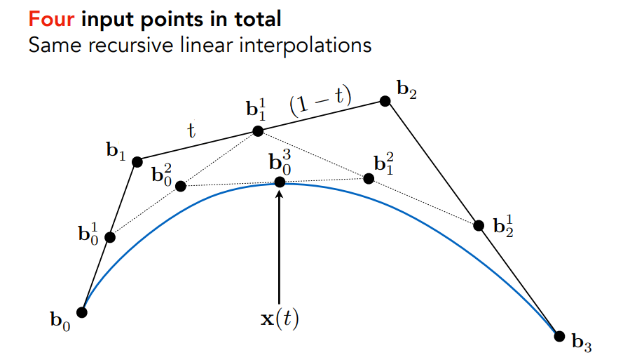

#### 11.1.1.3	贝塞尔曲线的代数形式

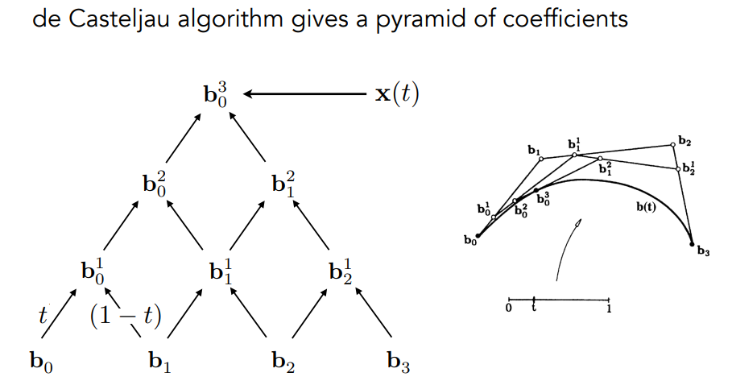

> 2阶贝塞尔曲线

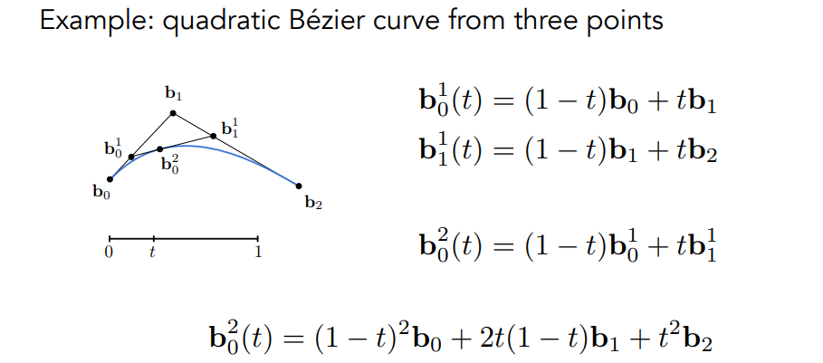

### 11.1.2	n阶贝塞尔曲线的代数表示

> 参数为 **(1-t+t)^n^** 的多项式展开

$$
b^n(t) = \sum_{j=0}^n b_j B_j^n(t)
$$

1. $b^n(t)$：n阶贝塞尔曲线的表达式
2. $b_j$：第j个控制点，可以为三维空间中的点
3. $B_j^n(t)$：Bernstein多项式，此处为$C_{n}^i\ t^i\ (1-t)^{n-i}$

### 11.1.3	贝塞尔曲线的性质

1. 必须过起点和终点：$b(0)=b_0,b(1)=b_n$

2. 对于三阶贝塞尔曲线：$b'(0)=3(b_1-b_0),b'(1)=3(b_3-b_2)$

3. 在仿射变换中：**对贝塞尔曲线的仿射变换 <=> 对控制点做仿射变换然后再计算贝塞尔曲线**

   1. 但是对投影变换不行

4. 凸包性质：**贝塞尔曲线一定在控制点形成的凸包内**

   1. 凸包：包围某些顶点的最小凸多边形

      > 可以将顶点想象为钉子，用橡皮筋包裹住所有顶点，然后松手，橡皮筋最后的形状记为这些顶点的凸包

   2. 如果控制点在同一条直线上，则贝塞尔曲线就是这条直线

### 11.1.4	分段贝塞尔曲线 Picewise Bezier Curves

1. 通常为4个控制点，控制一段贝塞尔曲线

2. PS中的钢笔工具，就应用了分段贝塞尔曲线

   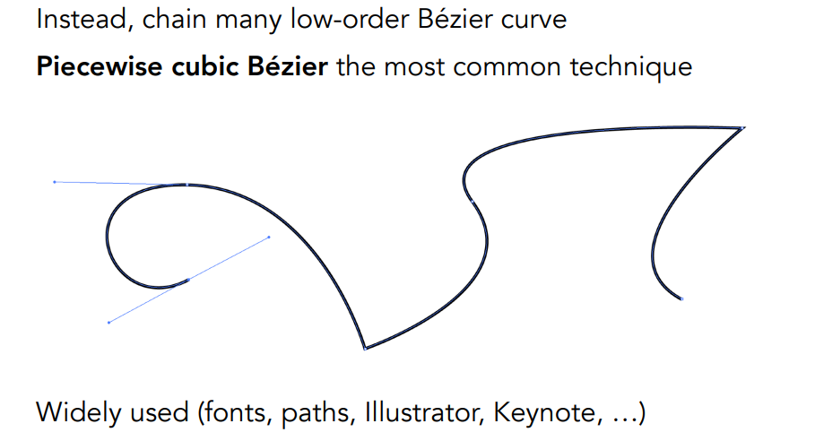

3. 保证**连续**（**C^0^连续**）：

   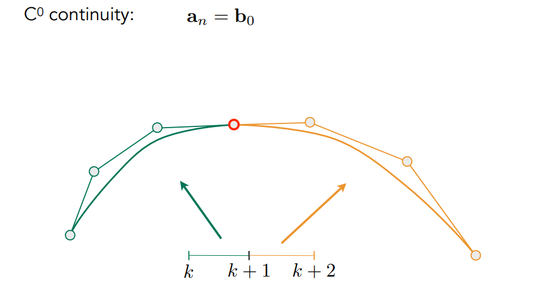

4. 保证**光滑/切线连续**（**C^1^连续**）：相邻的两端贝塞尔曲线中，上一段曲线的最后两个控制点，与下一段曲线的最初两个控制点，共线且距离相同

   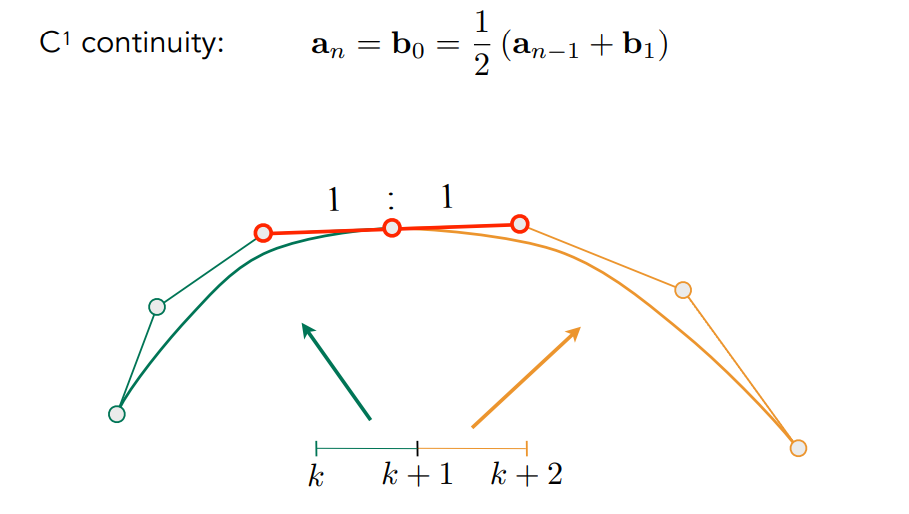

## 11.2	样条曲线 Spline

样条：一个可控的曲线

### 11.2.1	B样条 Basis-Spline

基函数样条

1. 贝塞尔曲线，既可以理解为用Bernstein多项式，对控制点加权求和；也可以理解为用控制点，对Bernstein多项式进行加权求和。则Bernstein多项式，即为基函数
2. 相当于由不同的函数，通过某一种方式结合起来，得到另一个函数
3. B样条是对贝塞尔曲线的扩展，可以保证**修改的局部性**，改变一个点，至多影响曲线的某个部分

## 11.3	贝塞尔曲面 Bezier Surfaces

### 11.3.1	4×4个控制点

1. 对于每一行的4个控制点，计算每一行的贝塞尔曲线

2. 对于每一个时间`t1`，对应的4行贝塞尔曲线上的点，认为是4个控制点，可以得到另一个贝塞尔曲线，其时间为`t2`

   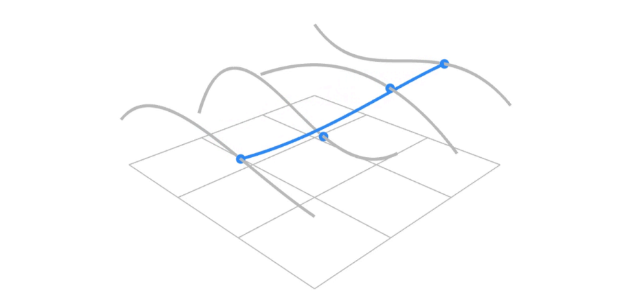

3. 在`t1,t2`的变换过程中，即可得到贝塞尔曲面

   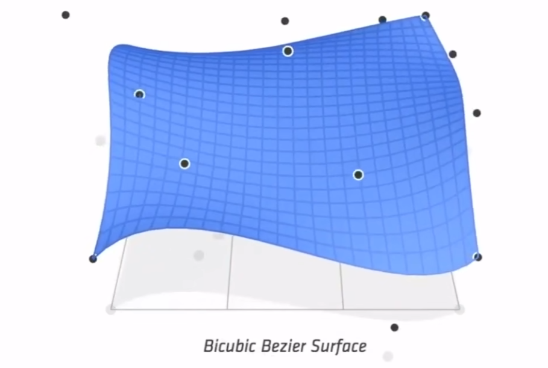

### 11.3.2	计算贝塞尔曲面

> 可以将参数`(u,v)`，映射到曲面上的对应点，因此贝塞尔曲面是显示表示

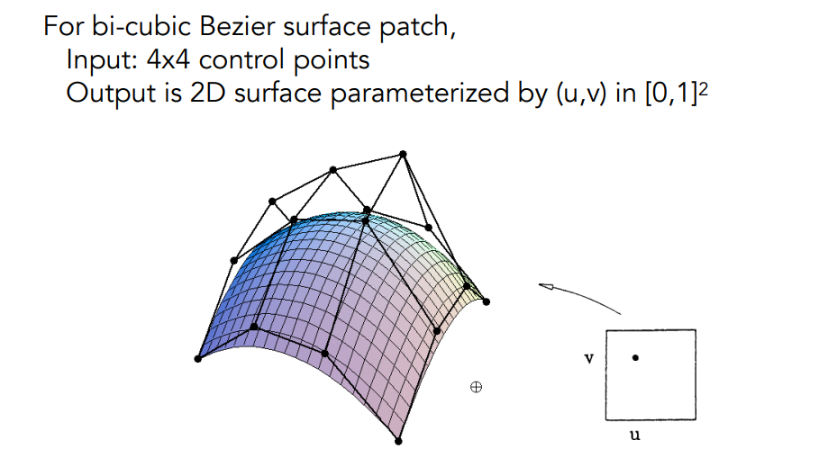

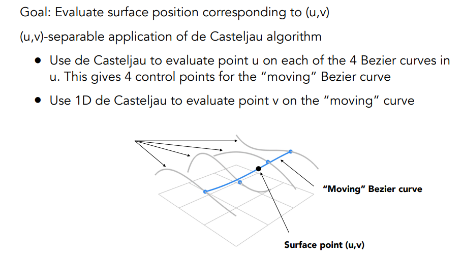

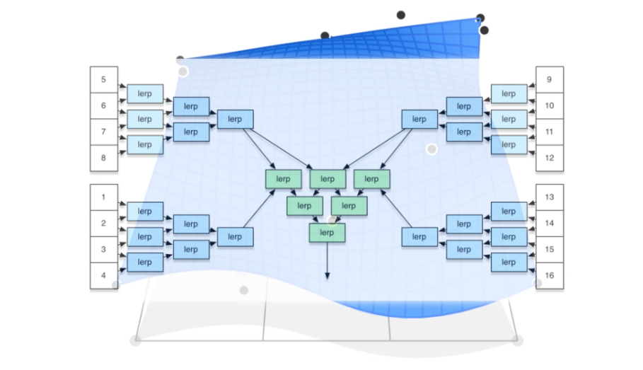