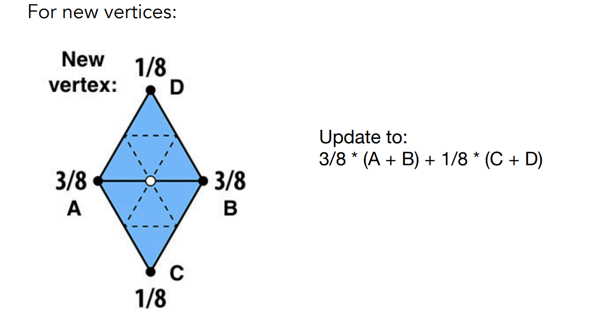
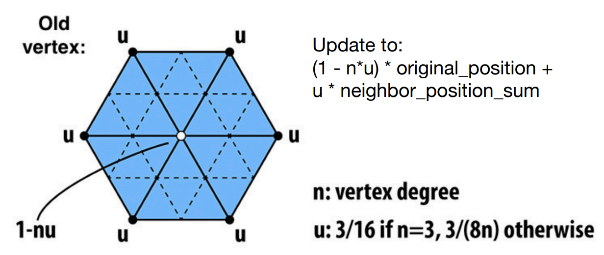
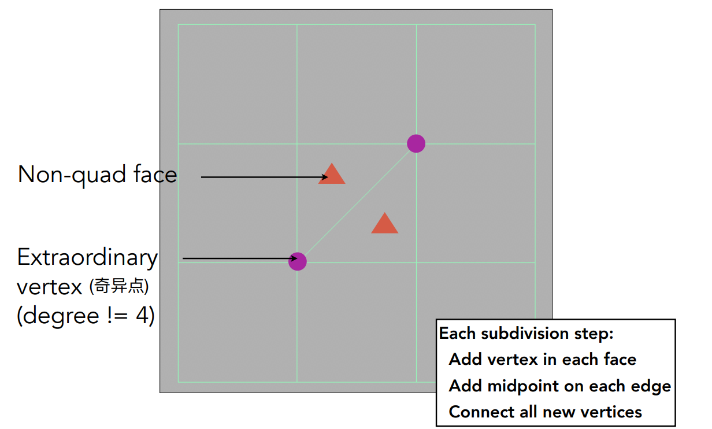
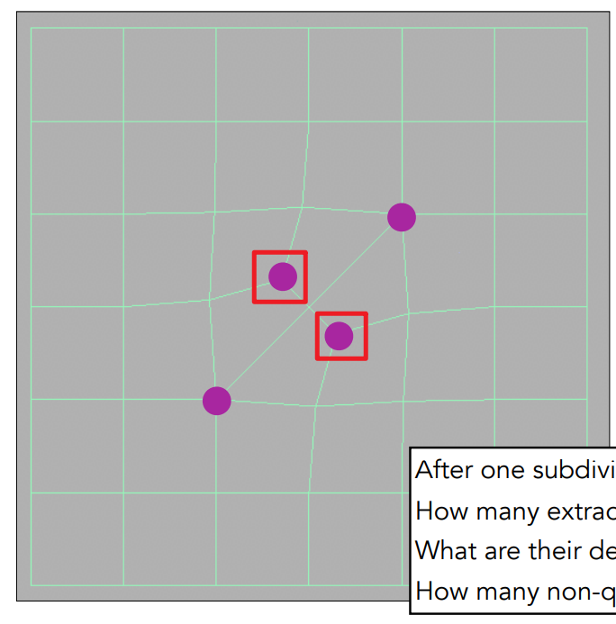
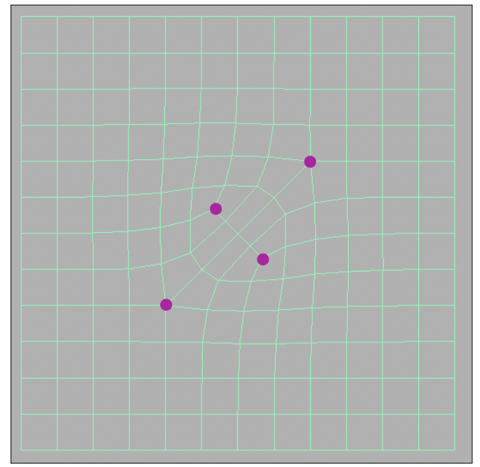
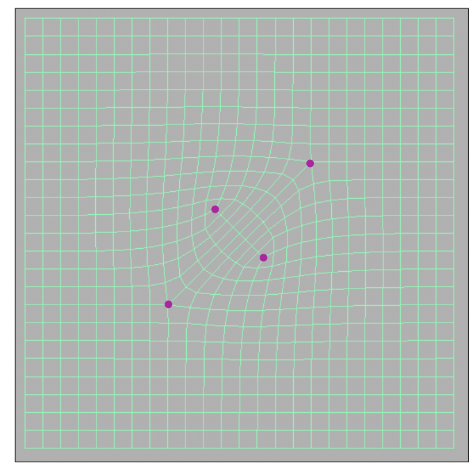
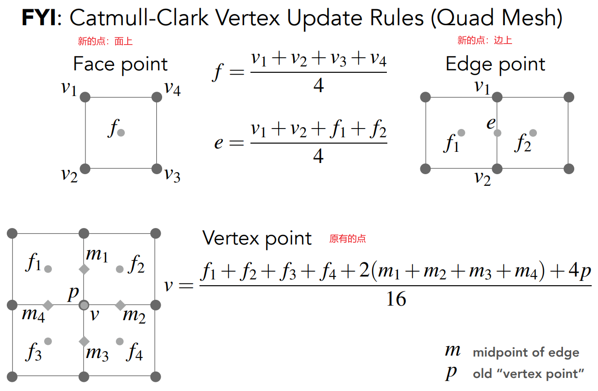
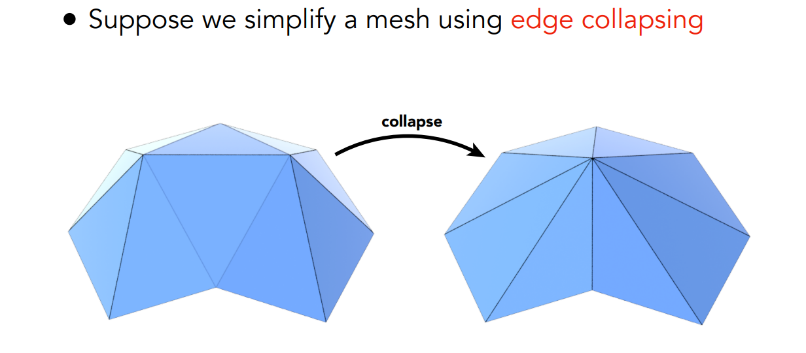
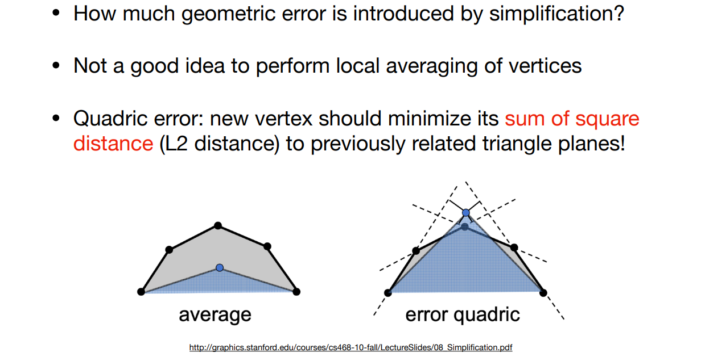
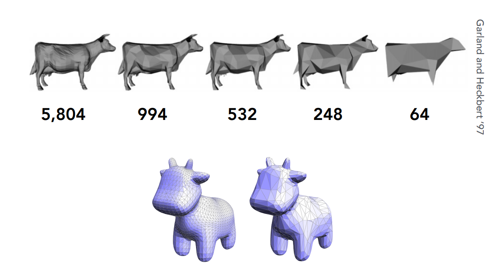

[TOC]

# 十二、几何3：网格体

## 12.1	网格体的细分 Subdivision

1. 引入更多三角形
2. 调整顶点的位置，让网格体更加接近原样

### 12.1.1	Loop细分：三角形网格体

1. 连接三角形三条边的中点，可以将一个三角形划分为四个三角形

   

2. 计算新的顶点的位置

   1. 设新增的顶点为图中的白点，白点被原来的两个三角形`ABC、ABD`共享
   2. 则可以计算新的顶点的坐标值：`3/8 * (A+B) + 1/8 * (C+D)`

   

3. 更改旧的顶点的位置

   1. 设顶点的度为`n`，与`n`相关的一个数`u`
   2. 则更改顶点的位置为：`(1-n*u) * 当前顶点原来的位置 + u * 相邻节点的位置之和`

   

### 12.1.2	Catmull-Clark细分：一般的网格体

1. quad face：四边形面
2. non-quad face：非四边形面
3. Extraordinary vertex：奇异点，度数不为4的点

细分方法：

1. 增加新的点：每一条线取中点，每一个面取中点，然后将边上的中点与面中心的点连起来

   1. 新出现了2个奇异点，度数均为2
   2. 每个原来的非四边形面均会引入一个奇异点，且一次操作后会消失

   |  |  |  |
   | :----------------------------------------------------------: | :----------------------------------------------------------: | ------------------------------------------------------------ |

2. 修改点的坐标

   

## 12.2	网格体简化 Simplification

### 12.2.1	边坍缩 Collapsing An Edge

1. 选中一条边，将两个端点合并为一个顶点

### 12.2.2	二次度量误差 Quadric Error Metrics

1. 将点放到某一个位置，使得其到原本与它关联面的距离平方和最小

### 12.2.3	边坍缩的二次误差

1. 假设坍缩该边，并且将坍缩后的点放到最佳位置，计算其二次度量误差
2. 从误差小的边开始坍缩
3. 但是每一次坍缩后，需要更新其他受影响边的二次度量误差：用堆维护
4. 本质上是一个贪心算法，用局部最优，组成全局最优

