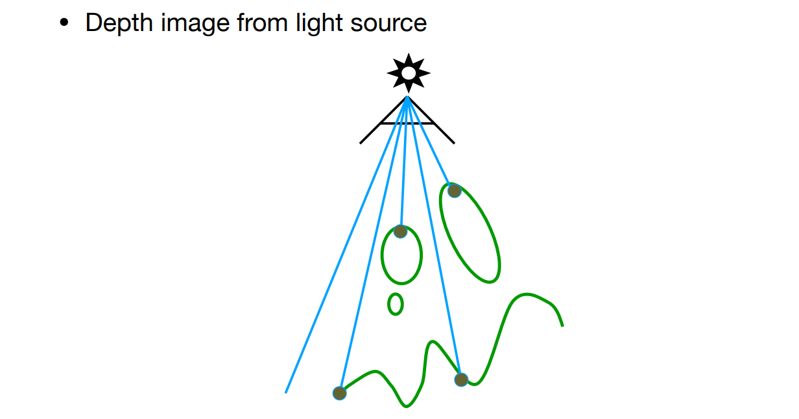
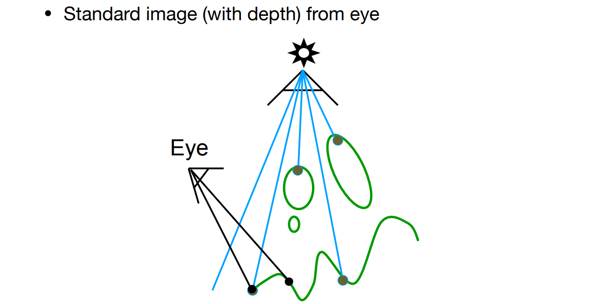
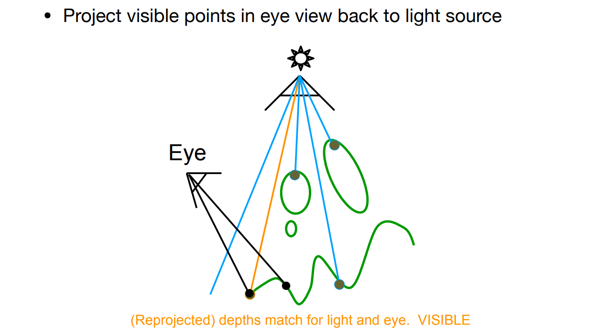
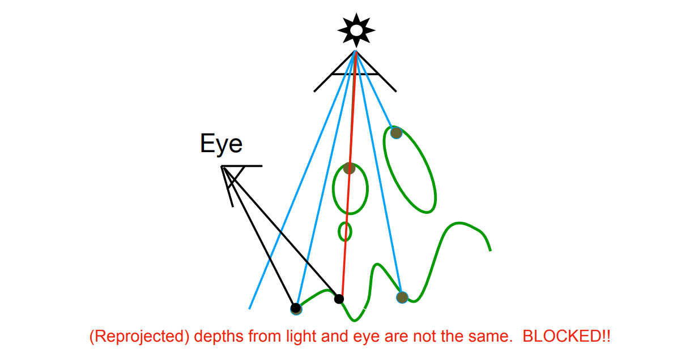
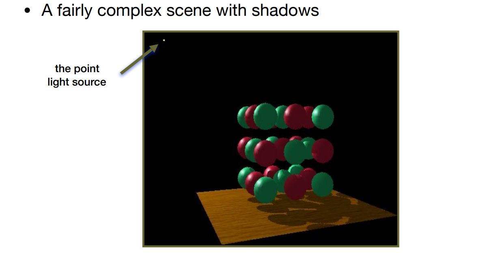
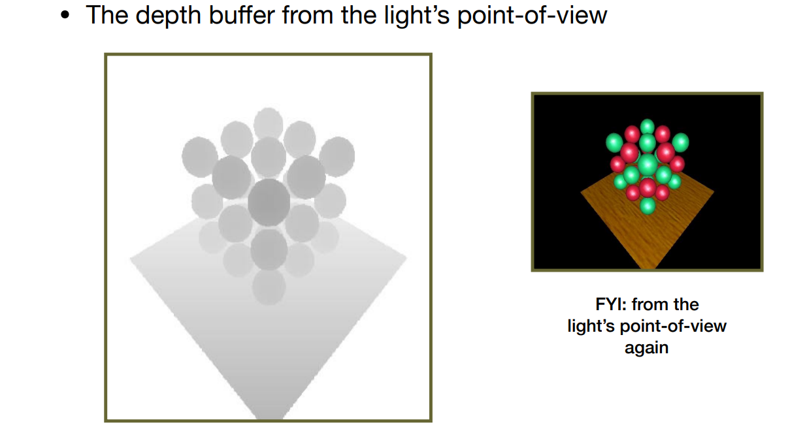
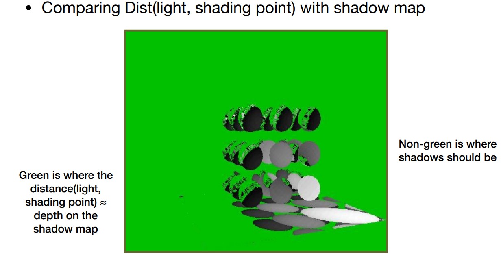
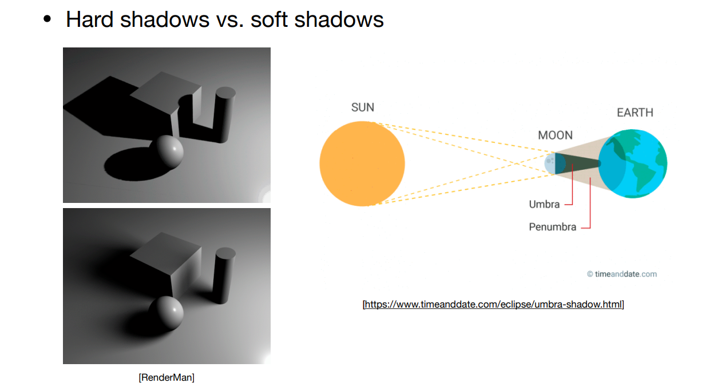

[toc]

# 十二、阴影 Shadow Mapping

1. 本质上是一个**图像空间**的算法
   1. 不需要知道场景的几何信息
   2. 会存在**走样**现象
2. 核心思想：
   1. 点不在阴影里 <=> 摄像机&光源均可以看到该点
3. Shadow Mapping只能处理点光源的阴影，且会有明显的边界，即**硬阴影**

## 12.1	第一步：Render from Light

从光源看向场景，记录看到的任何点的深度，即获取Z-Buffer

## 12.2	第二步：Render from Eye

1. 从摄像机看向场景，记录看到的点

   

2. 将看到的点，投影回光源，判断该位置对应的光源看到的深度

   1. 如果深度相同，则可以看到
   2. 如果深度不相同，则不可以看到

   

   

## 12.3	示例

1. 从光源看向场景，记录深度图

   

2. 从相机看向场景，将每一个像素投影回光源看到的图像，对比两个深度

   

3. 由于存在浮点精度、shadow map的分辨率与场景的分辨率等问题，会导致阴影的各种问题

## 12.4	硬阴影与软阴影

1. Umbra 本影：完全看不到光源
2. Penumbra 半影：看到部分光源
3. 软阴影一定是因为光源存在大小

