[TOC]

# 十三、光线追踪1：Whitted-Style Ray Tracing

## 13.1	为什么要使用光线追踪

1. 光栅化不能很好解决全局效果

   1. 软阴影
   2. Glossy反射
   3. 间接光照

   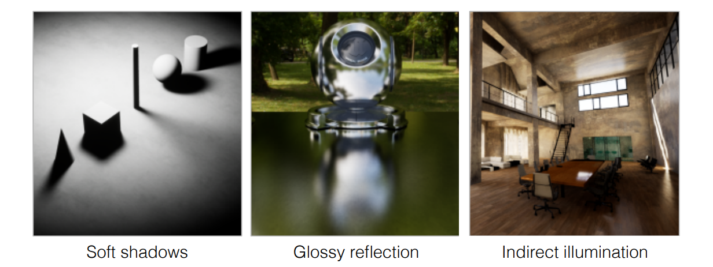

2. 光栅化的速度很快，但是质量较低，通常用于实时渲染

3. 光线追踪质量高，但是非常慢，通常用于离线制作

## 13.2	基础光线追踪算法

### 13.2.1	光线是什么

1. 光线沿直线传播
2. 光线和光线不会发生碰撞
3. 光线从光源发出，经过反射、折射等过程，进入人的眼睛：**光路可逆性**

### 13.2.2	光线投射

1. eye ray：从**眼睛**到屏幕上的**像素**，连接的而成的射线，只记录最近的**交点**
2. shadow ray：从某个**点**到**光源**的连线
3. 根据两条线的关系，判断着色

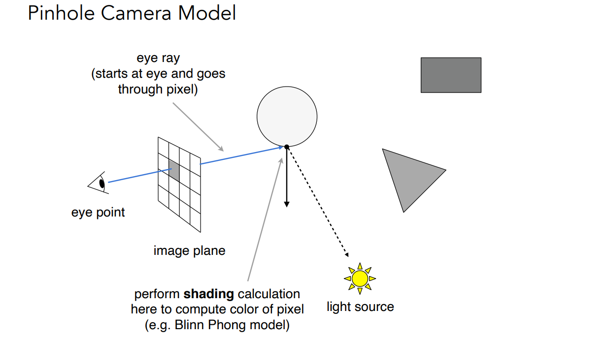

### 13.2.3	递归光线追踪

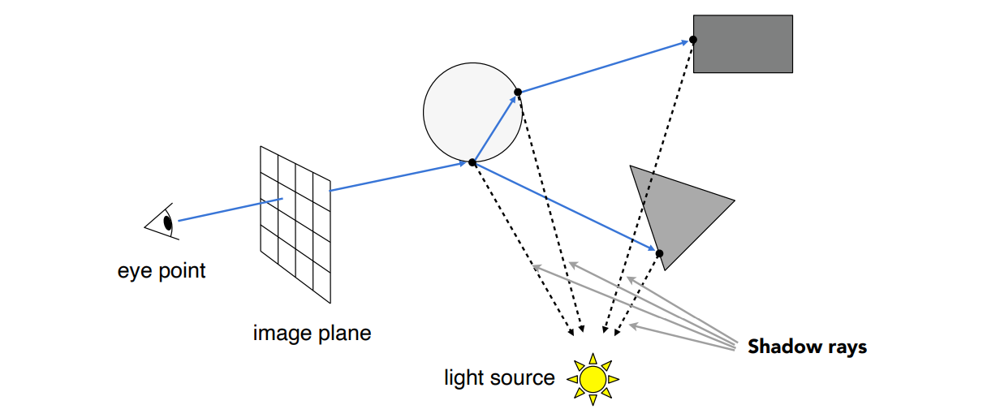

1. primary ray：即eye ray
2. secondary ray：经过折射/反射后的光线

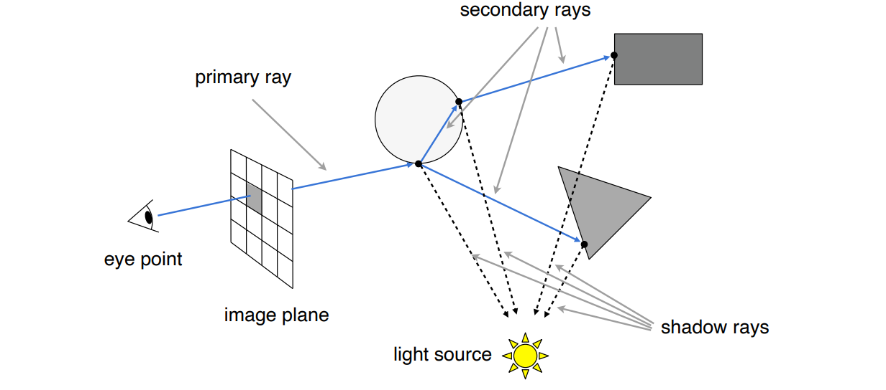

## 13.3	光线和表面的交点

### 13.3.1	光线的数学定义

1. 起点`o`，方向`d`
2. 射线定义：`r(t) = o + td`

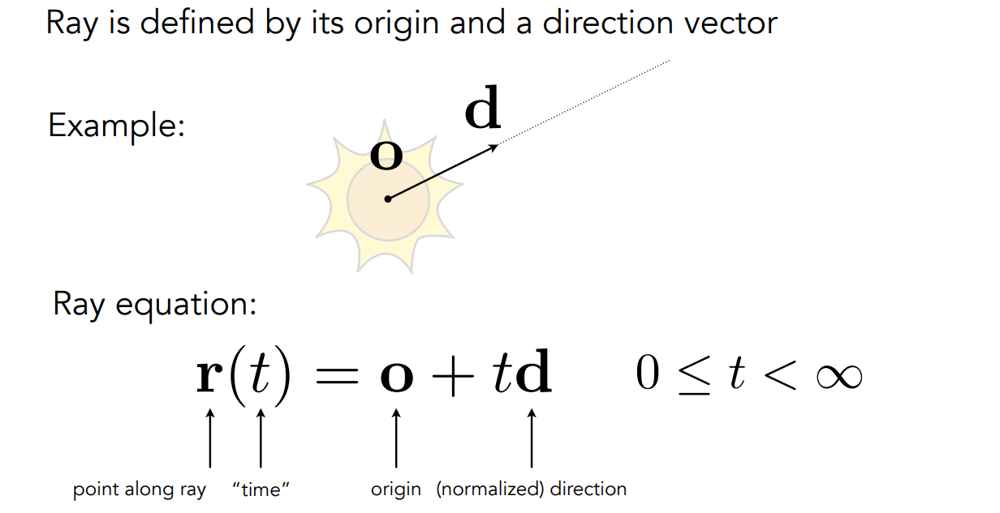

### 13.3.2	光线 与 球 求交点

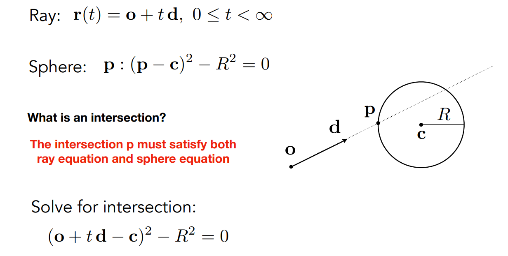

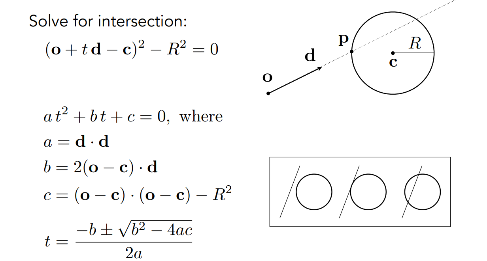

### 13.3.3	光线 与 隐式表面 求交点

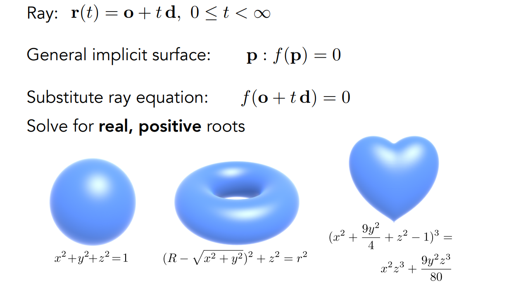

### 13.3.4	光线 与 三角形 求交点

> 如果射线与物体的交点数量为**奇数**，则点在**物体内**；如果是**偶数**，则在**物体外**

1. 光线和平面求交
2. 判断点是否在三角形内

#### 13.3.4.1	平面的数学定义

1. 给一个点$p_0$，一条法线$\vec{N}$
2. 则平面为：$(p-p_0)·\vec{N} = 0$

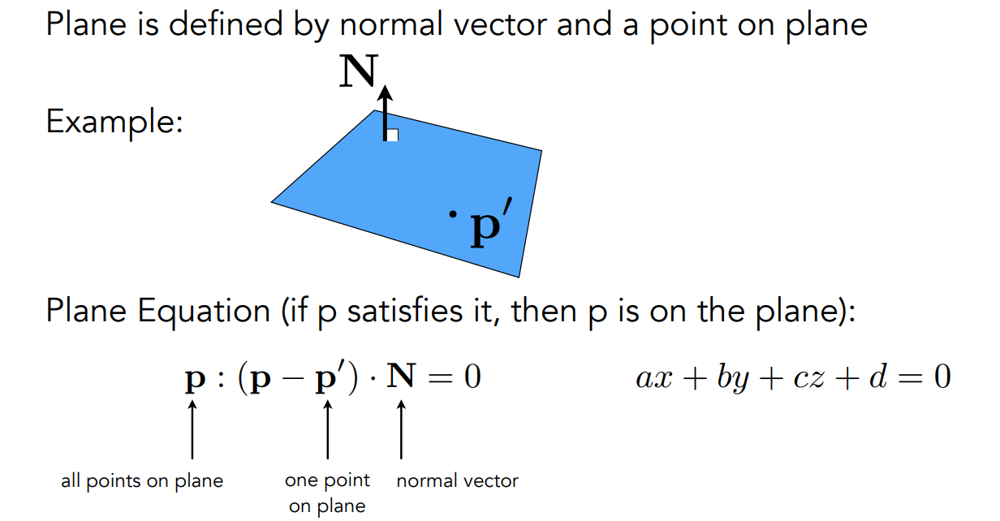

#### 13.3.4.2	光线和平面的交点

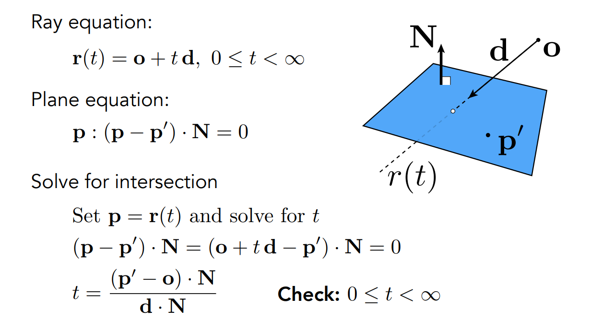

#### 13.3.4.3	Moller Trumbore算法

1. 用重心坐标表示平面：$(1-b_1-b_2)\vec{P_0} + b_1\vec{P_1} + b_2\vec{P_2}$
2. 判定点在射线上：$t\ge 0$
3. 判定点在三角形内：$b_1 \ge 0,b_2 \ge 0$

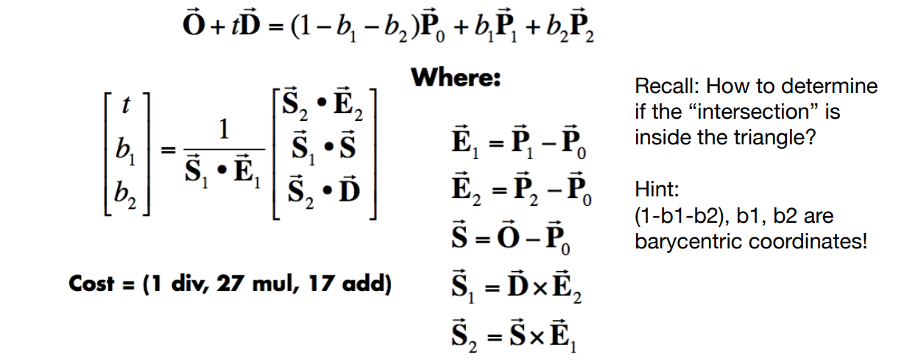

## 13.4	加速 光线 与 三角形表面 求交

### 13.4.1	包围盒 Bounding Volumes

1. 用一个简单的形状，将物体包围起来，如果不能与包围盒相交，则一定不会与物体相交

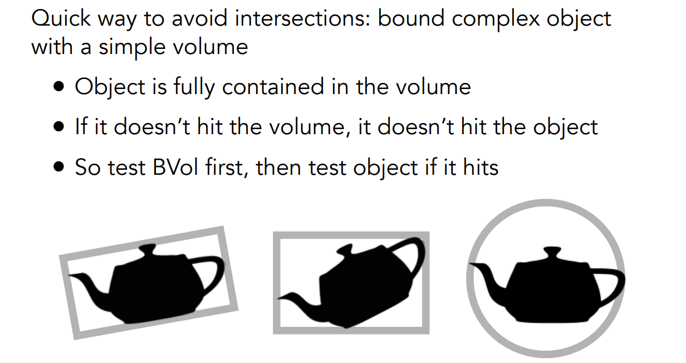

### 13.4.2	轴对齐包围盒AABB：Axis-Aligned Bounding Box

1. 空间中的长方体，可以理解为3对表面的交集

2. 轴对齐包围盒：长方体的每一个边，均与坐标轴平行

3. 二维空间，光线与长方形求交

   1. 对于竖着的情况，可以得到在$t=t_{x-min}$时，与$x=x_0$相交；在$t=t_{x-max}$时，与$x=x_1$相交
   2. 对于横着的情况，可以得到在$t=t_{y-min}$时，与$y=y_0$相交；在$t=t_{y-max}$时，与$y=y_1$相交
   3. 由于长方形可以看作四条线的交集，因此光线在长方形中的部分，也可以看作$[t_{x-min},t_{x-max}]$和$[t_{y-min},t_{y-max}]$的交集
   4. 从而可以得到光线与长方形的交点对应的时间$t_{enter} = \max(t_{x-min},t_{y-min})$，$t_{exit}=\min(t_{x-max},t_{y-max})$

   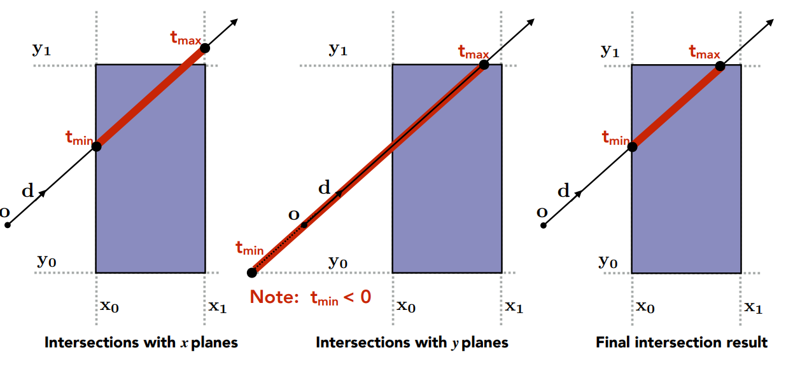

4. 三维空间，光线与长方体求交

   1. 只有当光线同时进入了3对表面，才能说光线进入了长方体
   2. 光线只要离开了1对表面，就说钢线离开了长方体
   3. 对于每一对表面，计算一次$[t_{min},t_{max}]$
   4. 则对于长方体来说，$t_{enter} = \max(t_{min})$，$t_{exit}=\min(t_{max})$

5. 如果$t_{exit}<0$，则说明盒子在光线的背后，不可能有交点

6. 如果$t_{exit}\ge0, t_{enter}<0$，则说明光线的起点在盒子里面，肯定有交点

**因此，光线与AABB有交点，当且仅当：$t_{enter}<t_{exit}$  并且  $t_{exit} \ge 0$**

