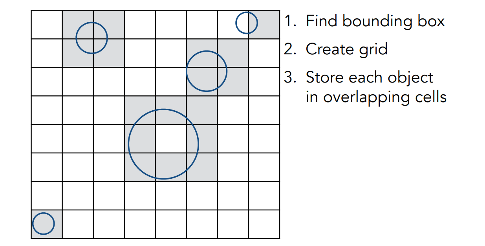
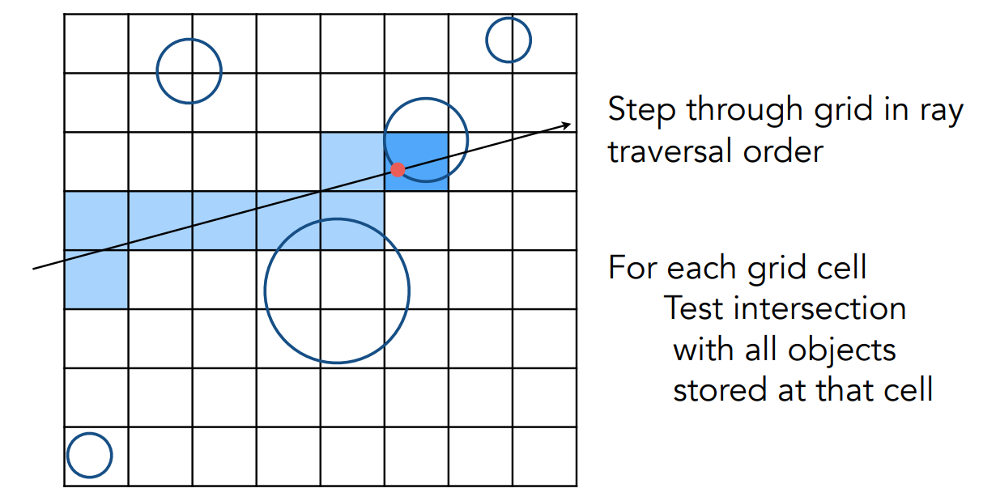
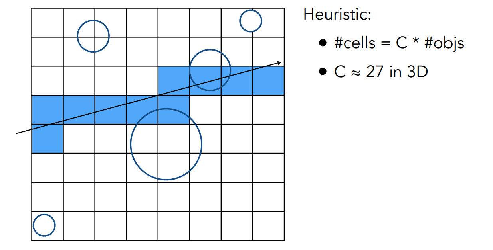
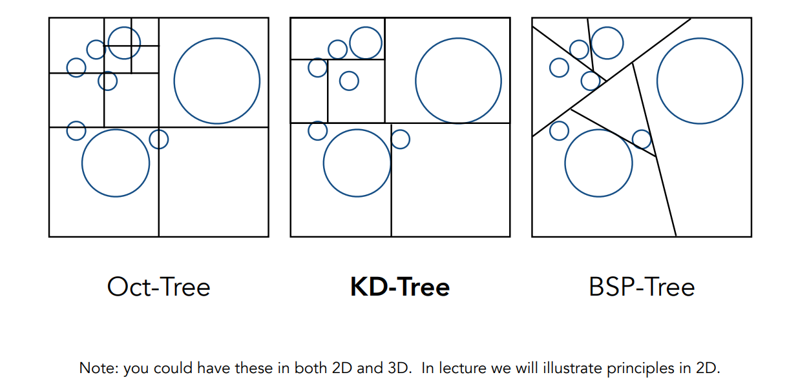
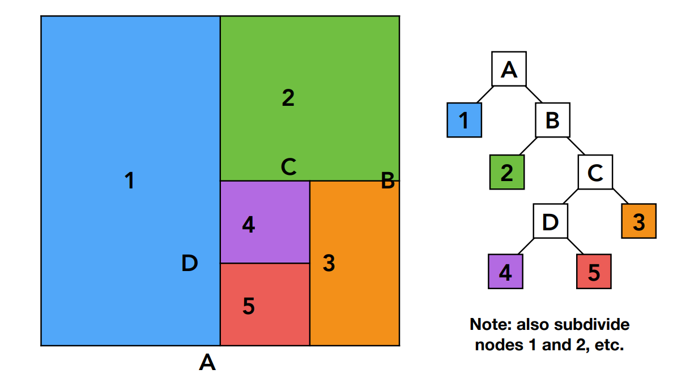
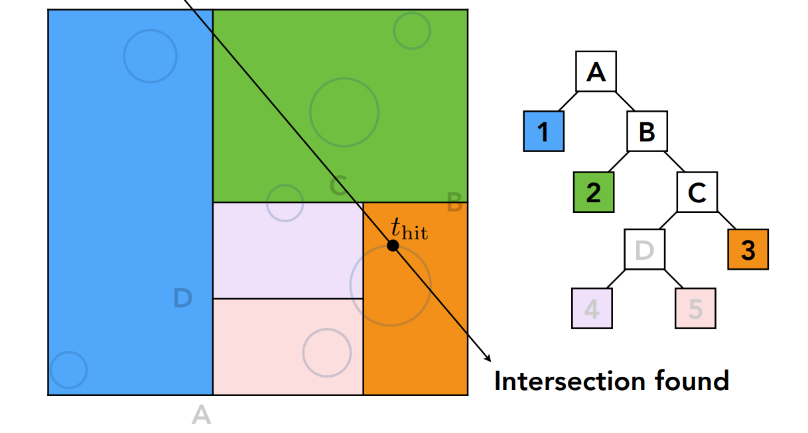
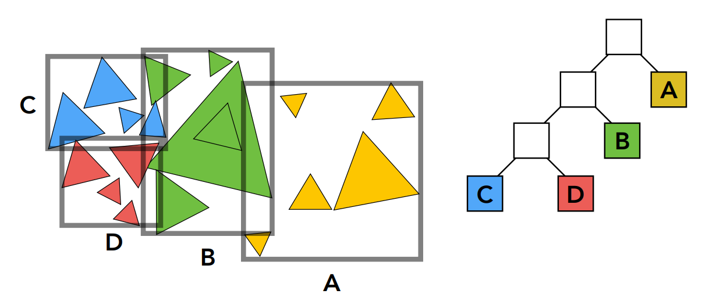
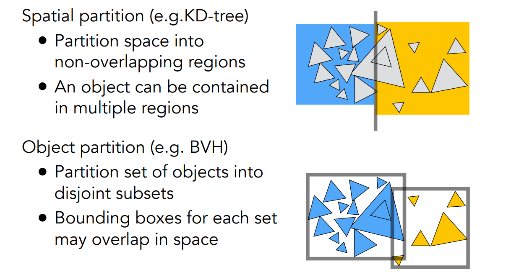

[TOC]

# 十四、光线追踪2：使用AABB包围盒加速光线追踪

## 14.1	直接使用AABB包围盒

1. 找到包围盒

2. 将包围盒分为格子`Grid`

3. 如果某个格子与物体的表面相交，则标记该格子

   

4. 将光线与格子求交

   1. 如果光线与格子相交，且格子内有物体，则将光线与对应物体求交

   

5. 格子过于稀疏 or 过于密集，均会使效率变低

6. 通常，格子的数量是场景中的物体数目的整数倍：`#cells = C * #objs`

   

## 14.2	空间划分 Spatial Partitions

将空间划分为大小不同的盒子

缺点：

1. 难以判断哪些三角形属于当前格子
2. 一个三角形可能会处在多个格子中

### 14.2.1	KD-Tree 预处理

1. 注意，每一个部分都要划分，按照水平、竖直的顺序交替分割
2. 中间节点：
   1. 分割轴：x、y、z
   2. 分割位置：在分割轴上的分割点的坐标
   3. 子节点：指向子节点的指针，有2个子节点
3. 叶节点：
   1. 记录和该格子相交的物体 

### 14.2.2	KD-Tree加速光线追踪

1. 如果光线和格子没有交点，则不做操作
2. 如果光线和格子有交点
   1. 如果格子为叶节点，则光线与叶节点中的所有物体求交
   2. 否则与格子的两个子节点求交

## 14.3	物体划分 Object Partitions

1. 将物体分为两堆，然后再求包围盒
2. 包围盒之间可能有相交，但可以保证一个三角形最多只在一个包围盒中

### 14.3.1	层次包围盒 BVH：Bounding Volume Hierarchy

1. 找到一个包围盒
2. 递归的将包围盒中的物体划分为两个部分
3. 重新计算包围盒
4. 重复23，直到每个包围和中的物体数量足够少
5. 将物体存在每个叶节点中

### 14.3.2	划分方法

1. 每次找最长的轴进行划分
2. 每次找第n/2个三角形，进行划分，保证两边的三角形个数相差不多
   1. 根据重心坐标，划分三角形的位置
   2. 可以类似于找第k大数，通过快排，在O(n)时间内找到
3. 如果场景中的物体移动了，就需要重新建立BVH树

### 14.3.3	BVH加速光线追踪

1. 如果光线和包围盒没有交点，则不做操作
2. 如果光线和包围盒有交点
   1. 如果包围盒为叶节点，则光线与叶节点中的所有物体求交
   2. 否则与包围盒的两个子节点求交

### 14.3.4	空间划分 vs 物体划分

