[TOC]

# 十五、光线追踪3：BRDF & 渲染方程

## 15.1	辐射度量学 Basic radiometry

1. 如何描述光照：定义了一系列的方法和单位
2. 给光赋予了一系列空间上的属性（依旧是基于几何光学）
   1. Radiant flux：辐射通量
   2. intensity：强度
   3. irradiance：辐射通量密度
   4. radiance：辐射
3. 在物理上准确定义光照的方法

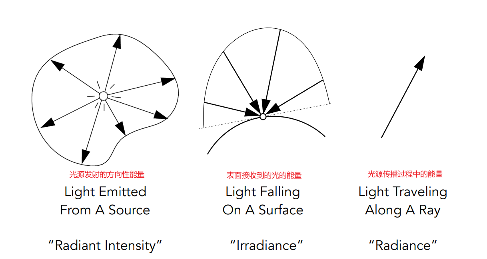

### 15.1.1	Radiant Flux/Power：单位时间的能量

1. Radiant **Energy**：光源辐射出来的能量，$Q$，单位为**焦耳J**，在CG中基本不使用
2. Radiant **Flux/Power**：单位时间内发射的能量，$\Phi=\frac{dQ}{dt}$，单位为**瓦特W**/**流明lm=lumen**

### 15.1.2	Radiant Intensity：单位立体角的能量

1. Radiant **Intensity**：单位立体角上的power，$I(\omega)=\frac{d\Phi}{d\omega}$，单位为**坎德拉cd**
   1. 也就是光源在某个方向上的亮度

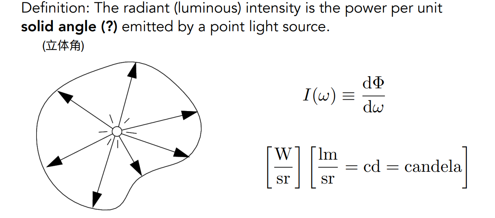

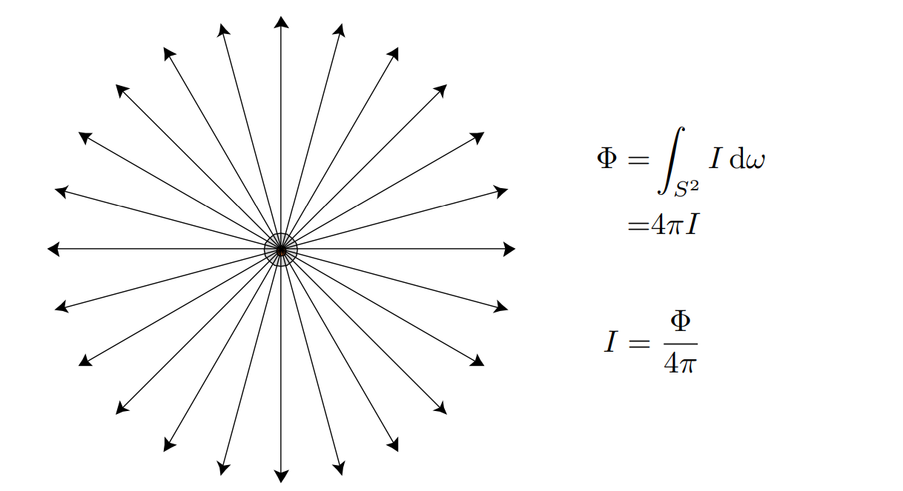

#### 15.1.2.1	立体角 Solid Angles

1. 角度：$\theta=\frac{l}{r}$，单位为**rad**
2. 立体角：$\Omega=\frac{A}{r^2}$，单位为**sr**

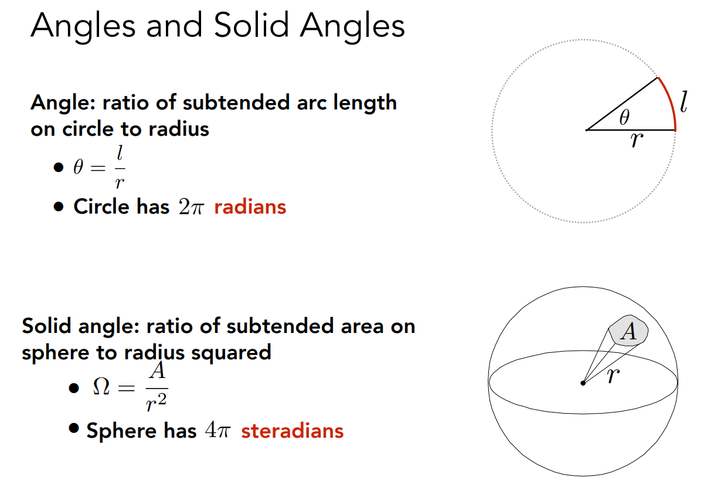

#### 15.1.2.2	单位立体角  Differential Solid Angles

1. 单位面积：$dA=r^2sin\theta\ d\theta\ d\phi$
2. 单位立体角：$d\omega=sin\theta\ d\theta\ d\phi$

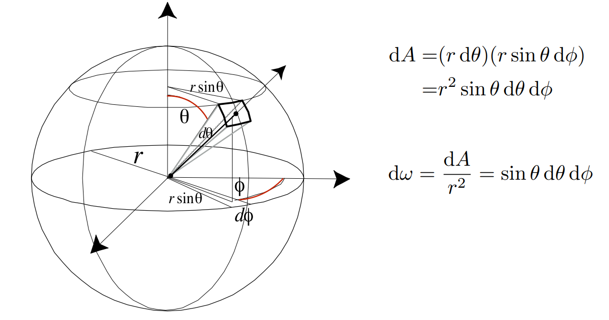

### 15.1.4	  Irradiance：单位面积的能量

1. Irradiance：表面上**与光线垂直**的单位面积接收到的能量，$E(x)=\frac{d\phi(x)}{dA}$，单位**$\frac{W}{m^2}$，$\frac{lm}{m^2}$=lux**

   1. 如果表面与光线**不垂直**，则需要投影到垂直方向：$E(x)=\frac{d\phi(x)}{dA}\ \cos \theta$，$\theta$为光线与法线的夹角

   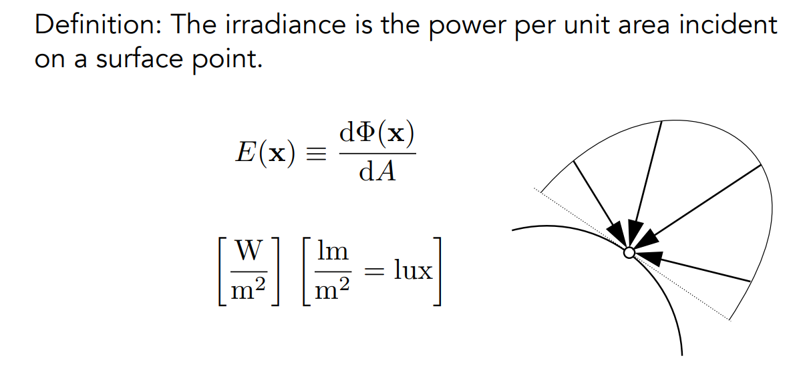

2. 光在传播的过程中，Intensity没有变，而Irradiate变小了，因为面积变大了

   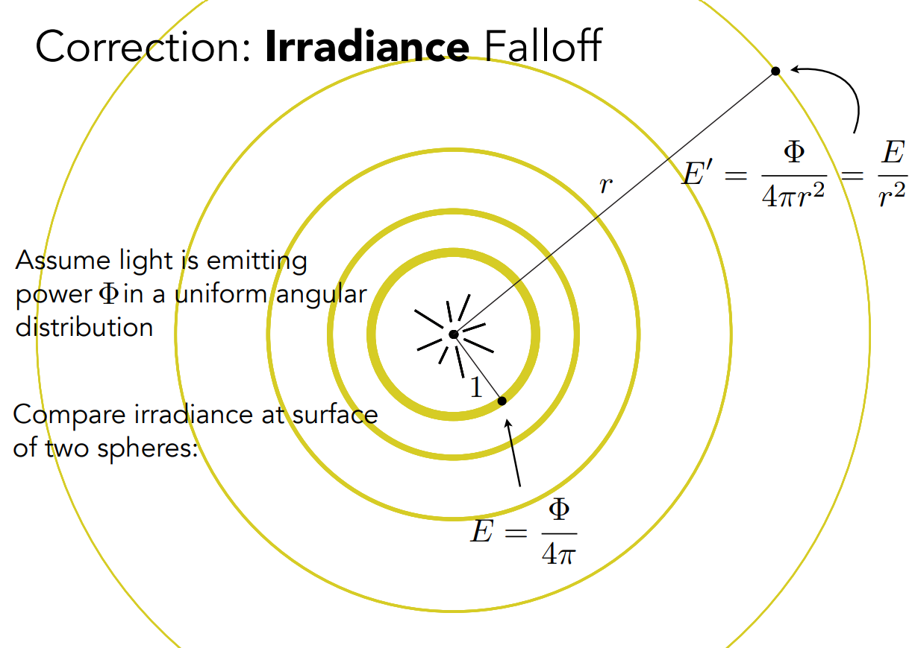

### 15.1.5	Radiance：单位立体角&单位面积的能量

1. Radiance：表面上**与光线垂直**的单位面积接收到的能量，$L(p,\omega)=\frac{d^2\phi(p,\omega)}{d\omega dA cos \theta}$，单位**$\frac{cd}{ m^2}$，$\frac{lm}{sr\ m^2}=\frac{lm}{sr\ m^2}$=nit**
   1. 单位面积的Intensity：$L(p,\omega)=\frac{dI(p,\omega)}{dA cos \theta}$
   2. 单位立体角的Irradiance：$L(p,\omega)=\frac{dE(p)}{d\omega cos \theta}$

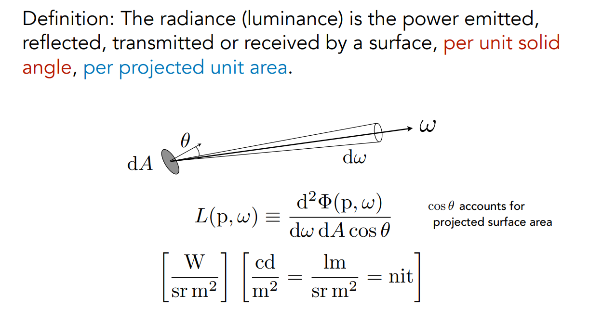

### 15.1.6	Irradiance vs Radiance

1. **Irradiance**：单位面积**dA**接收到的所有能量，$E(p)$
2. **Radiance**：单位面积**dA**在单位方向**dω**处接收到的所有能量，$L(p,\omega)$

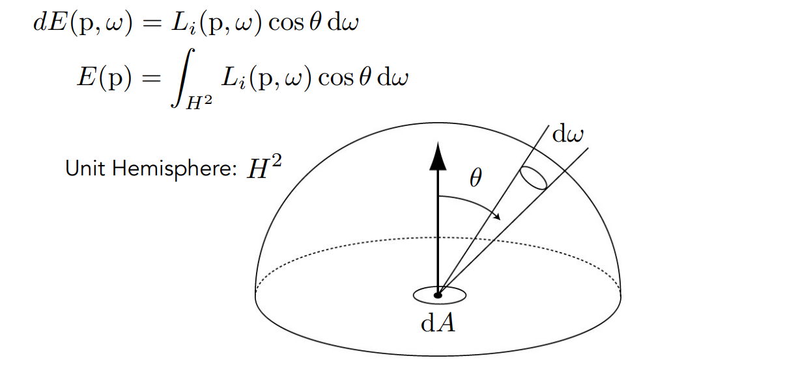

## 15.2	BRDF：双向反射分布函数

> **Bidirectional Reflectance Distribution Function**

### 15.2.1	某个点的反射

1. 单位面积**dA**，在某个单位立体角**ω~i~**处吸收能量**dE(ω~i~)**
2. 会反射到另一个单位立体角**ω~r~**、单位面积的能量**dL~r~(x, ω~r~)**

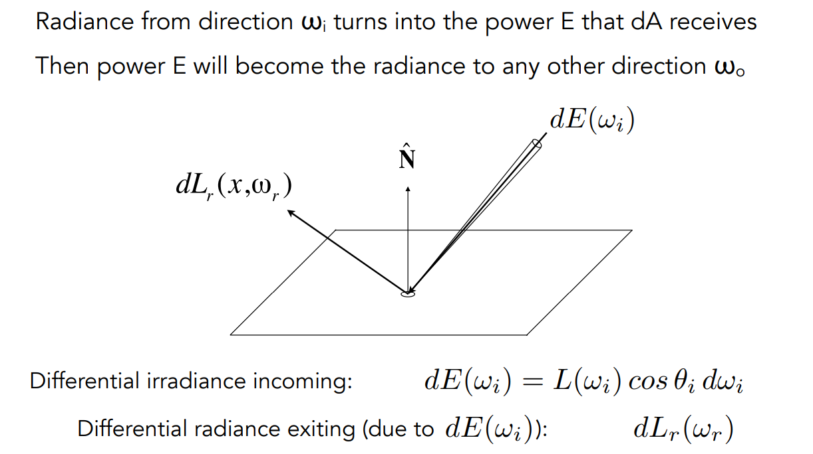

### 15.2.2	BRDF

1. 入射光的Radiance：**dE~i~(ω~i~)**
2. 反射光的Irradiance：**dL~r~(ω~r~)**
3. 入射光在反射方向的能量分布比例**f~r~(ω~i~ → ω~r~)**为：
   1. 入射光的Radiance / 反射光的Irradiance 

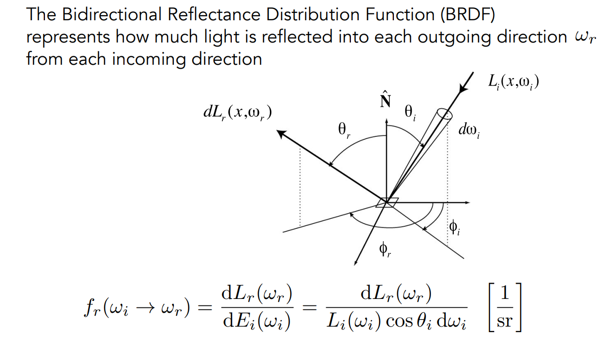

### 15.2.3	反射方程 Reflection Equation

1. 某个着色点**p**，当反射方向为**ω~r~**是，反射的光**L~r~(p, ω~r~)**为：
   1. 在每个入射方向**ω~i~**的反射的能量**f~r~(p, ω~i~ → ω~r~) L~i~(p, ω~i~) cos θ~i~**，对入射方向立体角**dω~i~**的积分
   2. 只考虑半球**H^2^ / Ω+**
2. 问题：任何出射的radiance，都可能作为其他着色点的入射的radiance，因此存在递归定义

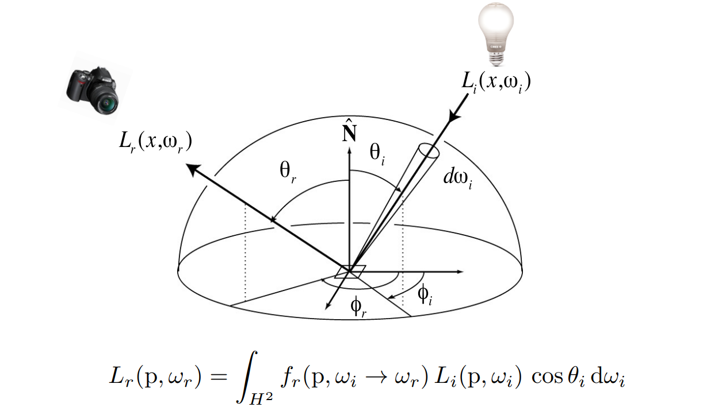

## 15.3	渲染方程 Rendering Equation

某个点**p**向某个方向**ω~o~**出射的光**L~o~(p, ω~o~)**由两部分构成

1. 自己产生的光：$L_e(p, ω_o)$
2. 反射的光：$\int_{\Omega+}L_i(p,\omega_i)f_r(p,\omega_i,\omega_o)(n·\omega_i)d\omega_i$

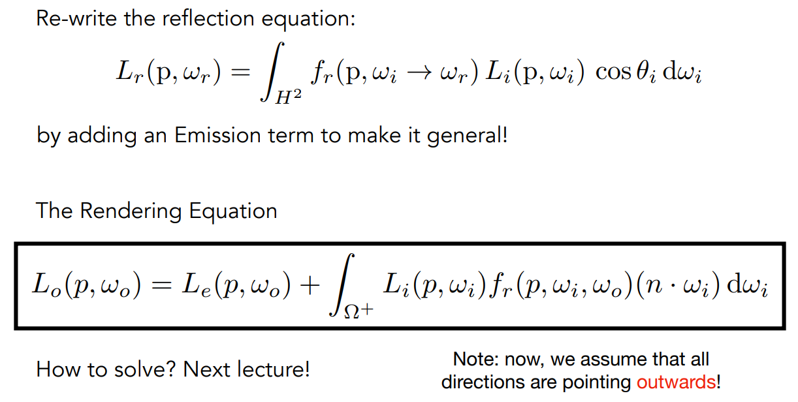

### 15.3.1	一个点光源

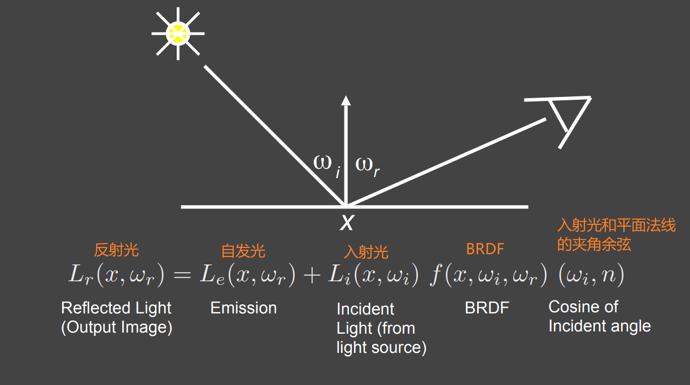

### 15.3.2	很多个点光源：加和

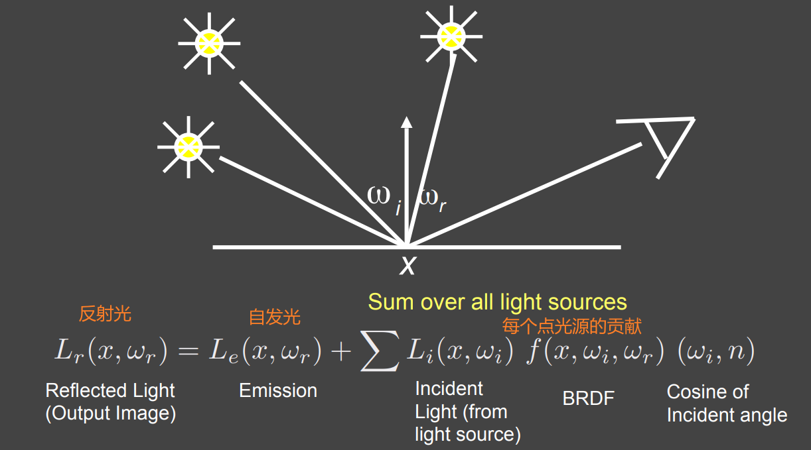

### 15.3.3	面光源：很多个点光源的集合 => 积分

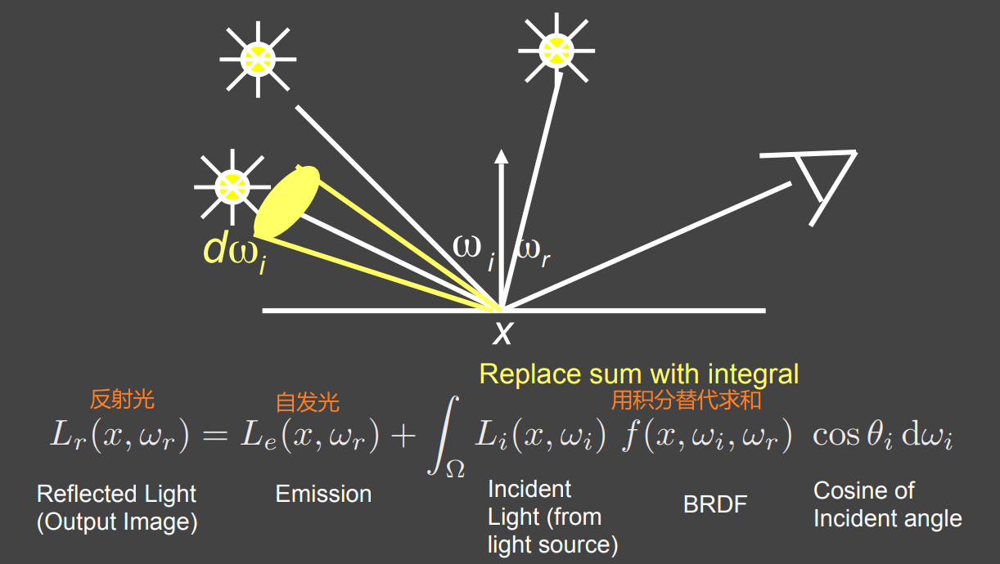

### 15.3.4	其他表面的反射：当成面光源使用

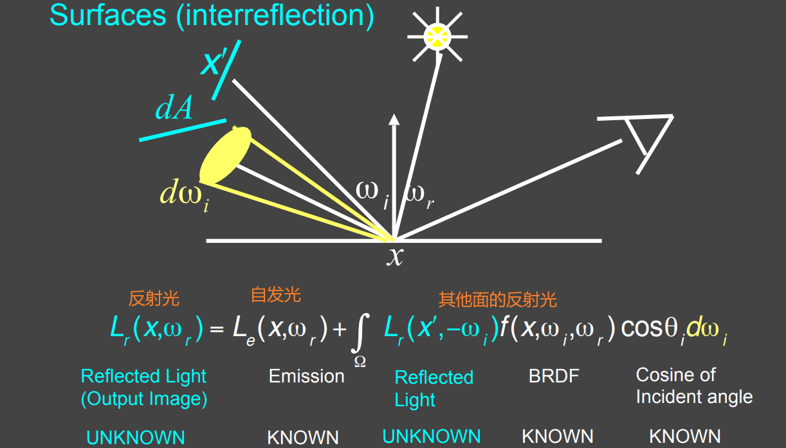

### 15.3.5	渲染方程的简化表示

> 积分方程

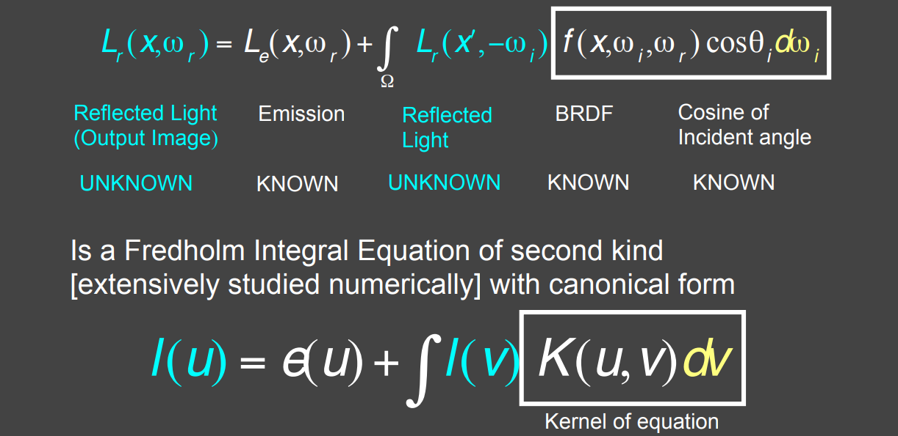

> 线性算子等式

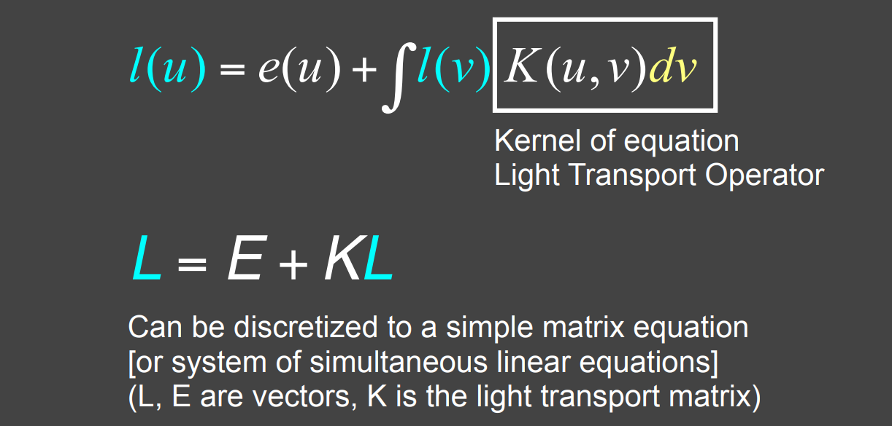

### 15.3.6	光线弹射n次的光线追踪 => 全局光照

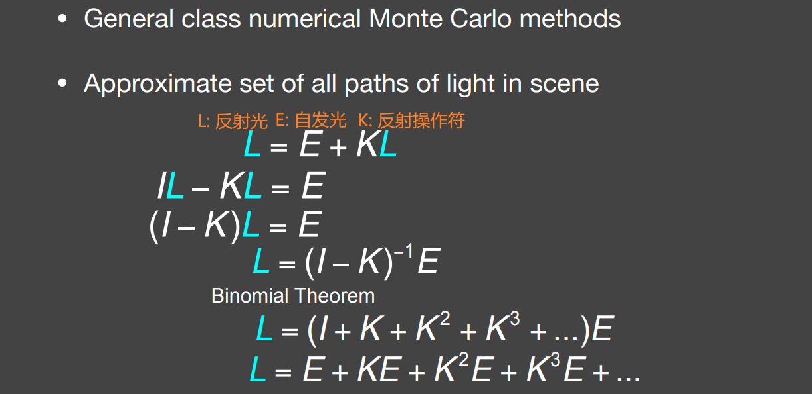

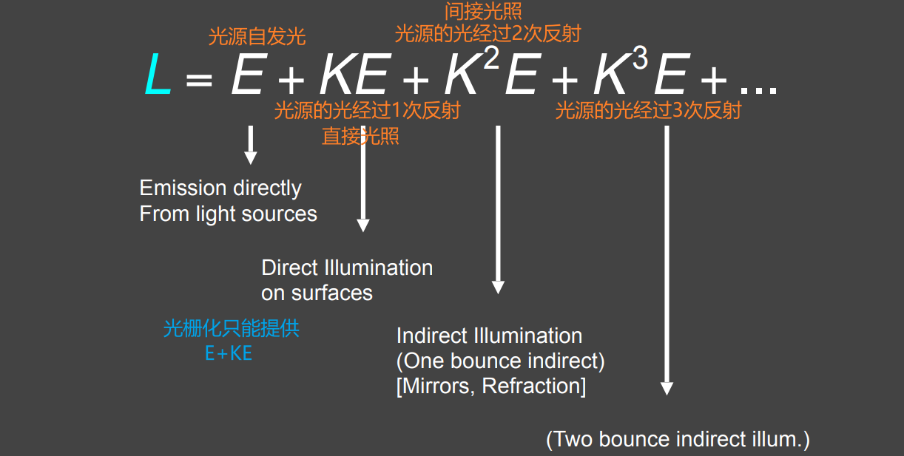

## 15.4	概率论

### 15.4.1	PDF：概率分布函数，X ~ p(x)

> **Probability Distribution Function**

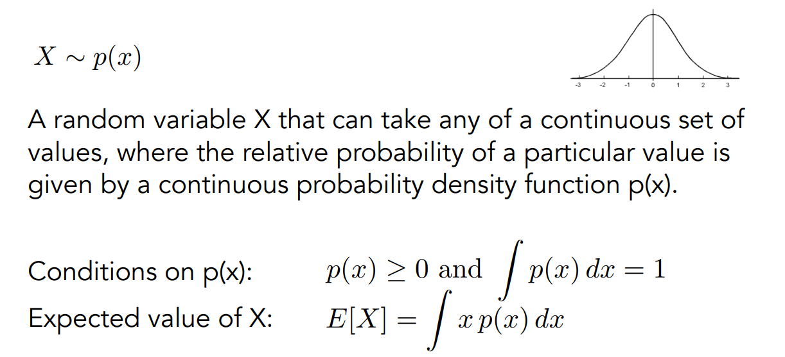

### 15.4.2	随机变量函数的期望

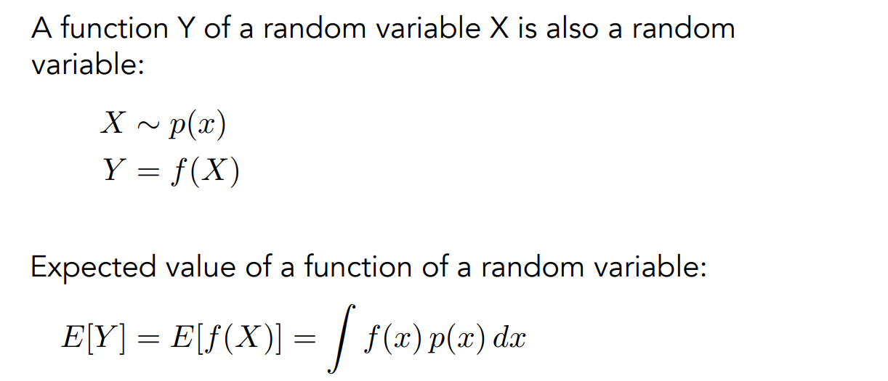