[TOC]

# 十六、光线追踪4：蒙特卡洛积分 & 路径追踪

## 16.1	复习

> 渲染方程：描述了光线的传递 

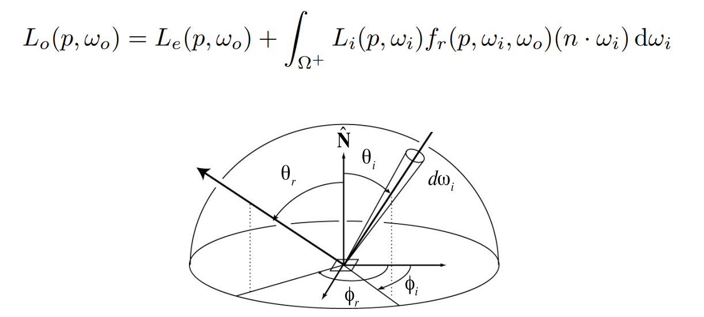

1. 存在积分
2. 是一个递归的计算：因为入射光可能是其他面的反射光

## 16.2	蒙特卡洛积分：采样求定积分

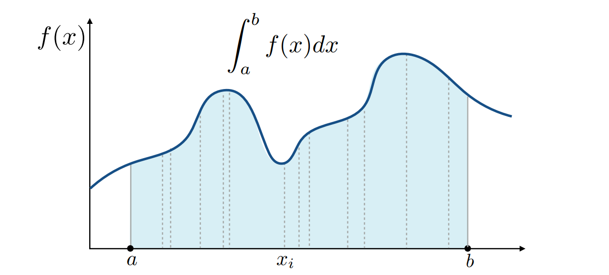

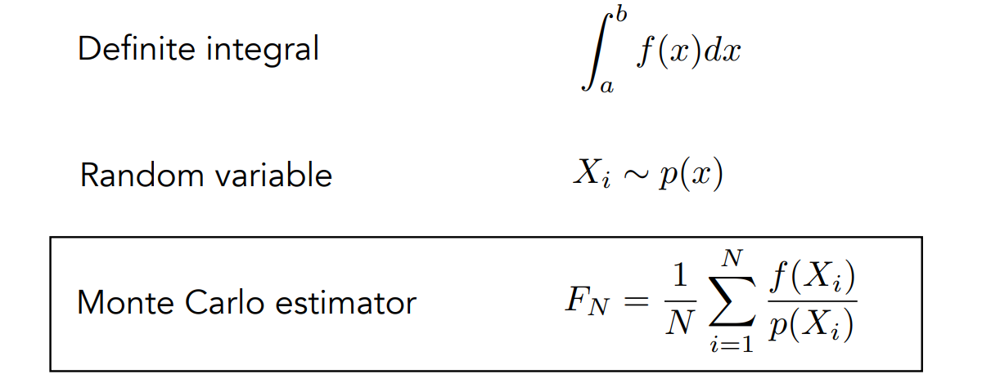

1. 在$[a,b]$中采样多次，设每次采样点为$x_i$，对应的函数值为$f(x_i)$，则使用$(b-a)*f(x_i)$，近似定积分的值
2. 当采样次数足够多时，求平均值，即可得到实际的定积分的值
3. 设随机采样点$X_i$ ~ $p(x)$，要求$\int_{a}^b p(x)=1$，则蒙特卡洛的积分值为：$F_N=\frac{1}{N}\sum_{i=1}{N}\frac{f(X_i)}{p(X_i)}$

> 示例：用$X_i$ ~ $p(x)$ = C采样
>
> 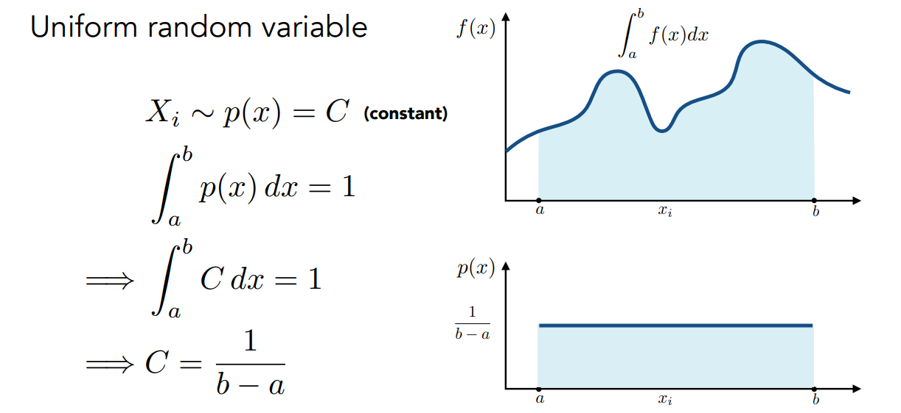
>
> 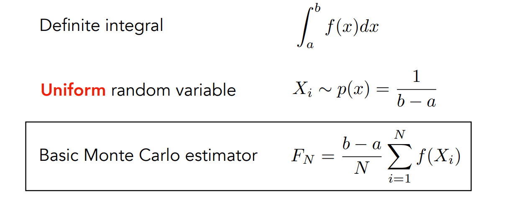

注意：

1. 采样次数越多，结果越精确
2. 在x上采样，则就是在x上积分

## 16.3	路径追踪：Path Tracing

### 16.3.1	Whitted-Style Ray Tracing 的做法存在的问题

不断的弹射光线，在任意一个位置均弹射光线

1. 如果是光滑物体：则沿镜面方向反射、折射方向折射
2. 如果是漫反射物体：停止弹射

存在问题：

1. 对于glossy物体，不能按照specular那样的镜面反射处理
2. 漫反射物体会将光线均匀的弹射到各个部分，而非不反射

### 16.3.2	使用蒙特卡洛积分，实现渲染方程中的积分

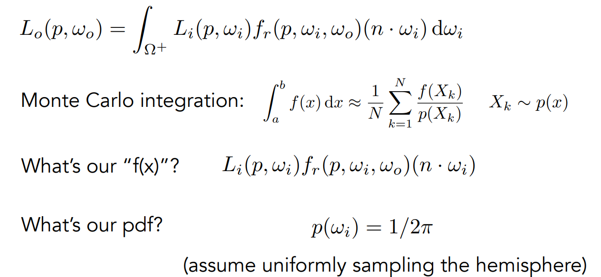

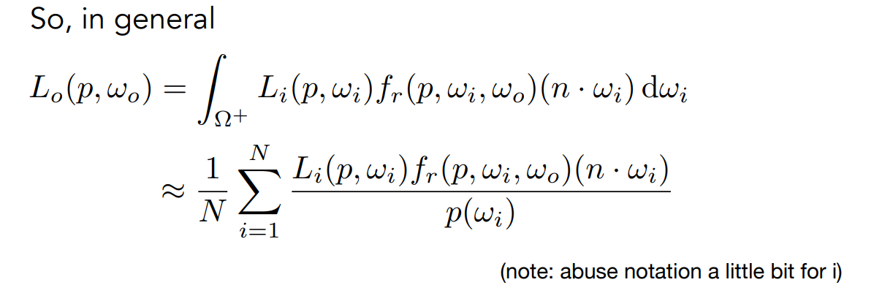

#### 16.3.2.1	直接光照

**shade(p, ω~o~)**

1. 随机选择**N**个方向，N的分布满足某一种PDF
2. **L~o~**初始化为0.0
3. 对于每一个方向**ω~i~**
   1. 追踪光线**r(p, ω~i~)**
   2. 如果光线**r**击中了光源
      1. **L~o~ += (1/N) * L~i~ *  f~r~ * cos / PDF(ω~i~)**
4. 返回**L~o~**

#### 16.3.2.2	间接光照

> 相当于从P点看Q点的直接光照

**shade(p, ω~o~)**

1. 随机选择**N**个方向，N的分布满足某一种PDF
2. **L~o~**初始化为0.0
3. 对于每一个方向**ω~i~**
   1. 追踪光线**r(p, ω~i~)**（p点发出，方向为ω~i~）
   2. 如果光线**r**击中了光源
      1. **L~o~ += (1/N) * L~i~ *  f~r~ * cos θ / PDF(ω~i~)**
   3. 如果光线**r**击中了物体，且物体位于**q**
      1. **L~o~ += (1/N) * shade(q, -ω~i~) *  f~r~ * cos θ / PDF(ω~i~)**
4. 返回**L~o~**

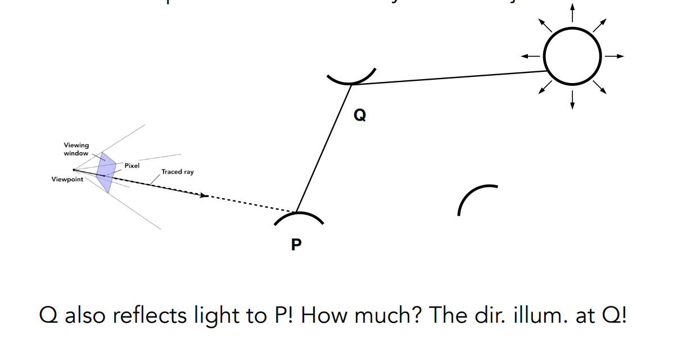

## 16.4	路径追踪：解决光线数量爆炸

> 问题：光线的数量会爆炸：光线数量 = N ^反射次数^，只有当N = 1时，才不会指数爆炸 ==> 路径追踪

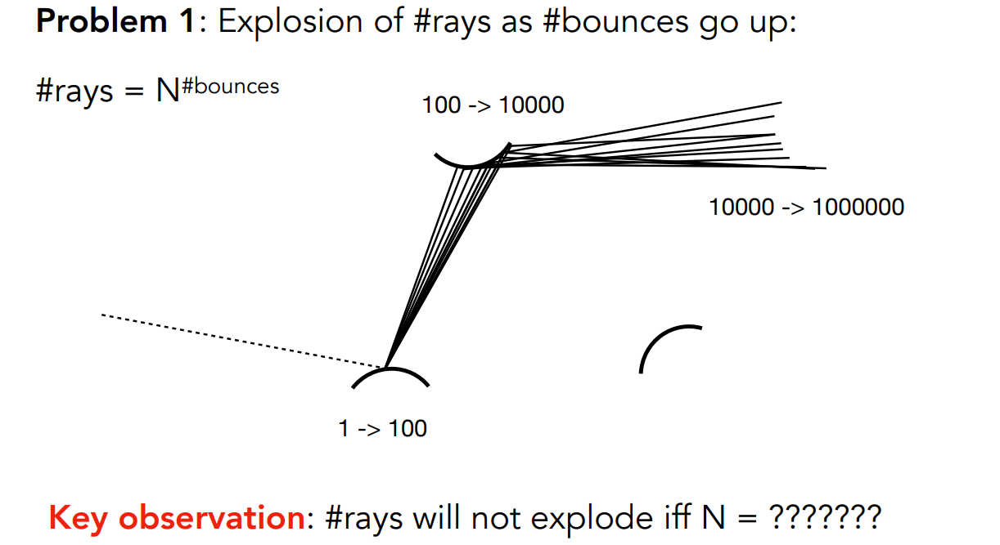

### 16.4.1	每一个着色点，只使用1根光线进行追踪

**shade(p, ω~o~)**

1. 随机选择**1**个方向**ω~i~**，ω~i~的分布满足某一种PDF
2. 追踪光线**r(p, ω~i~)**（p点发出，方向为ω~i~）
3. 如果光线**r**击中了光源
   1. 返回 **L~o~ = L~i~ *  f~r~ * cos θ / PDF(ω~i~)**
4. 如果光线**r**击中了物体，且物体位于**q**
   1. 返回 **L~o~ = shade(q, -ω~i~) *  f~r~ * cos θ / PDF(ω~i~)**

### 16.4.2	解决噪声问题：选择多个穿过该着色点的路径，每个路径1条光线

**ray_generation(camPos, pixel)**

1. 在该像素中，随机选择**N**个采样位置
2. **pixel_radiance = 0.0**
3. 对于每一个采样位置
   1. 追踪光线**r(camPos, cam_to_sample)**
   2. 如果光线**r**在**p**点击中场景
      1. **pixel_radiance += (1/N) * shade(p, sample_to_cam)**
4. 返回**pixel_radiance**

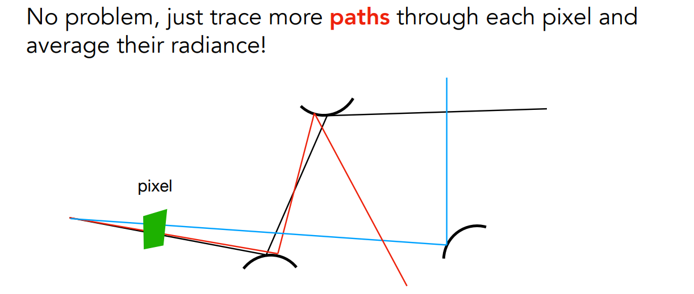

### 16.4.3	解决递归无法停下问题：Runssian Roulette

> 问题：**shade(p, ω~o~)**是递归定义的，可能无法停下 ==> RR，一定概率停止追踪

1. 定义一个概率**P**
2. **P**的概率，发射一个光线，并且返回**L~o~ / P**
3. **1-P**的概率，不发射光线，返回**0**
4. 最后的期望依旧为**L~o~**

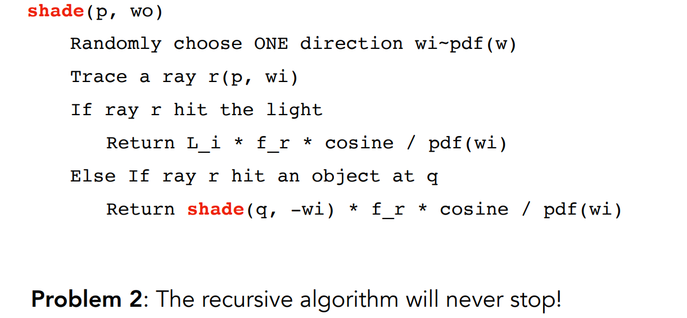

**shade(p, ω~o~)**

1. 定义概率**P_RR**
2. 随机生成一个在**[0,1]**的实数**dist**， 如果**dist>P_RR**，则返回**0.0**
3. 随机选择**1**个方向**ω~i~**，ω~i~的分布满足某一种PDF
4. 追踪光线**r(p, ω~i~)**（p点发出，方向为ω~i~）
5. 如果光线**r**击中了光源
   1. 返回 **L~o~ = L~i~ *  f~r~ * cos θ / PDF(ω~i~) / P_RR**
6. 如果光线**r**击中了物体，且物体位于**q**
   1. 返回 **L~o~ = shade(q, -ω~i~) *  f~r~ * cos θ / PDF(ω~i~) / P_RR**

### 16.4.4	让路径追踪变得高效：对光源采样

> 均匀采样，导致很多光线无法打到小的光源，导致浪费计算力

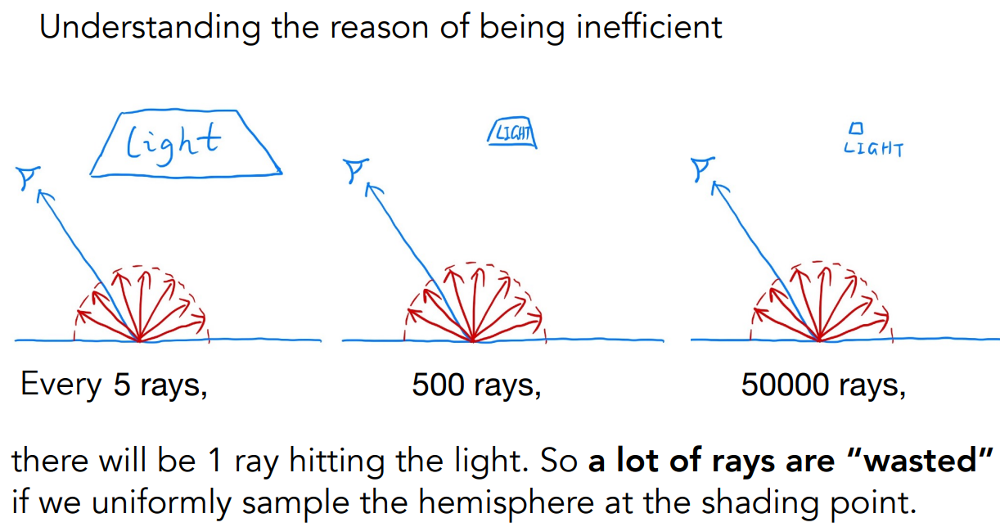

> 对光源进行采样，然后将渲染方程修改为对光源的积分：即找到 **dω** 与 **dA** 的关系

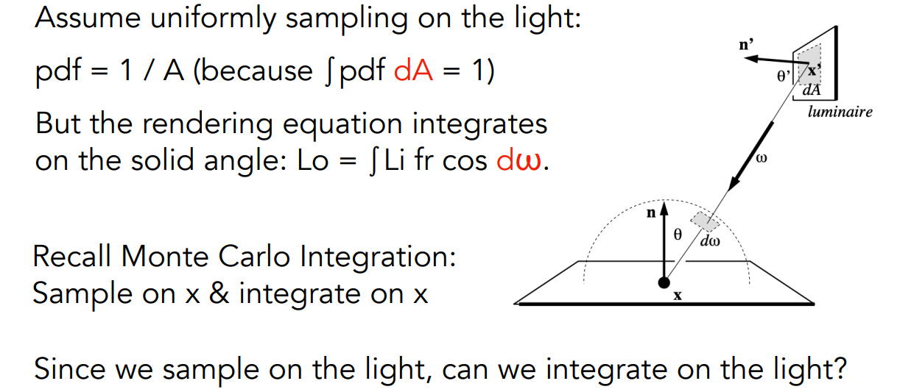

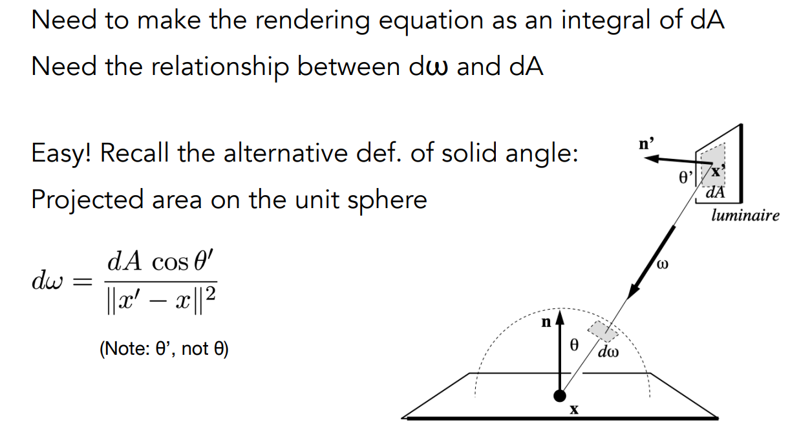

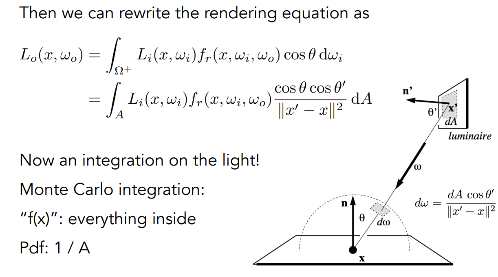

> 优化算法

将radiance分为两个部分：

1. 来自光源的radiance：直接采样光源
2. 其他反射光：使用RR的方法

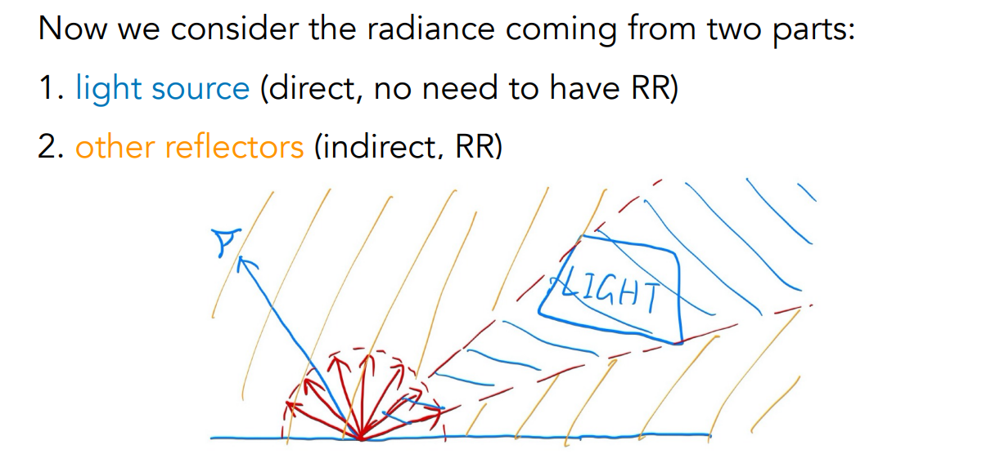

**shade(p, ω~o~)**

1. > 光源的贡献

   1. 均匀的对位于**x'**的光源进行采样，**PDF_light = 1 / A**
   2. 从**p**向**x'**发射一条光线，如果光线不会被阻挡，则
      1. **L_dir = L~i~ * f~r~ * cos θ * cos θ‘ / |x' - p|^2^ / PDF_light**

2. > 其他反射光的贡献

   1. **L_indir = 0.0**
   2. 判断是否需要采样，RR的概率为**P_RR**
   3. 均匀的对半球进行采样，方位角为**ω~i~**，**PDF_hemi = 1 / 2Π**
   4. 追踪光线**r(p, ω~i~)**（p点发出，方向为ω~i~）
   5. 如果光线**r**击中了**非发光体**，且物体位于**q**
      1. **L_indir = shade(q, -ω~i~) *  f~r~ * cos θ / PDF_hemi  / P_RR**

3. 返回**L_dir + L_indir**