[TOC]

# 十七、材质与外观

## 17.1	材质 == BRDF + BTDF= BSDF

### 17.1.1	漫反射材质 BRDF

1. 光线会被均匀的反射到每个方向
2. 完全不吸收能量、不发光的漫反射材质：$f_r=\frac{\rho}{\pi} \in[0,\frac{1}{\pi}]$
   1. 其中$\rho \in [0,1]$，表示对光的反射率

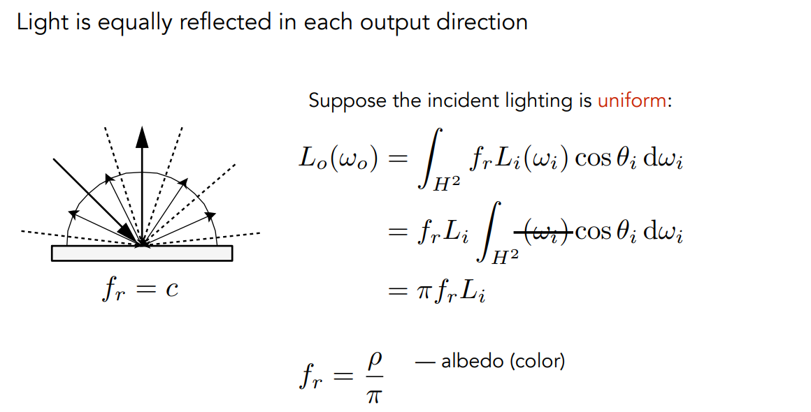

### 17.1.2	镜面反射 BRDF

1. 将入射光、反射光、平面放到立体角中
2. 立体角坐标轴的Z轴方向为法线方向，XY平面为物体表面

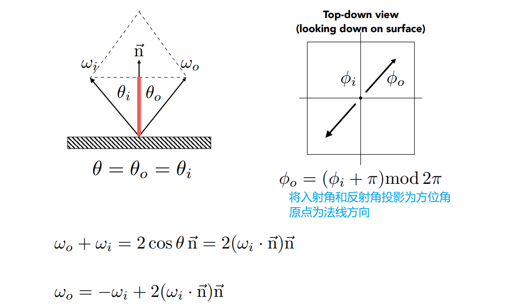-

### 17.1.3	折射 BTDF

1. 使用折射定律，算出反射角对应的$\theta$
2. 然后通过方位角，求解对应向量

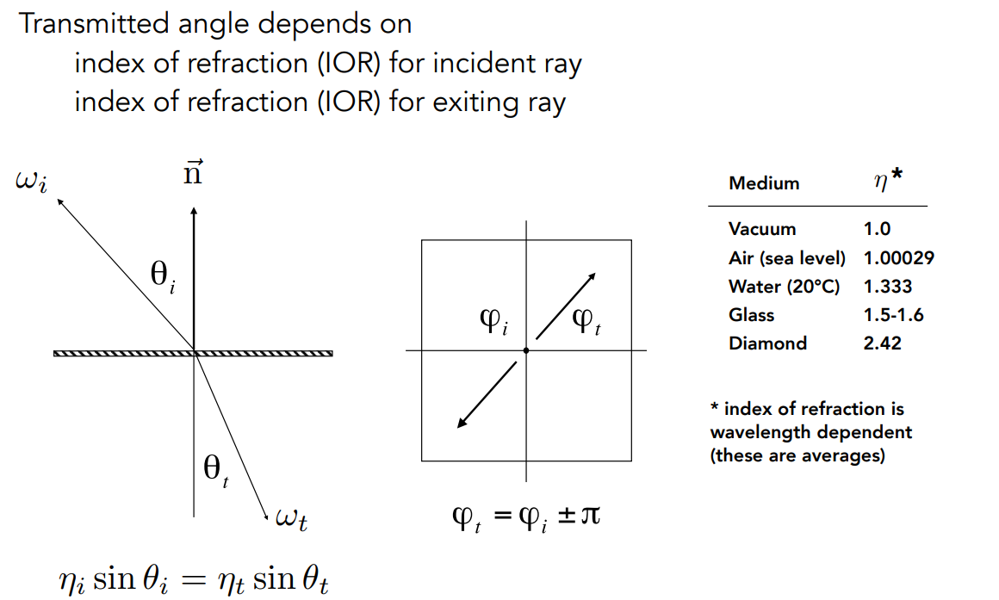

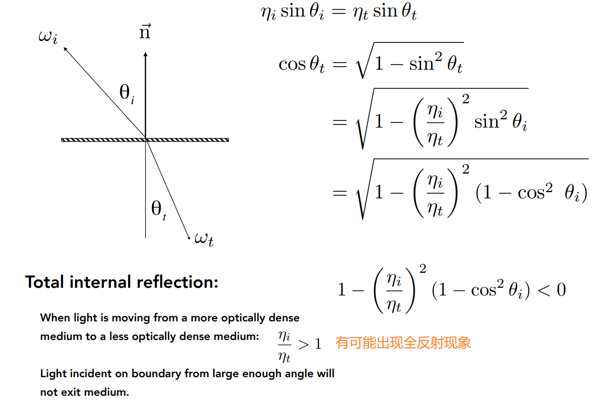

###  17.1.4	菲涅尔项：多少光反射，多少光折射

1. **反射率**取决于**入射角度**

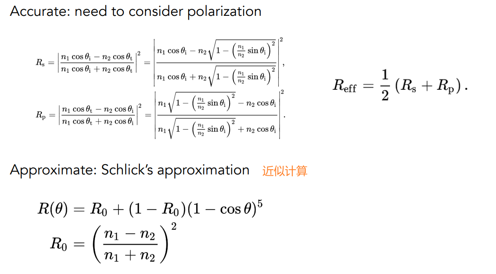

> 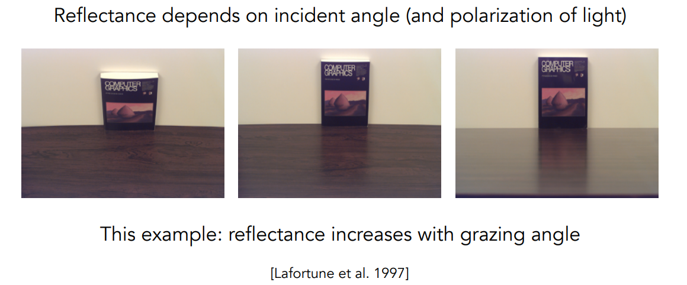
>
> 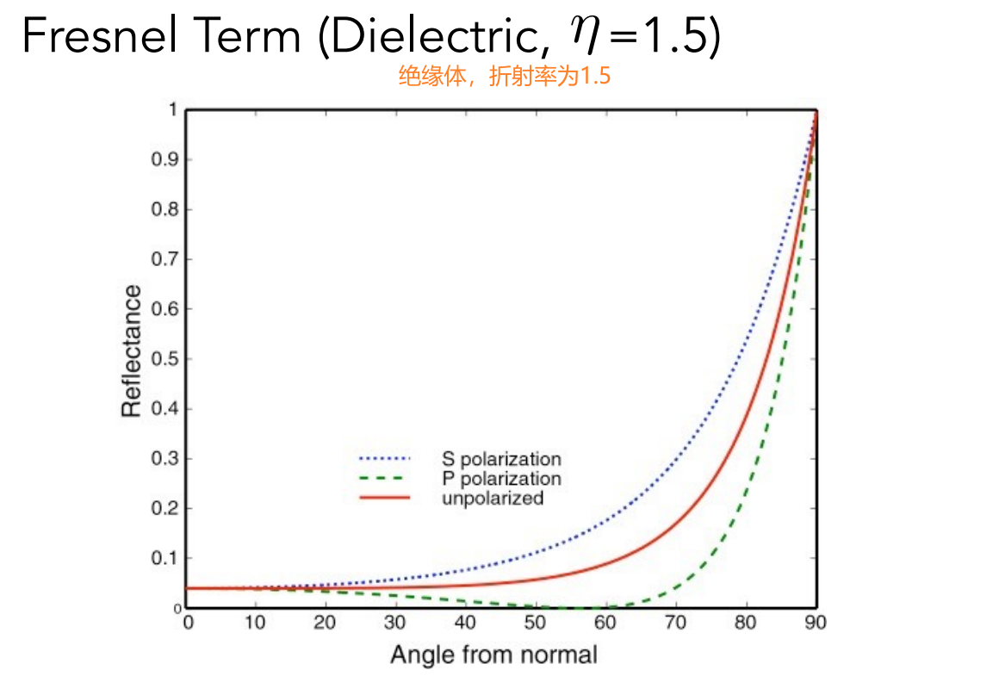
>
> 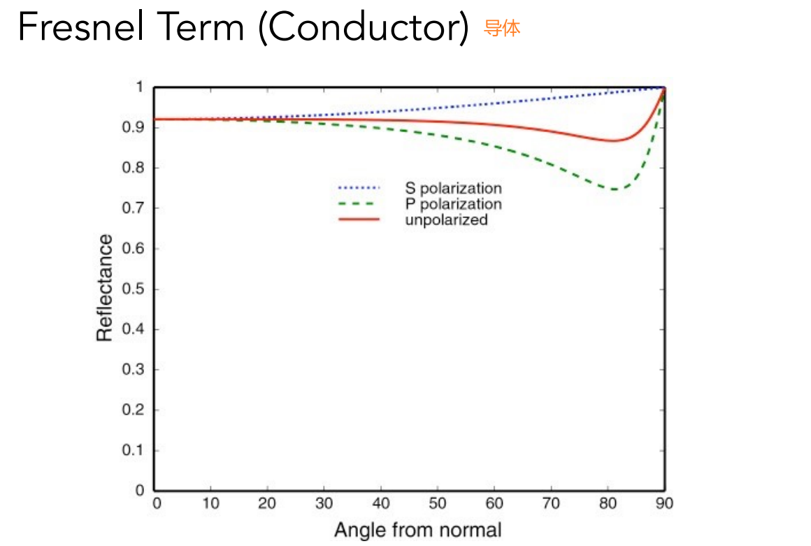

## 17.2	微表面模型 Microfacet Material

1. 从近处看：看到几何
2. 从远处看：看到材质、外观

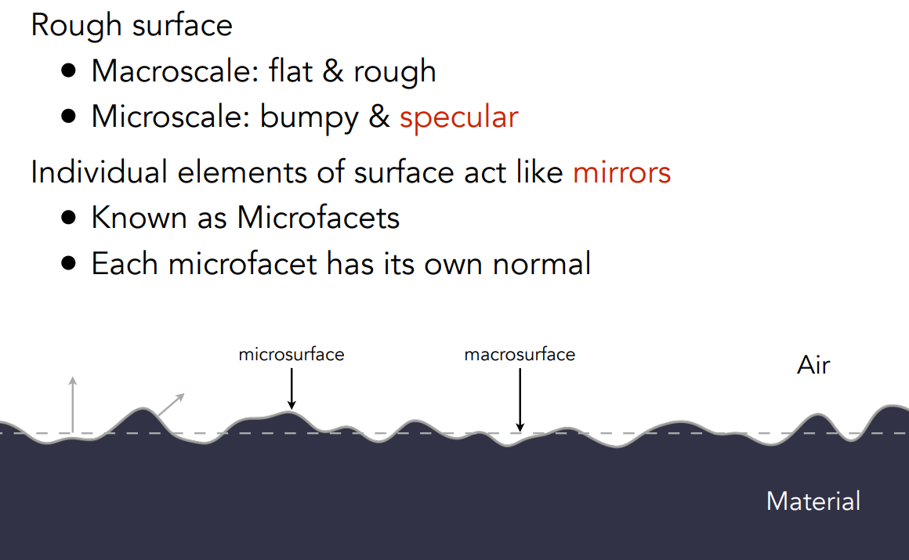

### 17.2.1	微表面BRDF

1. 微表面的法线分布，可以表示表面的粗糙程度
   1. 法线分布集中 <=> glossy
   2. 法线分布发散 <=> diffuse

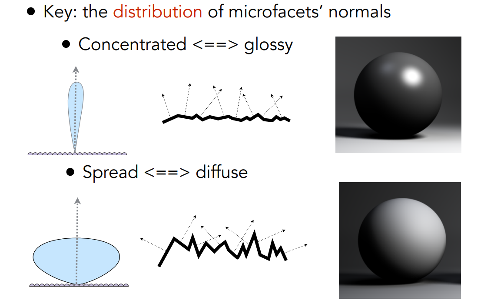

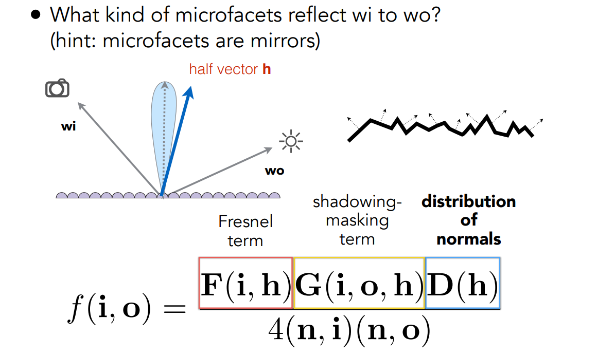
