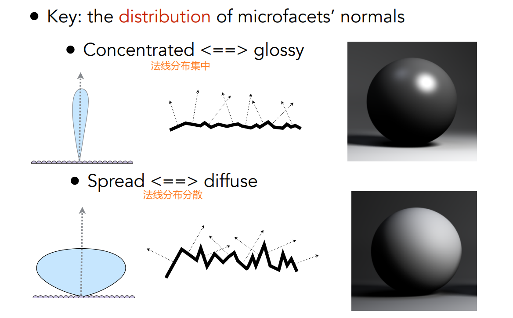
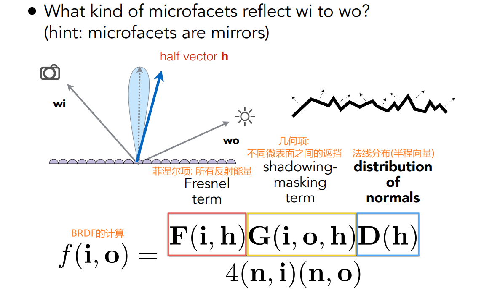
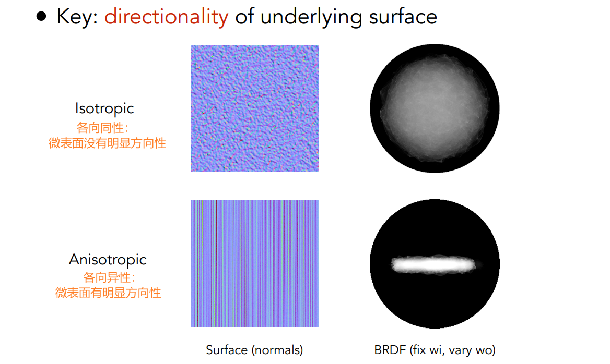
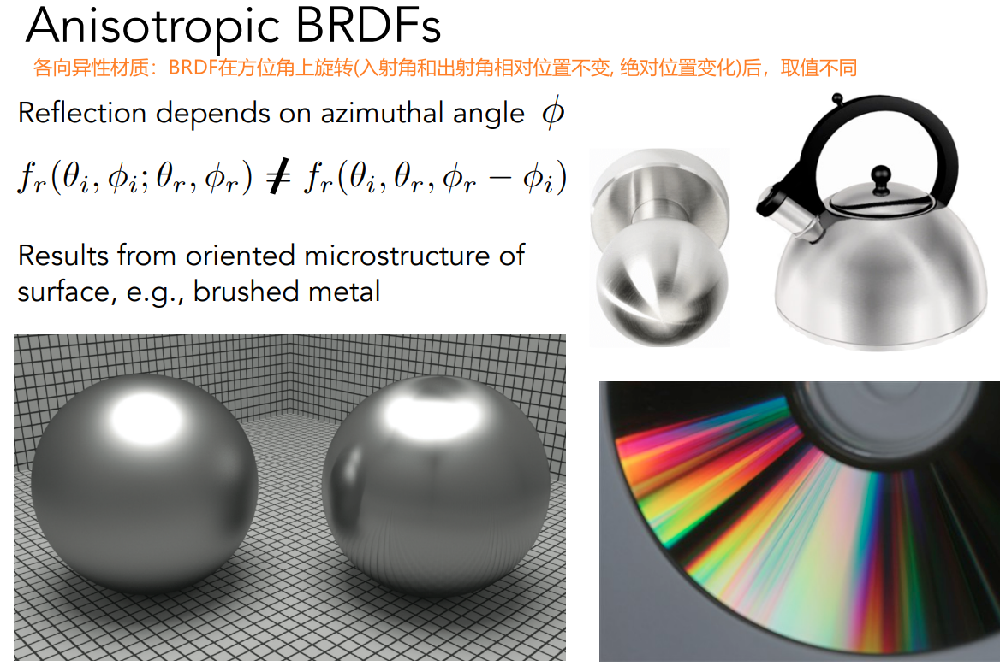
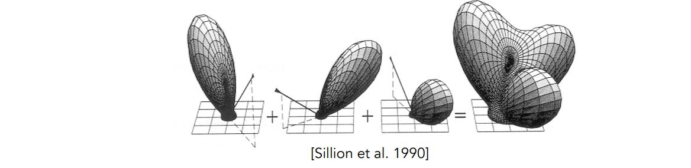
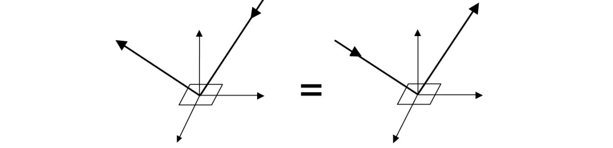
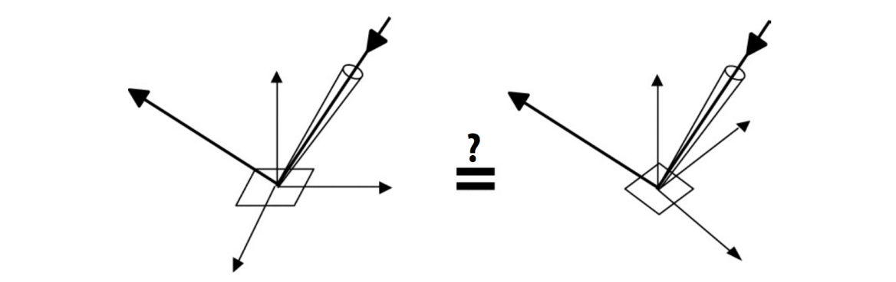
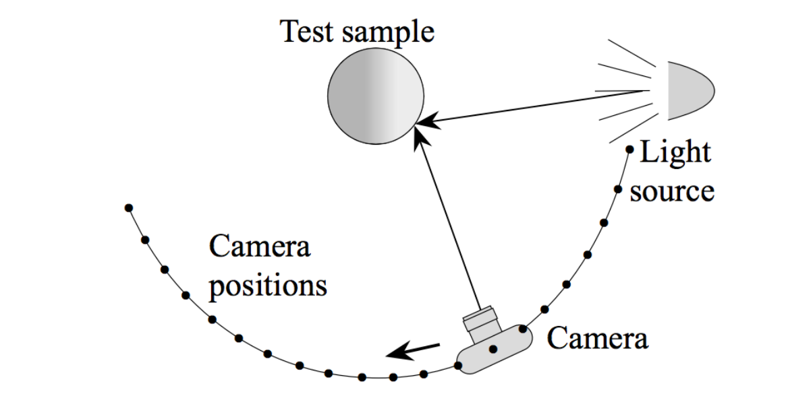
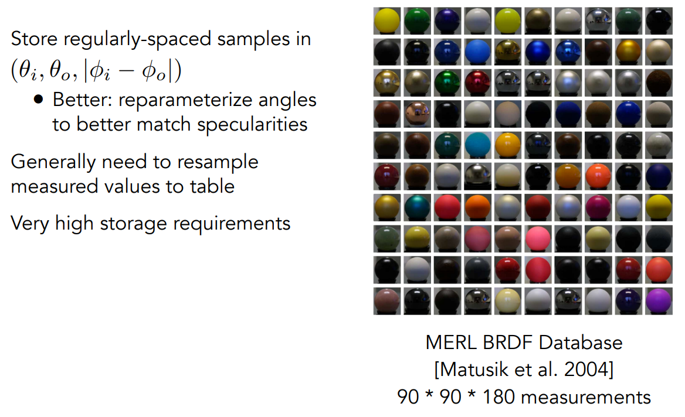

[TOC]

# 十七、材质与外观

## 17.1	材质 == BRDF + BTDF= BSDF

### 17.1.1	漫反射材质 BRDF

1. 光线会被均匀的反射到每个方向
2. 完全不吸收能量、不发光的漫反射材质：$f_r=\frac{\rho}{\pi} \in[0,\frac{1}{\pi}]$
   1. 其中$\rho \in [0,1]$，表示对光的反射率

### 17.1.2	镜面反射 BRDF

1. 将入射光、反射光、平面放到立体角中
2. 立体角坐标轴的Z轴方向为法线方向，XY平面为物体表面

-

### 17.1.3	折射 BTDF

1. 使用折射定律，算出反射角对应的$\theta$
2. 然后通过方位角，求解对应向量

###  17.1.4	菲涅尔项：多少光反射，多少光折射

1. **反射率**取决于**入射角度**

> 
>
> 
>
> 

## 17.2	微表面模型 Microfacet Material

1. 从近处看：看到几何
2. 从远处看：看到材质、外观

### 17.2.1	微表面BRDF

1. 微表面都是完全的镜子，只有在镜面反射方向，才能看到反射光线
2. 微表面的法线分布，可以表示表面的粗糙程度
   1. 法线分布集中 <=> glossy
   2. 法线分布发散 <=> diffuse
3. 当光线接近平行射入表面时，微表面之间的相互遮挡较大
   1. 称为grazing angle

### 17.2.2	各向同性/各向异性材质 Isotropic/Anisotropic Materials

## 17.3	BRDF的性质

1. 值非负：$f_r(\omega_i \rightarrow \omega_r) \ge 0$

2. 线性性质：$L_r(p,\omega_r)=\int_{H^2}f_r(p,\omega_i \rightarrow \omega_r)L_i(p, \omega_i)cos \theta_i\ d\omega_i$

   1. 可以分成很多块，然后相加

   

3. 可逆性：$f_r(\omega_i \rightarrow \omega_r) = f_r(\omega_r \rightarrow \omega_i)$

   

4. 能量守恒：$\forall \omega_r, \int_{H^2}f_r(\omega_i \rightarrow \omega_r)cos \theta_i\ d\omega_i \le 1$

   1. BRDF不可能让能量变多
   2. 因此，光线追踪经过很多次反射后，能量会收敛

5. 各向同性 & 各向异性

   1. 各向同性：$f_r(\theta_i,\phi_i;\theta_r,\phi_r)=f_r(\theta_i,\theta_r,\phi_r-\phi_i)$
      1. 降低了一个维度的自由度
   2. 考虑对称性，对于所有的BRDF：$f_r(\theta_i,\theta_r,\phi_r-\phi_i)=f_r(\theta_r,\theta_i,\phi_i-\phi_r)=f_r(\theta_i,\theta_r,|\phi_r-\phi_i|)$

   

## 17.4	测量BRDF

1. 给定一个光源(入射方向)、一个摄像机(出射方向)
2. 更改这光源和摄像机的位置，测量对应的BRDF
3. 优化：
   1. 对于各向同性的物体，可以通过方位角，将4D转化为3D
   2. 可逆性：降低了一半的测量次数

## 17.5	保存BRDF

MERL BRDF Database：

1. 测量了很多不同的材质
2. 保存为三维数组

