[TOC]

# 十九、相机&透镜&光场

## 19.1	相机

快门：控制光在某个极短时间内进入相机

传感器：将光的信息记录下来，只能记录Irradiance，不能记录radiance，因此需要小孔/棱镜成像

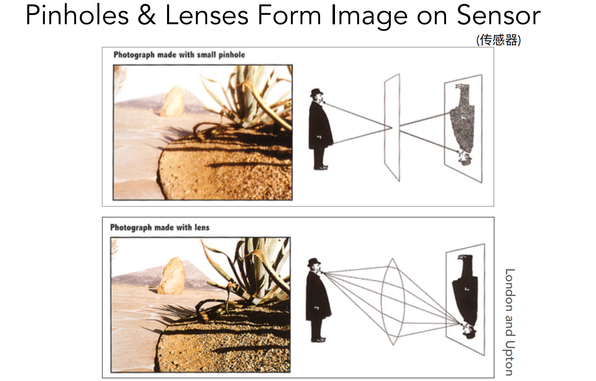

### 19.1.1	针孔相机

1. 没有景深的效果，不会模糊

### 19.1.2	基础概念

#### 19.1.2.1	视场 FOV

**FOV**：视场

1. 传感器高度：**h**
2. 传感器到小孔的距离：**焦距f**
3. 焦距越大，视场越大
4. 传感器越小，视场越小

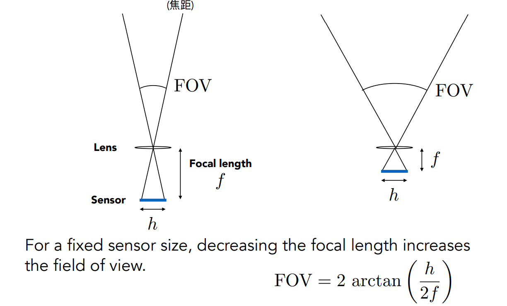

> 以**35mm格式**的胶片为标准，通过更改**焦距f**，定义视场
>
> 1. 也就是确定了传感器高度**h**
> 2. 通常说的是等效到35mm格式，而不是传感器就是35mm

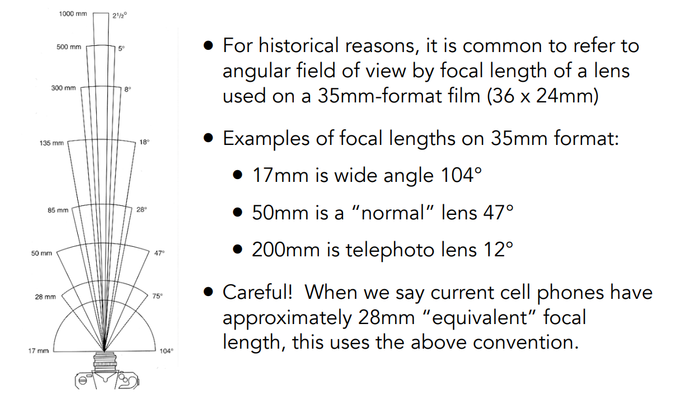

传感器sensor和胶片film可以不一样，但可以当作是一样的

1. 传感器：接收到了具体信息
2. 胶片：最后呈现的效果

> 小的传感器 + 小焦距，可以得到相同的视场

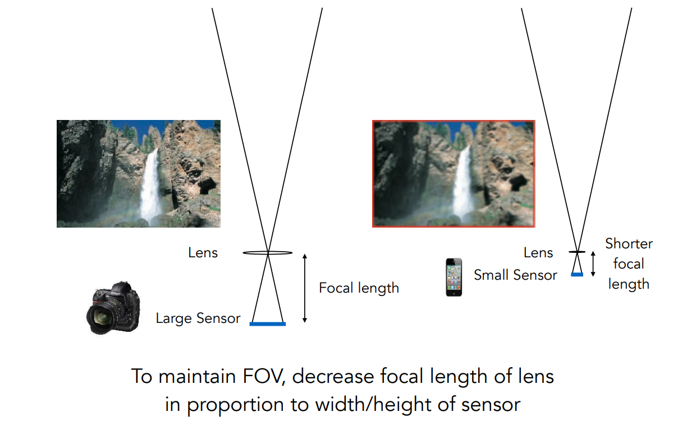

#### 19.1.2.2	曝光度 Exposure

**Exposure = 时间(T) × Irradiance(E)**

1. 时间越长、单位时间内接收到的能量越多，最后的曝光度越大
2. 曝光度记录的是energy，而不是power
3. 时间：由快门控制
4. Irradiance：由很多因素决定，如光圈

#### 19.1.2.3	影响曝光度的因素：光圈&快门&ISO

1. 光圈**Aperture Size**：用**`FN`或`F/N`**表示
   1. 模拟人的瞳孔，通过**F-stop/F-number**控制开关
   2. **N**对应光圈半径的倒数
   3. **光圈越大，越亮，但是远的部分越模糊**
   4. 如果要考虑景深，光圈就应该小，图像就会暗，因此就需要更长的快门时间，从而无法考虑运动模糊的问题
2. 快门**Shutter speed**：用分数表示
   1. 控制记录的时间
   2. **时间越长，越模糊**
   3. 因为存在运动模糊效果：对快门时间内记录到的所有信息做了一个平均
   4. 相当于在时间上采样时，做了一个模糊效果
   5. **Rolling shutter**：对于高速运动的物体，可能会出现扭曲的现象
3. 感光度**ISO gain**：用ISOxx表示
   1. 类似于后期处理，对接收到的光乘上某个数
   2. 可以发生在硬件上，也可以发生在软件上
   3. **ISO越大，越亮，但是噪声也越大**

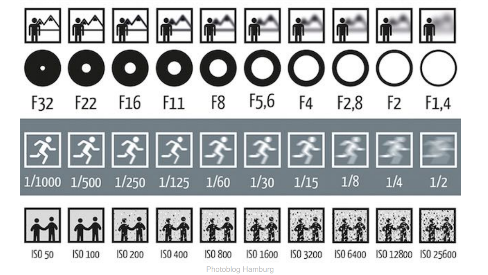

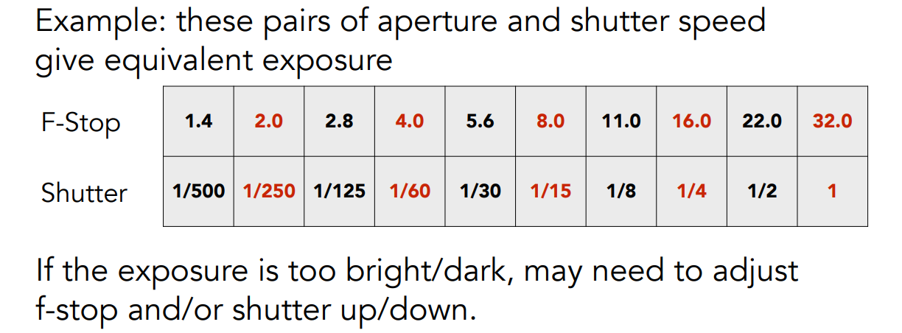

#### 19.1.2.4	高速/低速摄影

**高速摄影**

1. 即每秒钟要拍更多的照片
2. 快门时间变短，同时需要更大的光圈

**低速摄影/延迟摄影**

1. 即每秒钟要拍更少的照片
2. 快门时间变长，就是需要运动模糊

## 19.2	薄透镜近似

### 19.2.1	理想化薄透镜

1. 平行光可以汇聚到焦点上，过交点可以发散为平行光
2. 过中心不改变光路
3. 可以任意更改焦距：通过透镜组，动态改变焦距

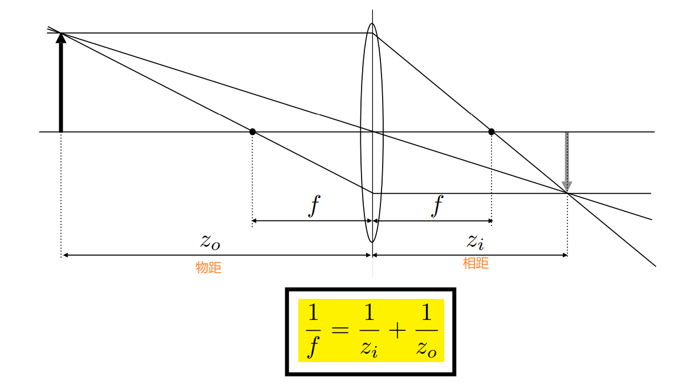

### 19.2.2	焦散模糊 Defocus Blur

**CoC**：Circle of Confusion

1. 当感光器在成像点后面时，会导致成像为一个圆
2. 光圈越大，CoC越大

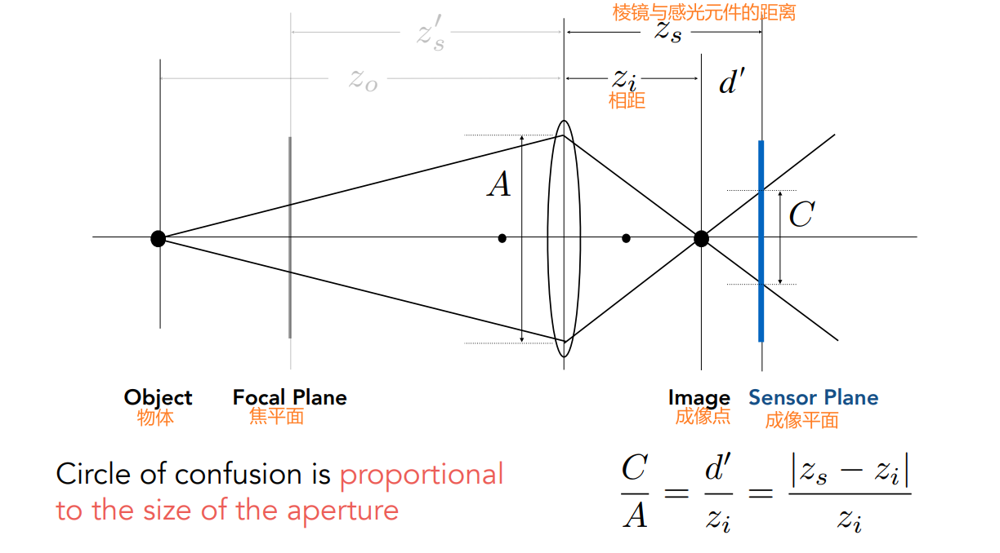

### 19.2.3	F-Number的定义

1. F-Number = 焦距 / 光圈直径
2. 拍的更清楚 => 使用小光圈

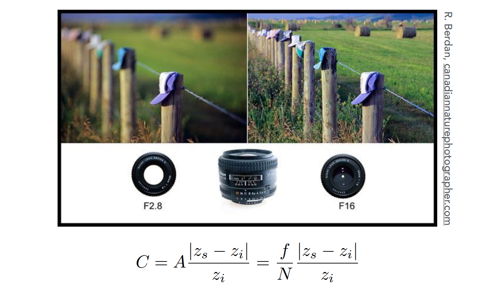

## 19.3	光线追踪模拟薄透镜

### 19.3.1	定义

1. 感光器的大小
2. 焦距、光圈大小
3. 物体与棱镜的距离，即物距**z~o~**

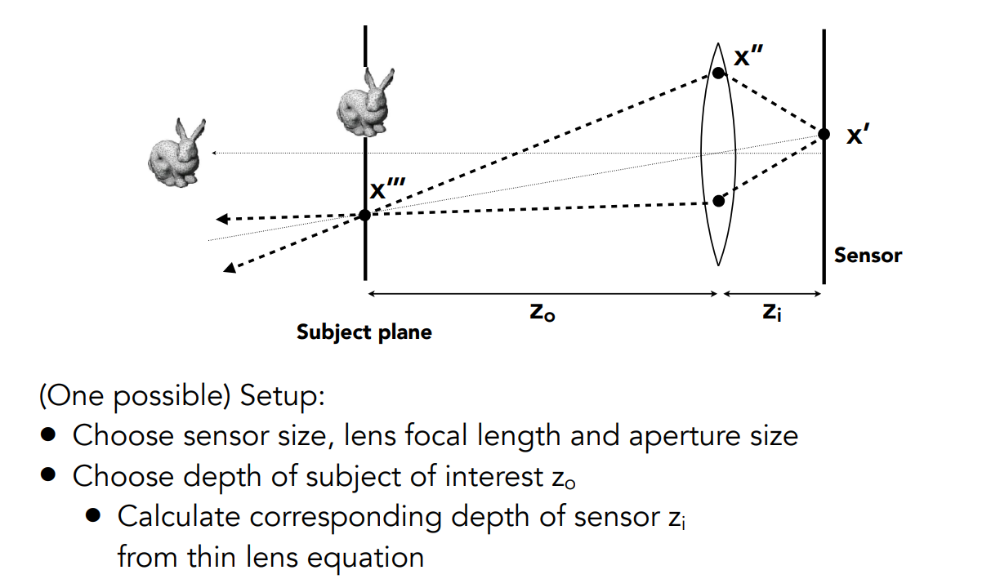

### 19.3.2	渲染方式

1. 在感光元件上选一个点**x'**
2. 在透镜上选另一个点**x''**
3. 连接**x'**和**x''**，可以得到通过该透镜后的光线**x''→x'''**
4. 考虑**x''→x'''**的Radiance，记录到**x'**上即可

## 19.4	景深 Depth of Field：D~F~ ~ D~N~

1. 用不同的光圈，会影响模糊的范围
2. 在**实际场景**中有**一段深度(景深)**，这段通过透镜，会在成像区域附近形成一个区域，我们认为这个区域内的CoC都是足够小的
3. 这段深度内的像素，认为均是锐利的，即不模糊的

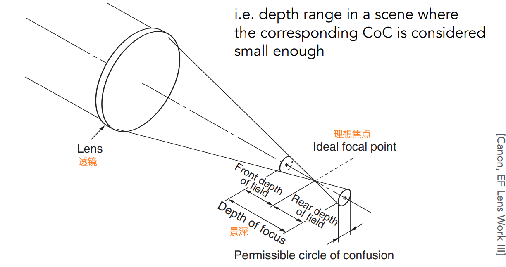

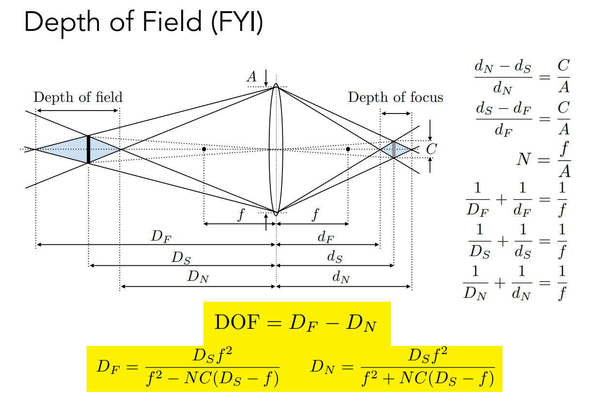

## 19.5	光场 Light Field / Lumigraph

### 19.5.1	全光函数 Plenoptic Function

#### 19.5.1.1	Grayscale snapshot：P(θ, Φ)

1. 定义了在一个固定地方，向任意一个**方向(θ, Φ)**看，能够看到的亮度值

#### 19.5.1.2	Color snapshot：P(θ, Φ, λ)

1. 定义了在一个固定地方，向任意一个**方向(θ, Φ)**看，能够看到的**波长为λ**的亮度值

#### 19.5.1.3	Movie：P(θ, Φ, λ, t)

1. 定义了在一个固定地方，在某个**时间t**，向任意一个**方向(θ, Φ)**看，能够看到的**波长为λ**的亮度值
2. 即电影

#### 19.5.1.4	Holographic Movie：P(θ, Φ, λ, t, V~X~, V~Y~, V~Z~)

1. 定义了在某个**位置(V~X~, V~Y~, V~Z~)**，在某个**时间t**，向任意一个**方向(θ, Φ)**看，能够看到的**波长为λ**的亮度值
2. 即全息电影

#### 19.5.1.5	Plenoptic Function：P(θ, Φ, λ, t, V~X~, V~Y~, V~Z~)

1. 在任何**时间t**、任何**地点V**、向任何**方向(θ, Φ)**看，所能看到的所有的**光λ**
2. 是一个七维函数

### 19.5.2	光线的定义

5个维度：**P(θ, Φ, V~X~, V~Y~, V~Z~)**

1. 3个维度的坐标
2. 2个维度的方向

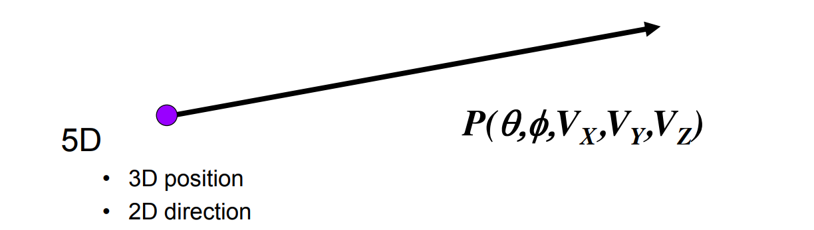

4个维度：

1. 2维的位置：**(u, v)**
2. 2维的方向：**(θ, Φ)**

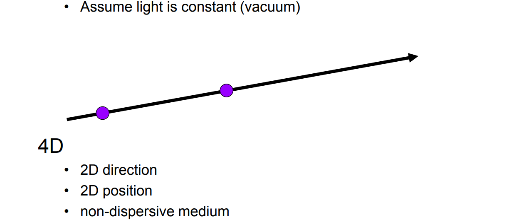

### 19.5.3	全光表面 Plenoptic Surface

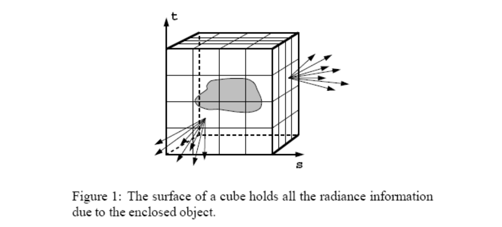

光场：任何一个位置，往任何一个方向去的光的强度

1. 在表面的位置：**(u, v)**
2. 方向：**(θ, Φ)**
3. 从任意一个位置，往任意一个方向看，都看到该光场的强度

### 19.5.4	光场

不需要直到物体具体是什么，只需要直到**包围盒外**的光场信息

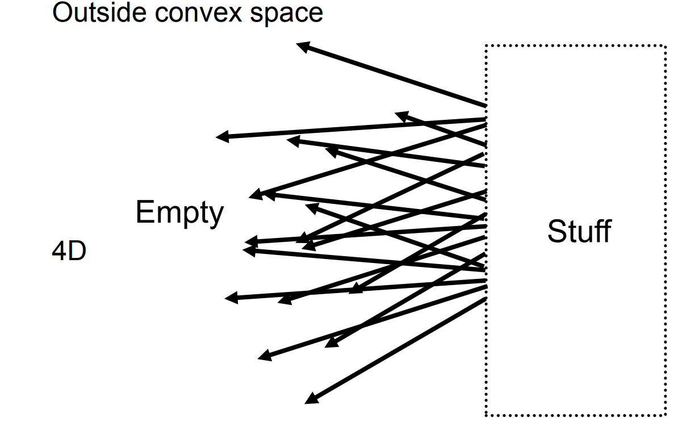

### 19.5.5	Lumigraph-Organization

取一个平面，只需要直到该平面上任何一个位置，往任何一个方向去的光的强度

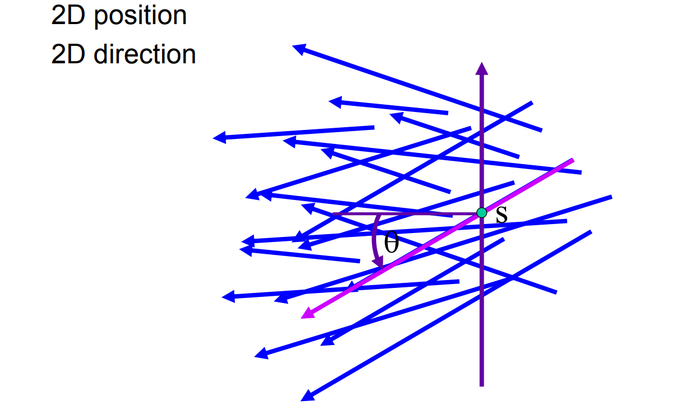

也可以定义两个平面**(u,v) & (s,t)**，定义该光线

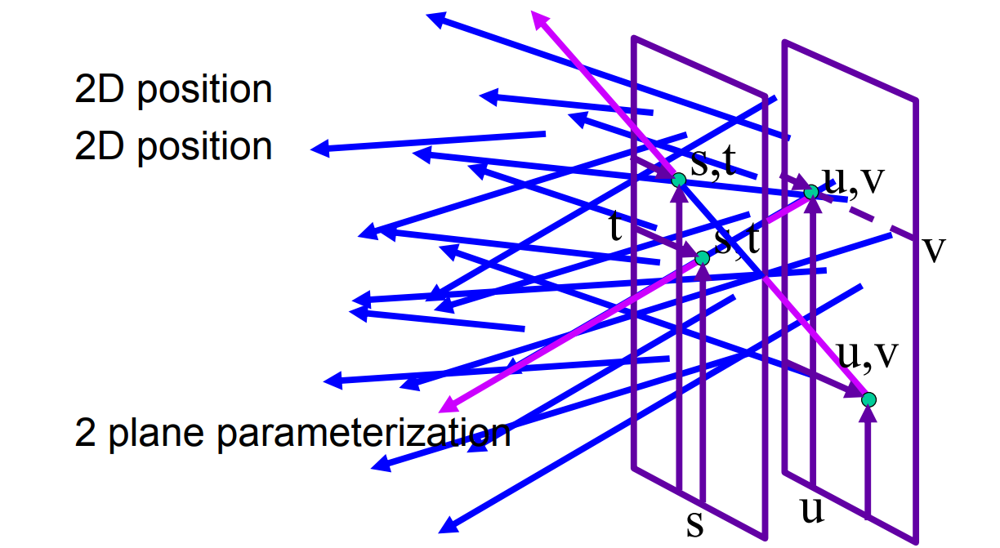

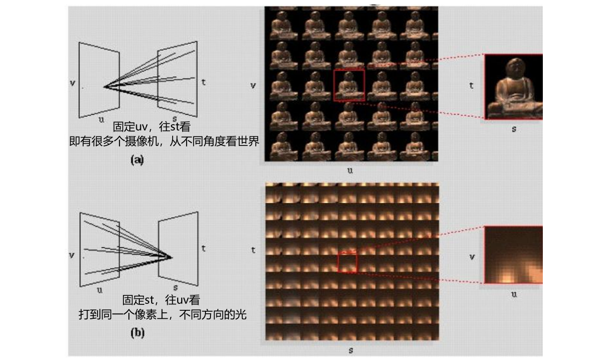

>
>
>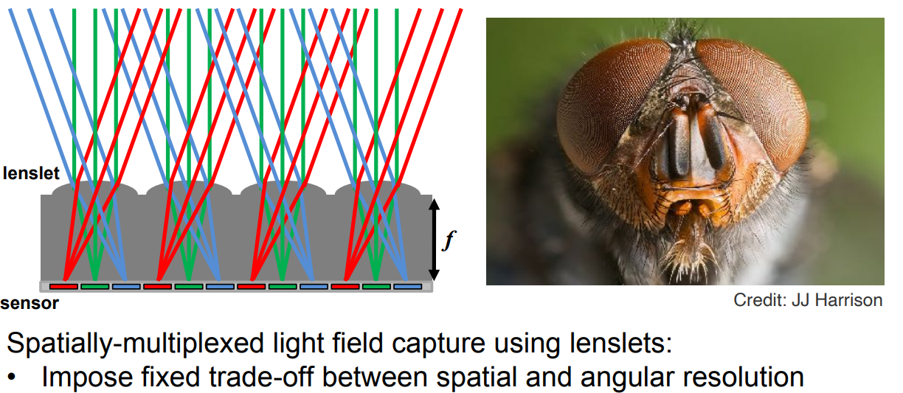

### 19.5.6	光场摄像机

