[TOC]

# 第2课：线性代数复习

## 2.1	向量点乘

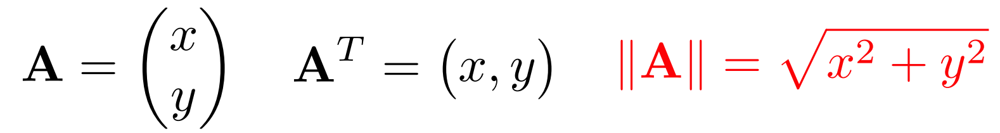

### 2.1.1	定义

$$
\begin{aligned}
\vec{a}·\vec{b}&=||\vec{a}||*||\vec{b}||*\cos\theta \\
			   &=x_a*x_b+y_a*y_b+z_a*z_b\\
\end{aligned}
$$

### 2.1.2	性质

1.   $\vec{a}·\vec{b}=\vec{b}·\vec{a}$
2.   $\vec{a}·(\vec{b}+\vec{c})=\vec{a}·\vec{b}+\vec{a}·\vec{c}$
3.   $(k\vec{a})·\vec{b}=\vec{a}·(k\vec{b})=k(\vec{a}·\vec{b})$

### 2.1.3	应用

1. 计算夹角：$\cos\theta=\frac{\vec{a}·\vec{b}}{||\vec{a}||*||\vec{b}||}$

   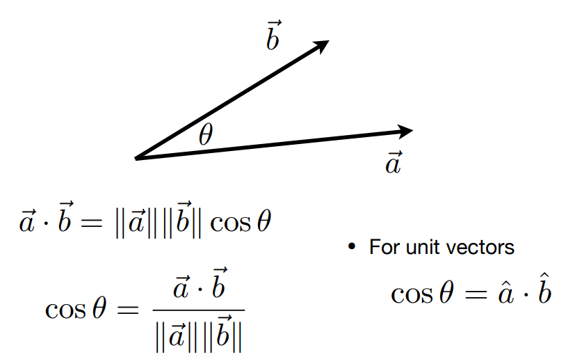

2. 计算投影：$||\vec{b}_⊥||=||\vec{b}||\cos\theta$，$\vec{b}_⊥=(||\vec{b}||\cos\theta)\ \hat a$

   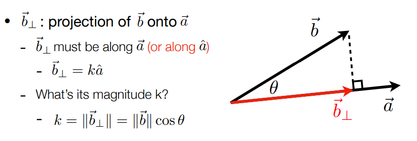

3. 将$\vec{b}$在$\vec{a}$方向分解：$\vec{b}=\vec{b}_⊥+(\vec{b}-\vec{b}_⊥)$

   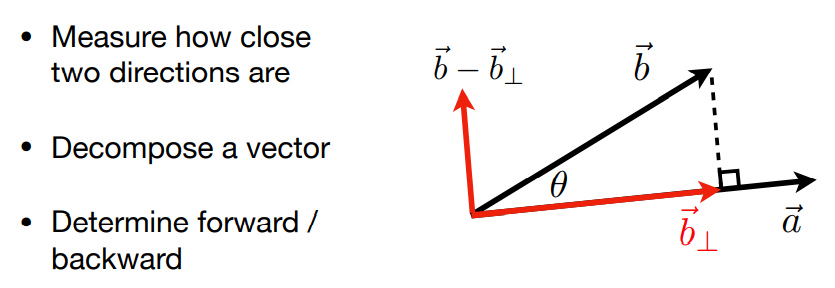

4. 向量之间的方向

   1.   $\vec{a}$与$\vec{b}$方向基本一致：$\hat{a}·\hat{b} > 0$，越接近1，夹角越接近0°
   2.   $\vec{a}$与$\vec{b}$方向基本相反：$\hat{a}·\hat{b} < 0$，越接近-1，夹角越接近180°
   3.   $\vec{a}$与$\vec{b}$垂直：$\hat{a}·\hat{b}=0$

   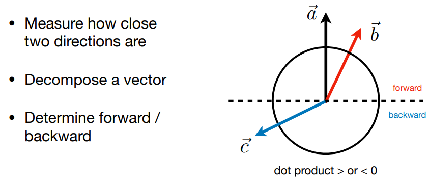

## 2.2	向量叉乘

### 2.2.1	定义

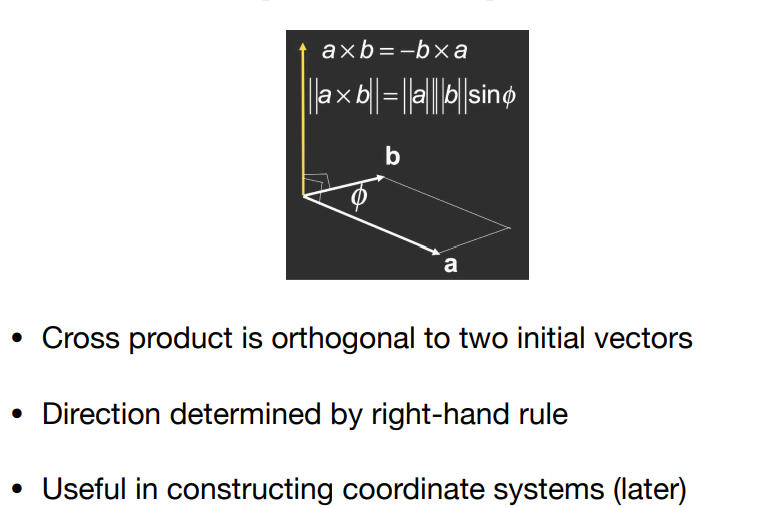

大小：$||\vec{a}×\vec{b}||=||\vec{a}||*||\vec{b}||*\sin\theta$

方向：右手螺旋定则，四指方向为$\vec{a}$旋转到$\vec{b}$，拇指方向为$\vec{a}×\vec{b}$的方向

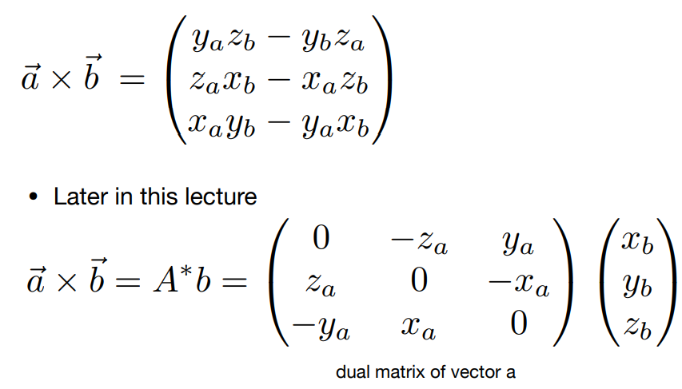

### 2.2.2	性质

性质：$\vec{a}×\vec{b}=-\vec{b}×\vec{a}$，可以用于建立空间直角坐标系：

1. 右手坐标系：$\vec{x}×\vec{y}=\vec{z}$
2. 左手坐标系：$\vec{x}×\vec{y}=-\vec{z}$

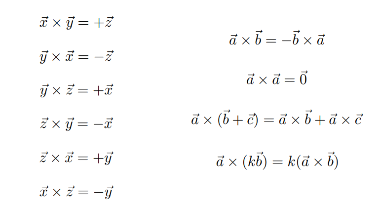

### 2.2.3	应用

1. 判断左右：假设$\vec{a}、\vec{b}$均在XY平面上

   1.   $\vec{b}$在$\vec{a}$的左侧：$Z_{\vec{a}×\vec{b}}>0$
   2.   $\vec{b}$在$\vec{a}$的右侧：$Z_{\vec{a}×\vec{b}}<0$

   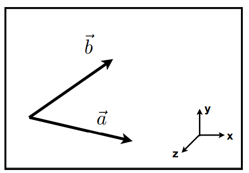

2. 判断内外：假设ABCP四点共面

   1.   P在▲ABC的内部：若ABC逆时针排列，则都在左面；若ABC顺时针排列，则都在右面
        1.   $\vec{AP}$在$\vec{AB}$的左面
        2.   $\vec{BP}$在$\vec{BC}$的左面
        3.   $\vec{CP}$在$\vec{CA}$的左面
   2.   P在▲ABC的外部：上述三个条件有一个不符合

   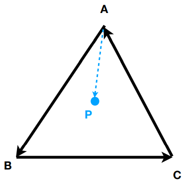

## 2.3	正交基/坐标系 

正交基：Orthonormal Bases 

坐标系：Coordinate Frames

### 2.3.1	定义

1.   $\vec{u}、\vec{v}、\vec{w}$均为单位向量
2.   $\vec{u}、\vec{v}、\vec{w}$两两垂直
3.   $\vec{w}=\vec{u}×\vec{v}$

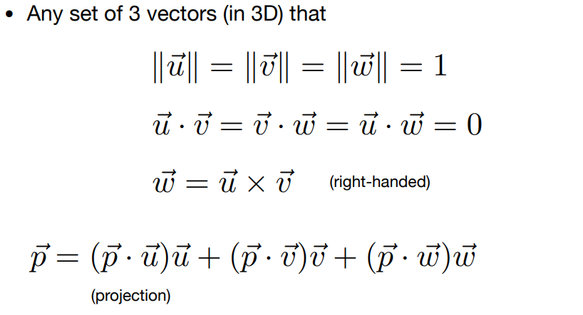

## 2.4	矩阵

### 2.4.1	矩阵乘法

1.   定义：设$A[m][n]*B[n][p]=C[m][p]$，则$C[i][j]=\sum_{k=1}^n A[i][k]*B[k][j]=\{A的第i行\}·\{B的第j列\}$
2.   性质：
     1.   没有交换律
     2.   有结合律：$(AB)C=A(BC)$
     3.   有分配律：$A(B+C)=AB+AC$，$(A+B)C=AC+BC$

### 2.4.2	矩阵转置

1. 定义：将行列互换

   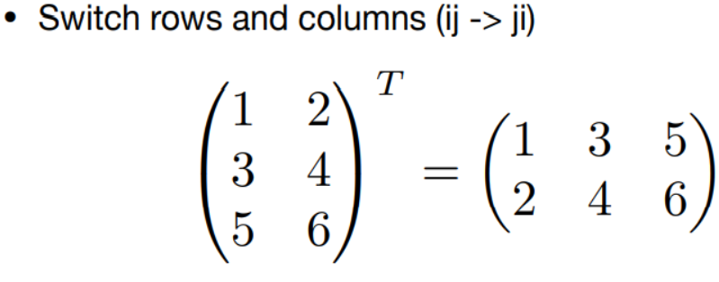

2. 性质：$(AB)^T=B^TA^T$

### 2.4.3	单位矩阵&矩阵的逆

1. 单位矩阵：

   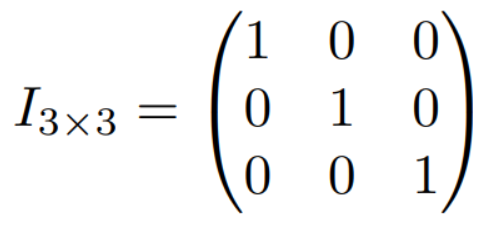

2. 逆矩阵的定义：$AA^{-1}=A^{-1}A=I$

3. 逆矩阵的性质：$(AB)^{-1}=B^{-1}A^{-1}$

### 2.4.4	矩阵&向量点乘/叉乘

1. 向量的对偶矩阵：

   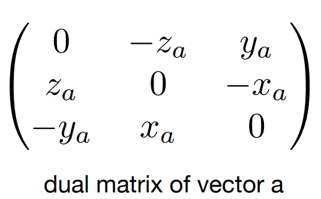

2. 矩阵&向量点乘/叉乘：

   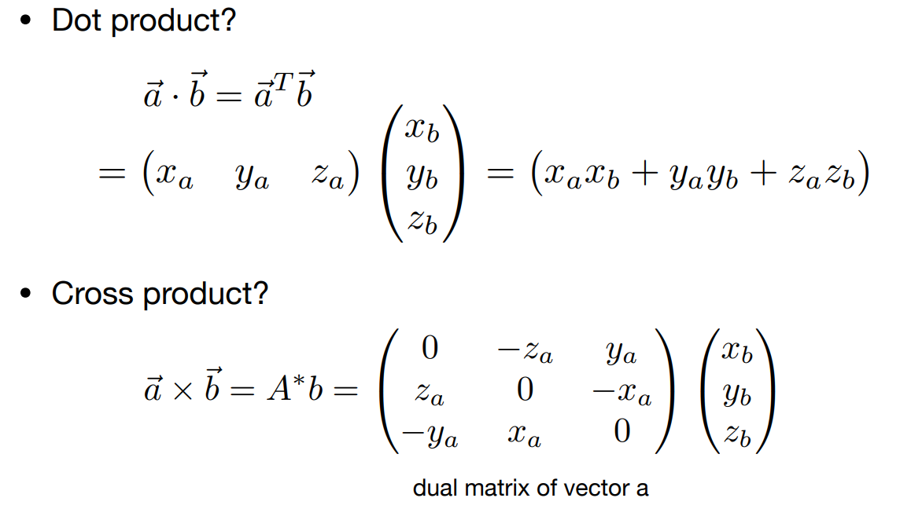