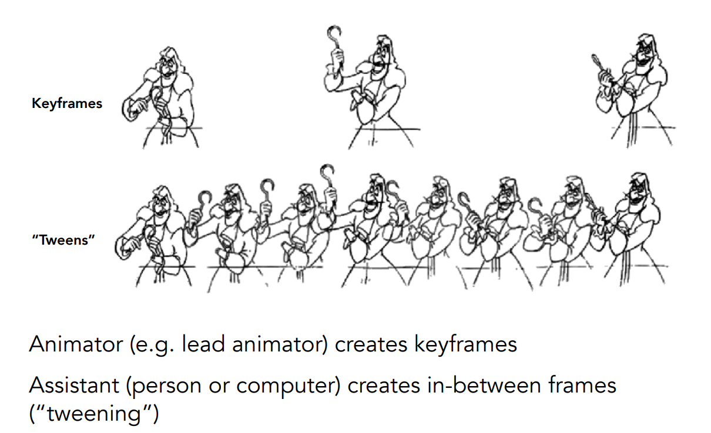
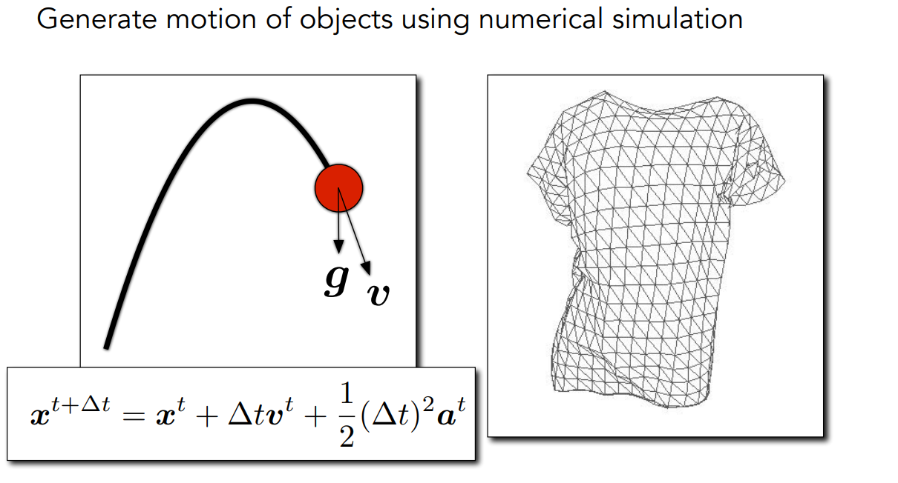
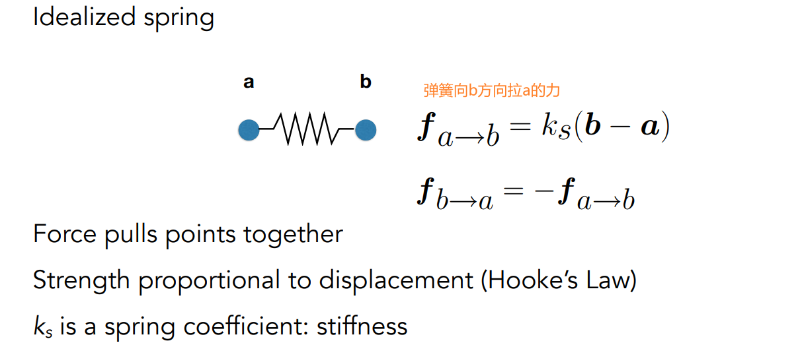
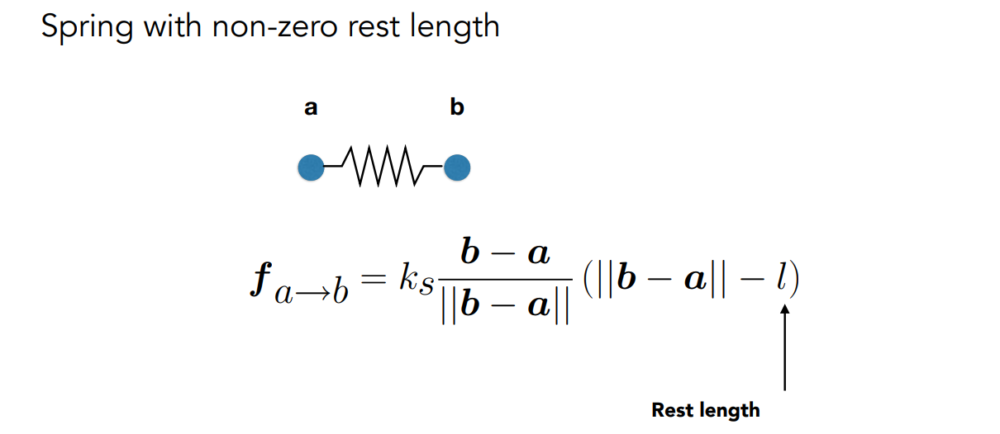
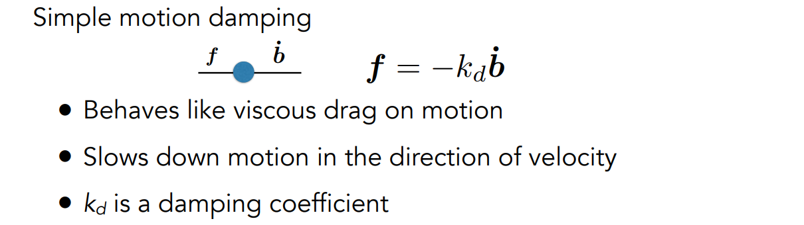
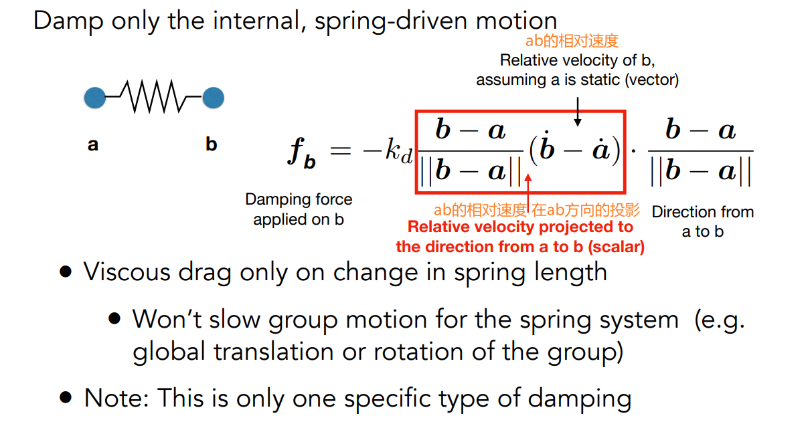
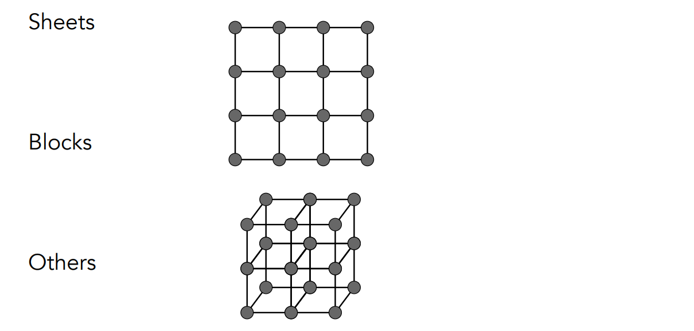
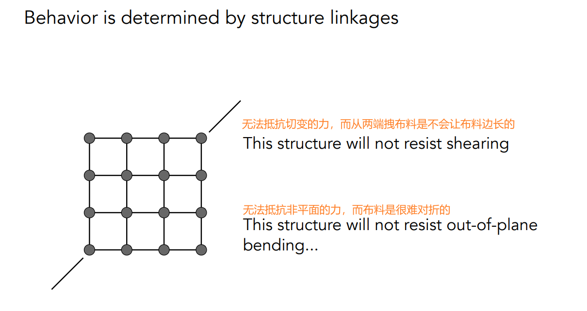
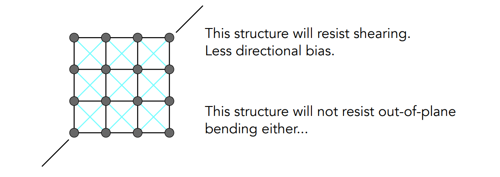

[TOC]

# 二十一、动画/模拟/仿真

## 21.1	关键帧动画

1. 给定一系列关键的帧，通过**插值**，将中间的帧补全

## 21.2	物理模拟

1. 建立物理模型，解某个时刻对应的方程

### 21.2.1	质点弹簧系统 Mass Spring System

1. 是一系列相互连接的质点和弹簧

#### 21.2.1.1	理想弹簧

1. 弹簧没有长度，弹簧的力只与其被拉伸的长度有关
2. $k_s$：劲度系数

#### 21.2.1.2	非零长度弹簧

1. 在理想弹簧的基础上，弹簧的初始长度为$l$
2. 问题：由于动能和弹性势能的相互转换，弹簧会永远震动下去

#### 21.2.1.3	添加能量流失

1. 在非零长度弹簧的基础上，添加一个摩擦力$f=-k_d\dot b$，使弹簧能够停下来
2. $k_d$：阻尼系数 damping coefficient
3. 问题：只能表示弹簧整体的能量损耗，不能表示弹簧内部的能量损耗

#### 21.2.1.4	添加内部阻尼

1. 在上述弹簧的基础上，添加内部阻尼，以让弹簧能够恢复原样
   1. 相对速度的投影：分解到沿着ab方向的速度，只有这个速度会让弹簧产生形变
2. 内部阻尼与弹簧的直接形变没有关系，只与ab的相对速度有关系

#### 21.2.1.5	弹簧的结构

用网格结构的弹簧模拟布料

1. 无法抵抗切变的力：从
2. 无法抵抗out-of-plane的力

> 添加两个方向的对角线方向的弹簧，抵抗切变的力：
>
> 1. 当从两端拉弹簧时，对角线上的弹簧会被压缩，从而产生抵抗切变的力

