[TOC]

# 第3课	变换1：2维变换

变换：

1. Modeling：模型变换，物体在3D空间中的运动
2. Viewing：视图变换，3D到2D的投影

## 3.1	2D Transform

### 3.1.1	Scale缩放变换

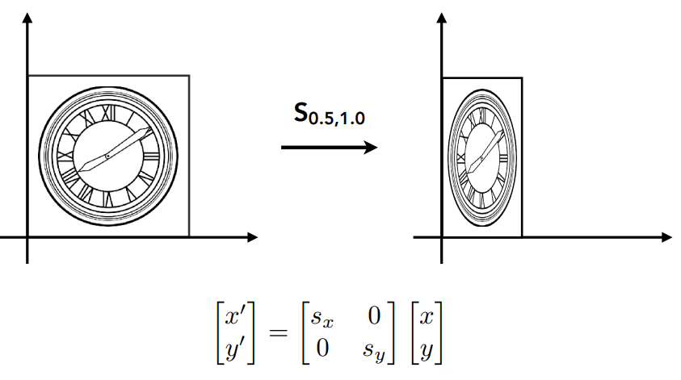

### 3.1.2	Reflectin翻转

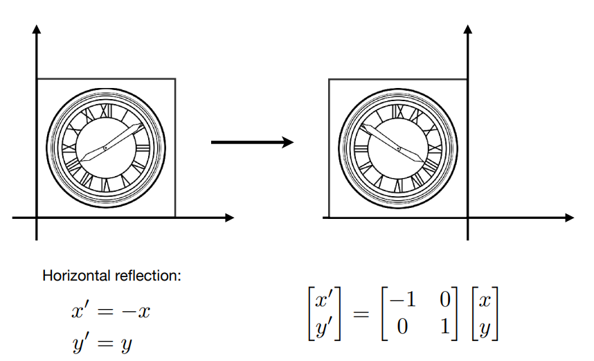

### 3.1.3	Shear切变

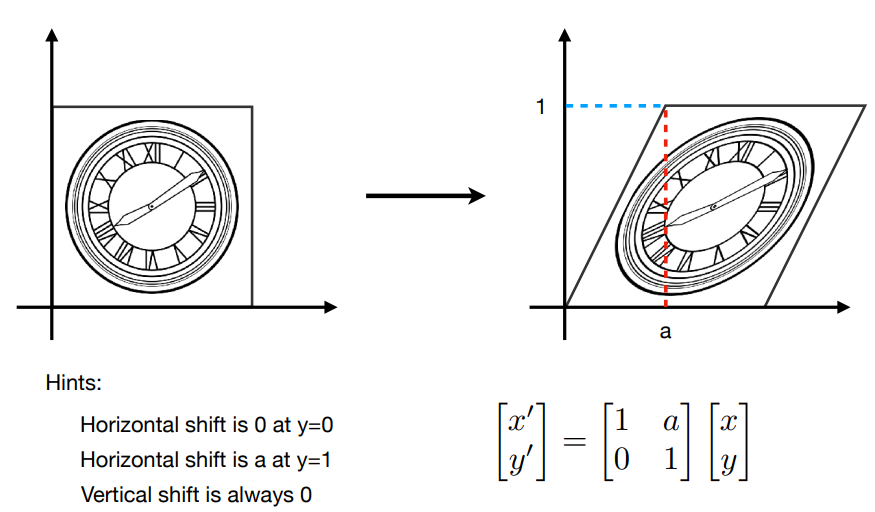

### 3.1.4	Rotate旋转(默认 绕原点 逆时针 旋转)

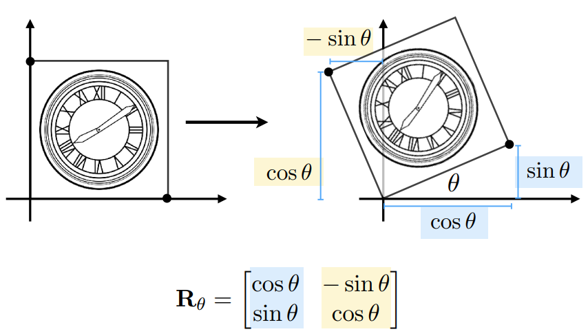

### 3.1.5	Linear Transform线性变换=矩阵

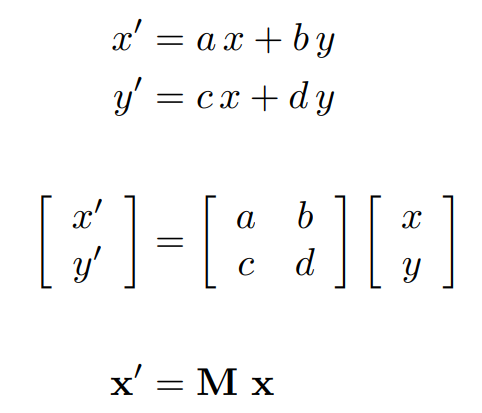

## 3.2	Homogeneous coordinates齐次坐标

### 3.2.1	Translation平移变换$\notin$线性变换

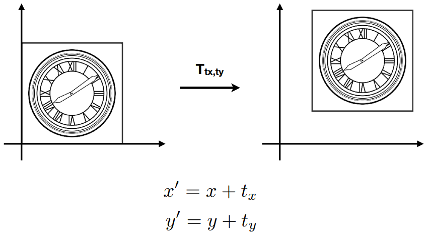

矩阵表示：

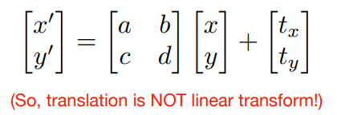

### 3.2.2	齐次坐标

添加一个维度

1.   2维点：$(x,y,1)^T$
2.   2维点的补充形式：$(x,y,w)^T$与$(\frac{x}{w},\frac{y}{w},1)^T$等价
3.   2维向量：$(x,y,0)^T$

对于两者第3个坐标的解释：

1.   点的第三维为0，向量的第三维为1，可以满足向量的平移不变性
2.   且可以满足以下性质
     1.   vector + vector = vector
     2.   point - point = vector
     3.   point + vector = point
     4.   point + point = 两个point的中点

### 3.2.3	Affine Transformation仿射变换 = 线性变换 + 平移变换

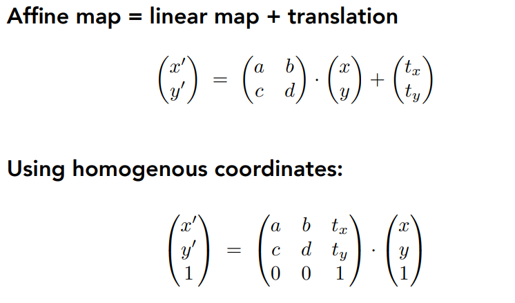

### 3.2.4	2D Transformation

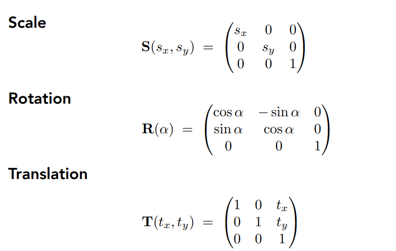

### 3.2.5	Inverse Transform逆变换

逆变换 <==> 乘变换矩阵的逆矩阵

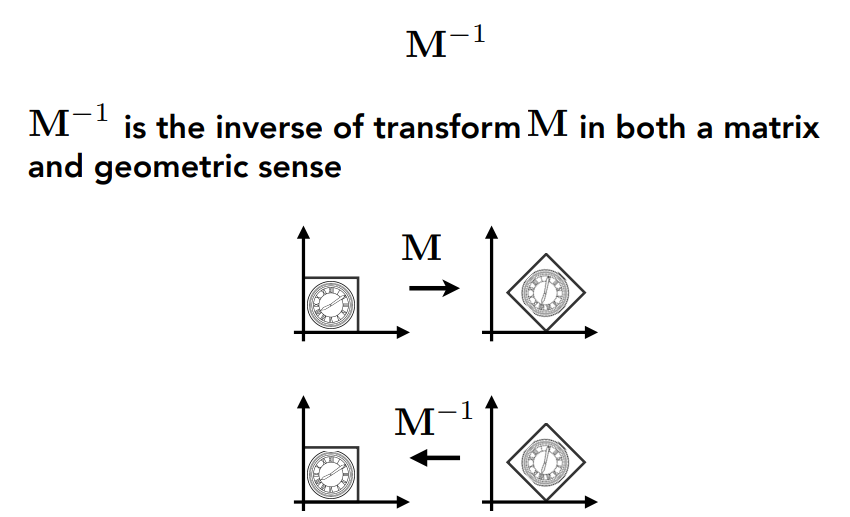

## 3.3	Composing Transforms变换的组合

### 3.3.1	举例

1.   复杂变换可以有简单变换组合而成
2.   简单变换的顺序是很有必要的 <==> 矩阵乘法不满足交换律

变换的目标：

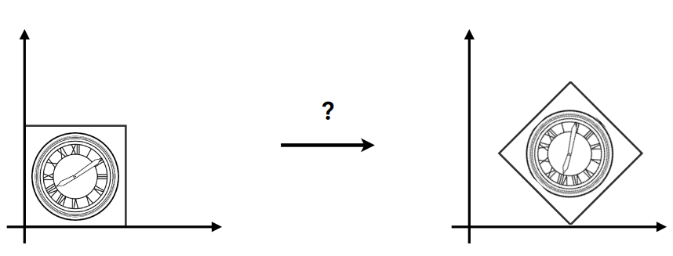

变换的方法：先平移后旋转 or 先旋转后平移

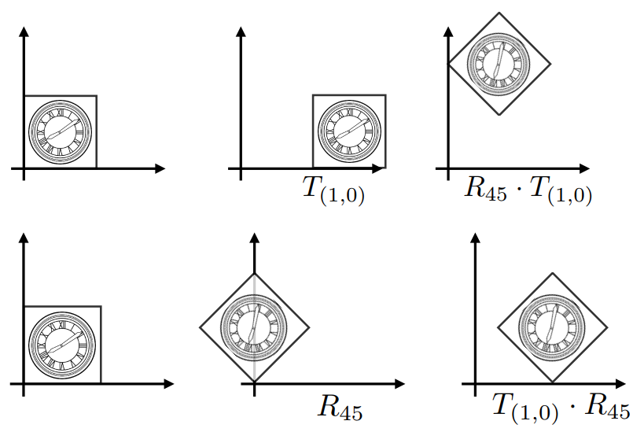

矩阵表示：**从右到左**进行矩阵乘法，顺序为：**缩放 => 旋转 => 平移**

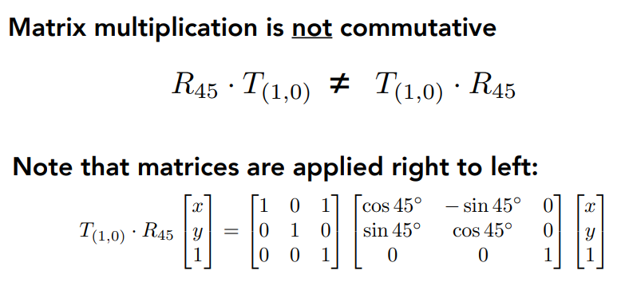

### 3.3.2	多个变换

假设有一系列仿射变换$A_1,A_2,A_3...$

1. 可以用矩阵乘法表示：

   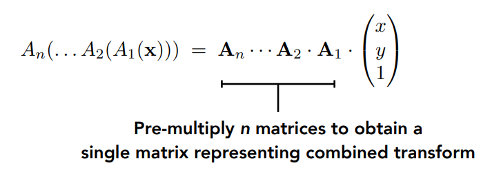

2. 可以先计算$A_n...A_2·A_1$，再与列向量相乘

   1.   一个3*3的矩阵可以表示任意的变换

### 3.3.3	变换的分解

以C点为中心进行旋转$\alpha$度：$T(\vec{c})·R(\alpha)·T(\vec{-c})$

1.   先将图形按照$\vec{-c}$的方向进行平移：$T(\vec{-c})$
2.   然后绕原点旋转$\alpha$度：$R(\alpha)$
3.   然后将图形按照$\vec{c}$的方向进行平移：$T(\vec{c})$

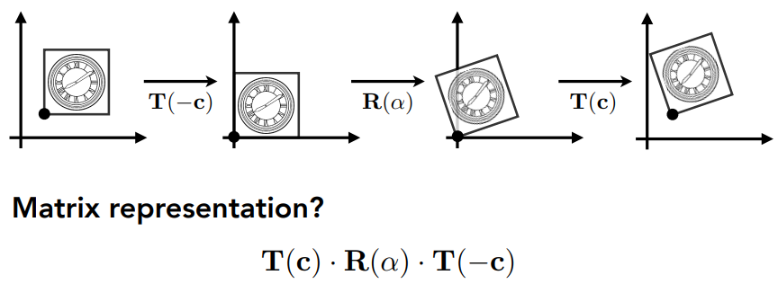