[TOC]

# 第4课	变换(续)

## 4.0	有关旋转的补充

$$
R_{\theta}=
\left(
\begin{matrix}
\cos\theta & -\sin\theta \\ 
\sin\theta & \cos\theta
\end{matrix}
\right) \\

R_{-\theta}=
\left(
\begin{matrix}
\cos\theta & \sin\theta \\ 
-\sin\theta & \cos\theta
\end{matrix}
\right)
=R_{\theta}^T \\

R_{-\theta}=R_\theta^{-1}
$$

正交矩阵：$R^T=R^{-1}$

## 4.1	3D Transformations

### 4.4.1	齐次坐标

1.   3维点：$(x,y,z,1)^T$
2.   3维点的补充形式：$(x,y,z,w)^T$与$(\frac{x}{w},\frac{y}{w},\frac{z}{w},1)^T$等价
3.   3维向量：$(x,y,z,0)^T$

### 4.4.2	Affine Transform

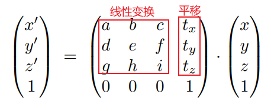

变换的顺序：先**线性变换**，后加**平移**量

#### 4.4.2.1	缩放

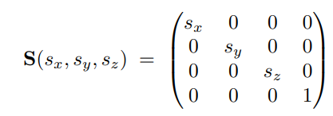

#### 4.4.2.2	平移

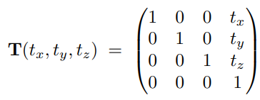

#### 4.4.2.3	旋转

##### 4.4.2.3.1	绕坐标轴旋转

1. 绕X轴：X不变，YZ旋转

   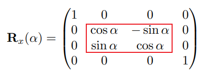

2. 绕Y轴：Y不变，ZX旋转

   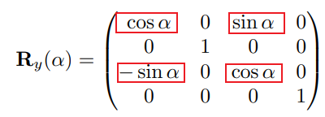

3. 绕Z轴：Z不变，XY旋转

   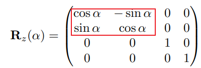

##### 4.4.2.3.2	绕任意过原点的轴旋转：罗德里格旋转公式

1. 绕任意轴旋转

   1.   将任意轴方向的旋转，分解为绕X、Y、Z轴的旋转：$R_{x,y,z}(\alpha,\beta,\gamma)=R_x(\alpha)R_y(\beta)R_z(\gamma)$
   2.   $\alpha,\beta,\gamma$也被称为欧拉角

2. **Rodrigues’ Rotation Formula罗德里格旋转公式**

   1.   向量**v** 绕过原点的轴**n** 旋转**$\alpha$**角，向量**I**为向量**v**方向的单位向量

   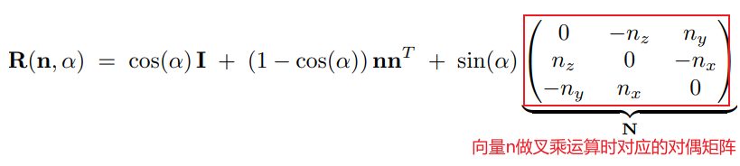

3. 推导思路：

   1. **v**与**n**垂直时，$\vec{v'}=\cos\alpha*\vec{v}+\sin\alpha*(\vec{n}×\vec{I})$

   2. **v**与**n**不垂直时，将**v**分解为 垂直于**n**的向量**v~⊥~** 和平行于**n**的向量**v~∥~**

      1.   $\vec{v_∥'}=\vec{v_∥}=|\vec{v}|*cos<\vec{v},\vec{n}>=\vec{v}·\vec{n}·\vec{n}$
      2.   $\vec{v_⊥}=\vec{v}-\vec{v_∥}=\vec{v}-\vec{v}·\vec{n}·\vec{n}$
      3.   $\vec{v_⊥'}=\cos\alpha*\vec{v_⊥}+\sin\alpha*(\vec{n}×\vec{v_⊥})$
      4.   综上可得：$\vec{v'}=\vec{v_∥'}+\vec{v_⊥'}=\cos\alpha*\vec{v}+(1-\cos\alpha)*\vec{v}·\vec{n}·\vec{n}+\sin\alpha*(\vec{n}×\vec{v})$

   3. 矩阵形式：$\vec{v'}=\cos\alpha*\vec{v}+(1-\cos\alpha)*\vec{v}·\vec{n}·\vec{n}+\sin\alpha*(\vec{n}×\vec{v})$$

      ​						$=[\cos\alpha*\vec{I}+(1-\cos\alpha)*\vec{n}·\vec{n}^T+\sin\alpha*(\vec{n}×\vec{I})]·\vec{v}$

4. 绕过任意轴**n** 旋转**$\alpha$**角

   1.   先将轴平移至过原点
   2.   然后旋转
   3.   最后平移回去

## 4.2	View/Camera Transformation 视图/相机变换

### 4.2.1	什么是视图变换

1.   与照相类比：**MVP**变换
     1.   找一个好的地方、人物排列 ==> 模型变换 **model** transformation
     2.   找一个好的角度放置摄像机 ==> 视图变换 **view** transformation
     3.   拍照                                       ==> 投影变换 **projection** transformation

### 4.2.2	定义Camera

1.   位置Position：$\vec{e}$
2.   往哪看Look-at/gaze direction：$\vec{g}$
3.   向上方向Up direction：$\vec{t}$

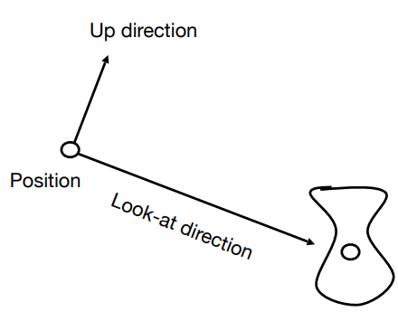

### 4.2.3	关键点

1. 只要 摄像机 与 物体 的相对位置一样，所看到的图形就是一样的

   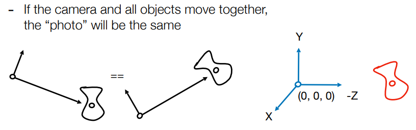

2. 将摄像机永远放在一个标准的位置

   1.   Position：原点
   2.   Up direction：Y轴
   3.   Look-at direction：-Z轴

3. 当相机变换时，将物体随着相机变换

### 4.2.4	将相机移动到标准位置

1. 方法

   1.   将$\vec{e}$平移到原点
   2.   旋转 $\vec{g}$ 到**-Z**的方向
   3.   旋转 $\vec{t}$ 到**Y**的方向
   4.   旋转 $\vec{g}×\vec{t}$ 到**X**方向

2. 矩阵表示：设$M_{view}=R_{view}T_{view}$

   1. 将$\vec{e}$平移到原点

      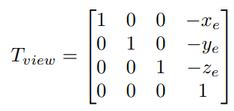

   2. 旋转 $\vec{g}$ 到**-Z**、 $\vec{t}$ 到**Y**、$\vec{g}×\vec{t}$ 到**X**：考虑逆矩阵

      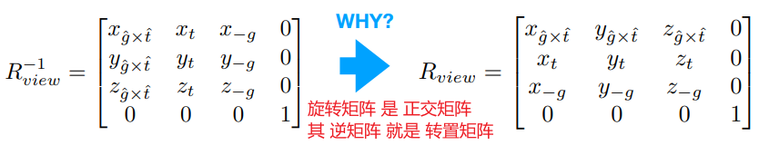

### 4.2.5	总结

1.   将物体与相机一起旋转
2.   将相机变换到标准位置：
     1.   Position：原点
     2.   Up direction：Y轴
     3.   Look-at direction：-Z轴
3.   这一步也被称为**ModelView Transformation**

## 4.3	Projection Transformation

1.   Orthographic Projection 正交投影：不存在近大远小
2.   Perspective Projection 透视投影：存在近大远小，平行线不再平行

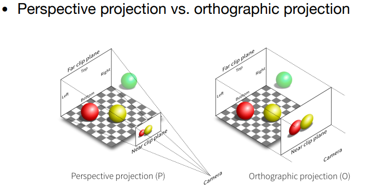

### 4.3.1	Orthographic Projection 正交投影

1. 方法：将一个立方体$[l, r]×[b, t]×[f, n]$映射到标准立方体$[-1, 1]^3$上

   1.   首先，通过**平移**操作，将立方体的中心移到原点
   2.   然后，通过**缩放**操作，将立方体缩放为标准立方体
   3.   立方体的定义：X轴$[l,r]$；Y轴$[b,t]$；Z轴$[f,n]$
   4.   变换之后，物体一定会有拉伸 

   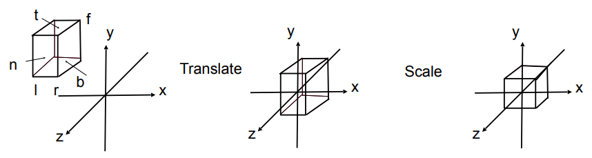

2. 变换矩阵

   1.   先平移到原点，再缩放到2

   $$
   M_{ortho}=
   \left(
   \begin{matrix}
   \frac{2}{r-l} & 0 			  & 0   		  & 0 \\
   0 			  & \frac{2}{t-b} & 0   		  & 0 \\
   0 			  & 0 			  & \frac{2}{n-f} & 0 \\
   0 			  & 0 			  & 0   		  & 1 \\
   \end{matrix}
   \right)
   
   \left(
   \begin{matrix}
   1 & 0 & 0 & -\frac{r+l}{2} \\
   0 & 1 & 0 & -\frac{t+b}{2} \\
   0 & 0 & 1 & -\frac{n+f}{2} \\
   0 & 0 & 0 & 1 \\
   \end{matrix}
   \right)
   
   =
   \left(
   \begin{matrix}
   \frac{2}{r-l} & 0 			  & 0   		  & -\frac{r+l}{r-l} \\
   0 			  & \frac{2}{t-b} & 0   		  & -\frac{t+b}{t-b} \\
   0 			  & 0 			  & \frac{2}{n-f} & -\frac{n+f}{n-f} \\
   0 			  & 0 			  & 0   		  & 1 \\
   \end{matrix}
   \right)
   $$

### 4.3.2	Perspective Projection 透视投影

#### 4.3.2.1	如何进行透视投影

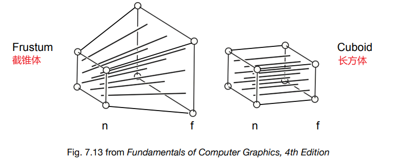

1.   首先，定义从相机点向外的两个平面**n、f**，**f**平面要比**n**平面大
2.   此时就相当于**f**平面上的点全部投影到**n**平面上
3.   投影方法
     1.   先将**Frustum**挤成**Cuboid**(n->n，f->f)：$M_{persp->ortho}$
          1.   近平面永远不变
          2.   远平面的Z值永远不变
          3.   远平面的中心点永远不变
     2.   再进行一次正交投影：$M_{ortho}$

#### 4.3.2.2	计算矩阵$M_{persp->ortho}$

1. 思路：找到变换后的点$(x',y',z')$与原来的点$(x,y,z)$的对应关系

2. 从YZ平面上看，$y'=\frac{n}{z}*y$

   1.   同理，$x'=\frac{n}{z}*x$

   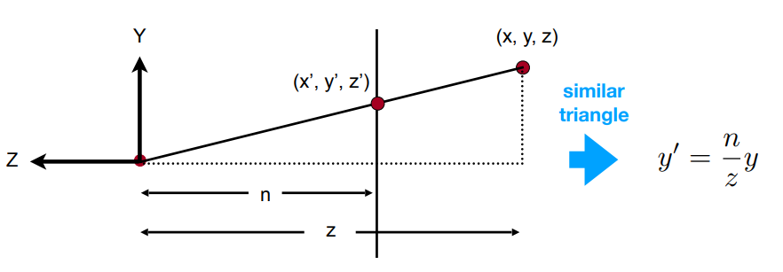

3. 齐次坐标表示

   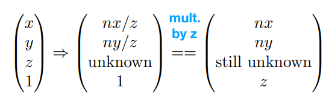

4. 矩阵表示

   1.   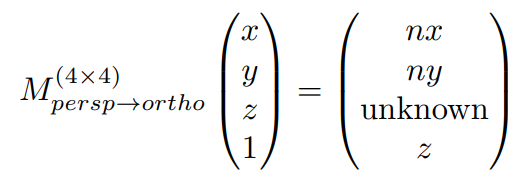
   2.   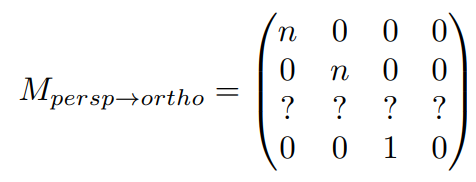

5. 对于矩阵的第三行(对于Z值)，有以下性质

   1. 在近平面上的点，Z值不变

      1.   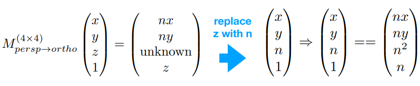
      2.   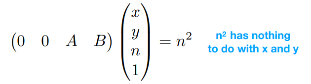
      3.   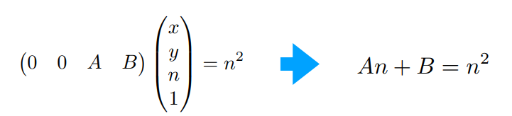

   2. 在远平面上的点，Z值不变

      1.   这里取中心点$(0,0,f)$
      2.   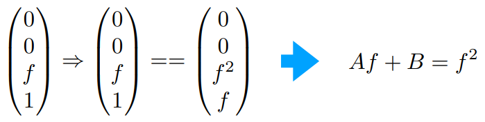

   3. 根据两个等式，可以解出$A,B$

      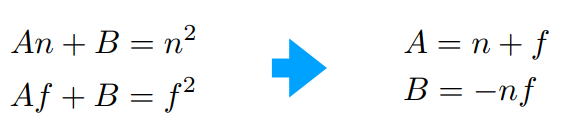

6. 综上
   $$
   M_{persp \rightarrow ortho}=
   \left(
   \begin{matrix}
   n & 0 & 0   & 0 \\
   0 & n & 0   & 0 \\
   0 & 0 & n+f & -nf \\
   0 & 0 & 1   & 0 \\
   \end{matrix}
   \right)
   $$

7. 最后，再进行正交投影：$M_{persp}=M_{ortho}M_{persp->ortho}$

$$
M_{persp}=
\left(
\begin{matrix}
\frac{2}{r-l} & 0 			  & 0   		  & -\frac{r+l}{r-l} \\
0 			  & \frac{2}{t-b} & 0   		  & -\frac{t+b}{t-b} \\
0 			  & 0 			  & \frac{2}{n-f} & -\frac{n+f}{n-f} \\
0 			  & 0 			  & 0   		  & 1 \\
\end{matrix}
\right)

\left(
\begin{matrix}
n & 0 & 0   & 0 \\
0 & n & 0   & 0 \\
0 & 0 & n+f & -nf \\
0 & 0 & 1   & 0 \\
\end{matrix}
\right)

=

\left(
\begin{matrix}
\frac{2n}{r-l}	& 0 			 & -\frac{r+l}{r-l} & 0 \\
0 				& \frac{2n}{t-b} & -\frac{t+b}{t-b} & 0  \\
0 				& 0				 & \frac{n+f}{n-f}	& -\frac{2nf}{n-f} \\
0 				& 0				 & 1				& 0 \\
\end{matrix}
\right)
$$

#### 4.3.3.3	对于不在近/远平面上的点

$$
\left(
\begin{matrix}
n & 0 & 0   & 0 \\
0 & n & 0   & 0 \\
0 & 0 & n+f & -nf \\
0 & 0 & 1   & 0 \\
\end{matrix}
\right)

\left(
\begin{matrix}
x \\
y \\
z \\
1 \\
\end{matrix}
\right)
=

\left(
\begin{matrix}
nx \\
ny \\
(n+f)z-nf \\
z \\
\end{matrix}
\right)

==>
\left(
\begin{matrix}
\frac{n}{z}x \\
\frac{n}{z}y \\
(n+f)-\frac{nf}{z} \\
1 \\
\end{matrix}
\right)
$$

1.   近平面上的点$(z=n)$
     1.   $z'=(n+f)-\frac{nf}{n}=n$
     2.   $z'=z$
2.   远平面上的点$(z=f)$
     1.   $z'=(n+f)-\frac{nf}{f}=f$
     2.   $z'=z$
3.   不在近/远平面上的点$(f<z<n)$
     1.   $z'=(n+f)-\frac{nf}{z}$
          1.   设$n=1,f=-1,z=0.5$，则$z'=2$
          2.   设$n=1,f=-1,z=-0.5$，则$z'=-2$
     2.   可得：若$z<0$，则$z'$更靠近**远平面$f$**；若$z>0$，则$z'$更靠近**近平面$n$**