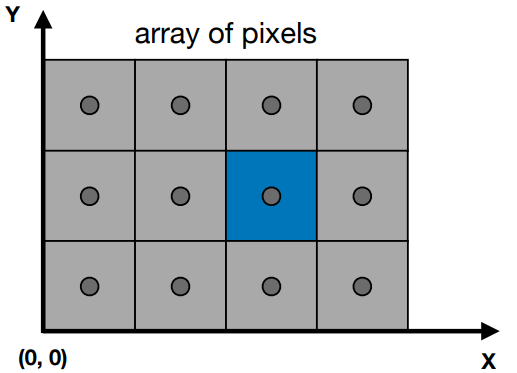
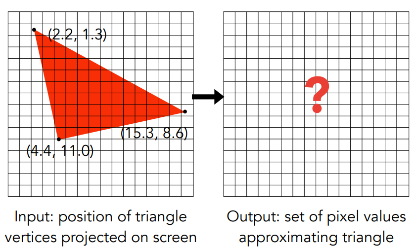
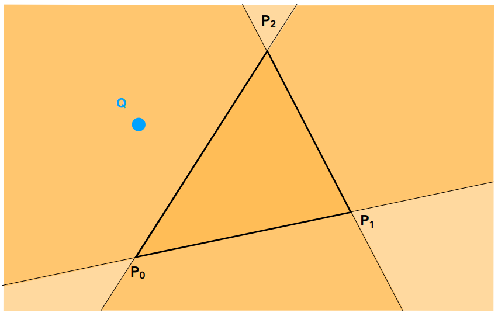
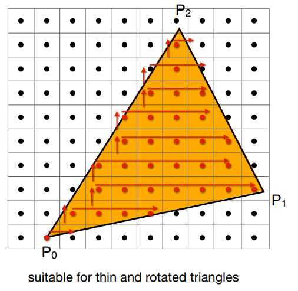

[TOC]

[TOC]

# 第5课	光栅化1：三角形

> 规范立方体 => 屏幕：**Canonical Cube to Screen**

## 5.1	屏幕的定义

1. 像素点形成的二维数组

   1. 数组的大小：分辨率**Resolution**

2. 屏幕是一个典型的光栅成像设备：**Raster Display**

   1.   在德语中，raster == screen
   2.   rasterize == drawing onto the screen

3. 像素**Pixel**：FYL，picture element的缩写

   1.   在本节课中，一个像素就是一个小的立方体，有着一个固定的颜色
   2.   颜色是红、绿、蓝的组合

4. 屏幕空间**Screen Space**

   

5. 像素的坐标

   1.   由一个整数坐标**(x,y)**表示，范围为**(0,0) ~ (width-1, height-1)**
   2.   像素的中心在**(x+0.5, y+0.5)**
   3.   屏幕的范围为**(0, 0) ~ (width, height)**

## 5.2	视口变换：$[-1,1]^3 \rightarrow [0,width]×[0,height]$

> **Viewport Transform**，思想：
>
> 1. 忽略Z
> 2. 变换XY坐标：$[-1,1]^2 \rightarrow [0,width]×[0,height]$
>
> 此时，三维空间中的多种物体，已经变成了二维空间上的多个多边形

$$
M_{viewport}=
\left(
\begin{matrix}
\frac{width}{2}	& 0					& 0	& \frac{width}{2} \\
0				& \frac{height}{2}	& 0	& \frac{height}{2} \\
0				& 0					& 1	& 0 \\
0				& 0					& 0	& 1
\end{matrix}
\right)
$$

## 5.3	现代显示原理

1. 帧缓冲**Frame Buffer**：将内存中的一块区域映射到屏幕上，内存中的数据即为要显示的数据

2. 液晶显示器**LCD**：Liquid Crystal Display， 通过液晶将光翻转

   

3. 发光二极管阵列LED：

   

4. 电子墨水屏：通过通电，控制每个像素的黑色/白色

   

## 5.4	三角形的性质

1.   最基础的多边形，任何多边形都可以拆分成多个三角形
2.   三角形三个顶点一定共面
3.   可以很好的定义内部外部
5.   定义三个顶点的属性后，可以轻易定义三角形内部的每个点的属性插值：重心插值

## 5.5	光栅化：三角形 => 像素



### 5.5.1	采样法 确定像素颜色

> **Sampling**：对于每一个采样点，查询函数的值

1. 也就是函数离散化的过程

   ```c++
   for(int x = 0; x < xmax; x++)
       output[x] = f(x);
   ```

2. 定义一个函数：**inside(t, x, y)**
   $$
   inside(t,x,y)=\left\{
   \begin{matrix}
   1 & (x,y)在三角形t内\\
   0 & (x,y)不在三角形t内
   \end{matrix}
   \right.
   $$

   ```c++
   for(int x = 0; x < xmax; x++)
       for(int y = 0; y < ymax; y++)
           image[x][y] = inside(tri, x+0.5, y+0.5);
   ```

   

3. **inside(t, x, y)**函数的实现方法：**叉乘**

   1. 已知点与三角形共面，如何判断一个点是否在三角形内

   2. 按照$P_0,P_1,P_2$的顺序进行叉乘$\vec{P_0P_1}×\vec{P_0Q}、\vec{P_1P_2}×\vec{P_1Q}、\vec{P_2P_0}×\vec{P_2Q}$，三者的$Z$的正负性相同则说明$Q$在三角形内

      

   3. 边界情况：可以不做处理 or 特殊处理，在本课中，均不做处理

   

### 5.5.2	三角形的包围盒

1. 三角形的包围盒**Bounding Box**：只需要考虑包围盒内的像素

   1. 这里是轴向的**AABB**包围盒，因为只有XY平面的

      

2. 也可以对每行计算 最左像素 和 最右像素

   

