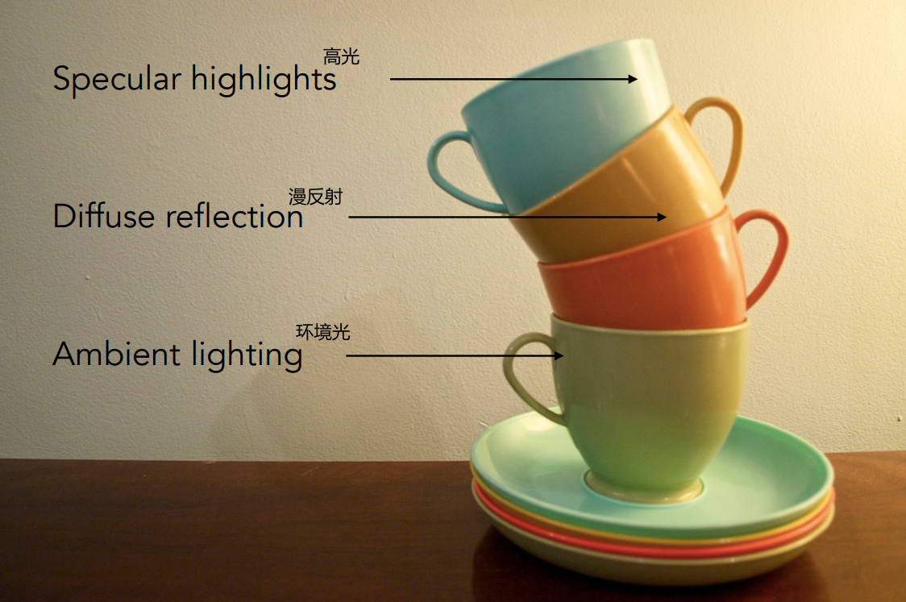
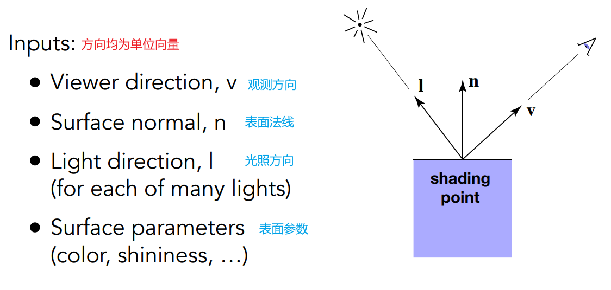
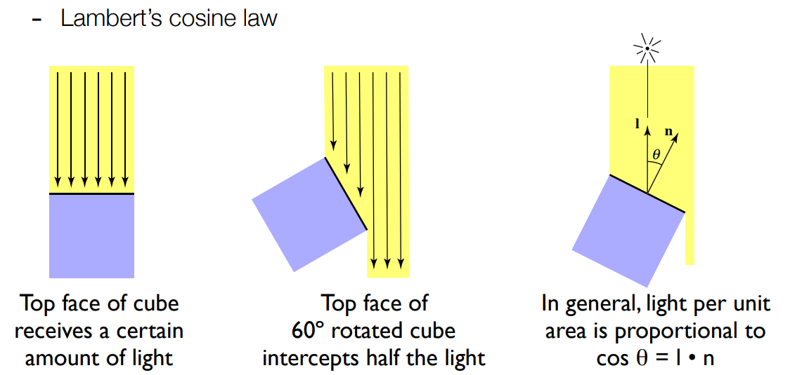
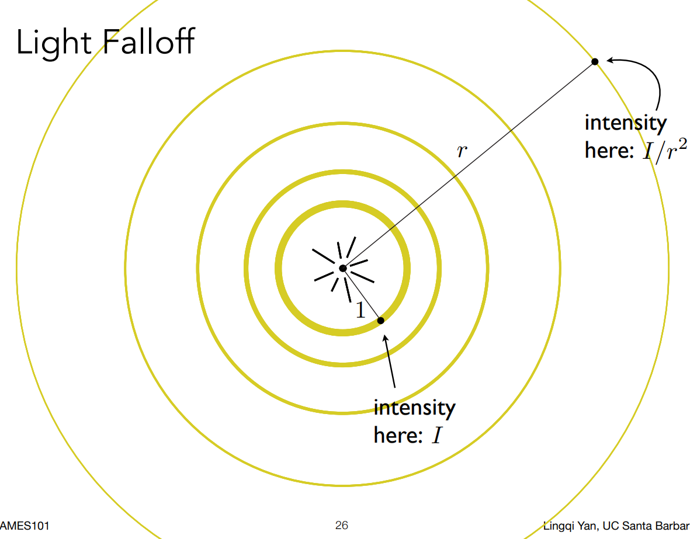
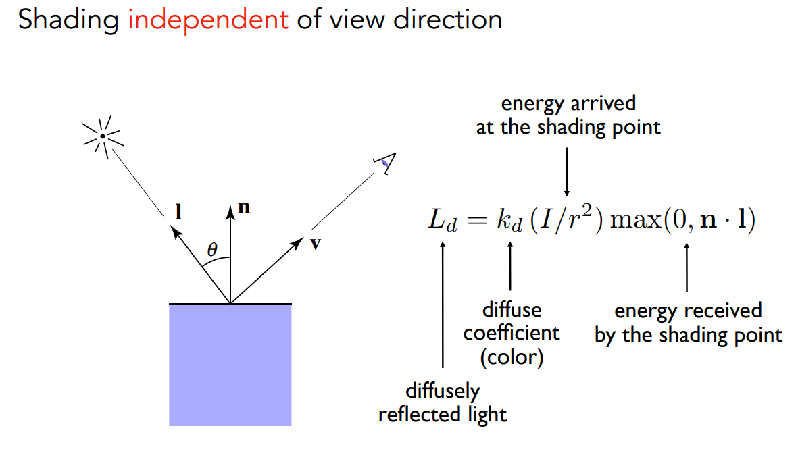
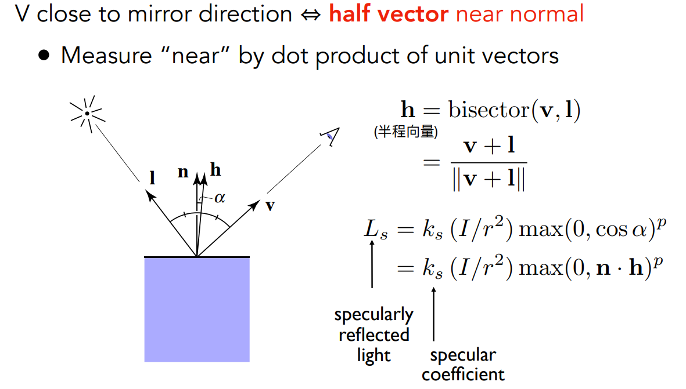
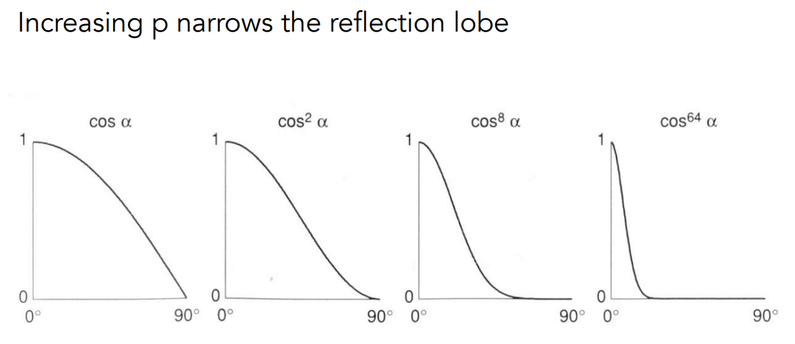
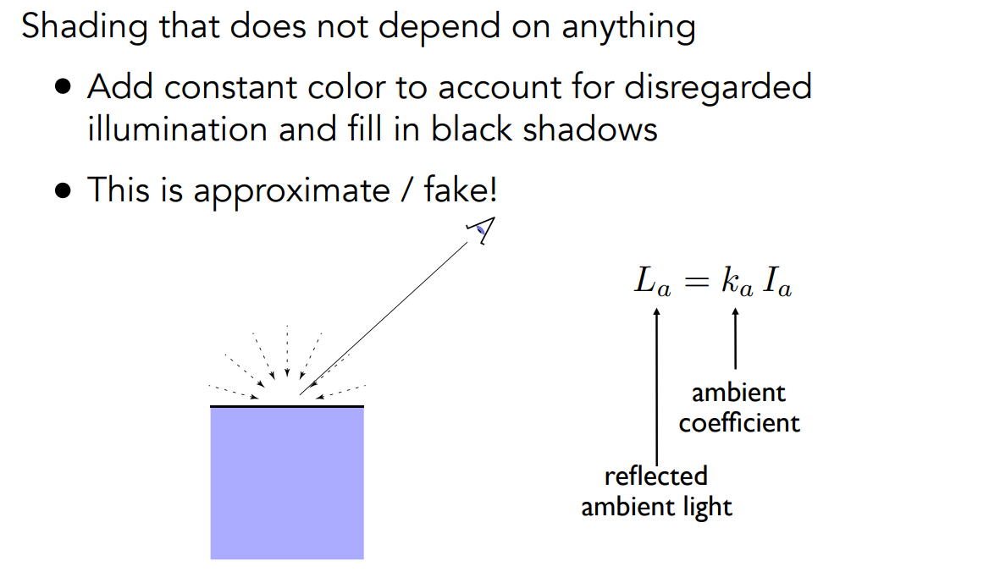
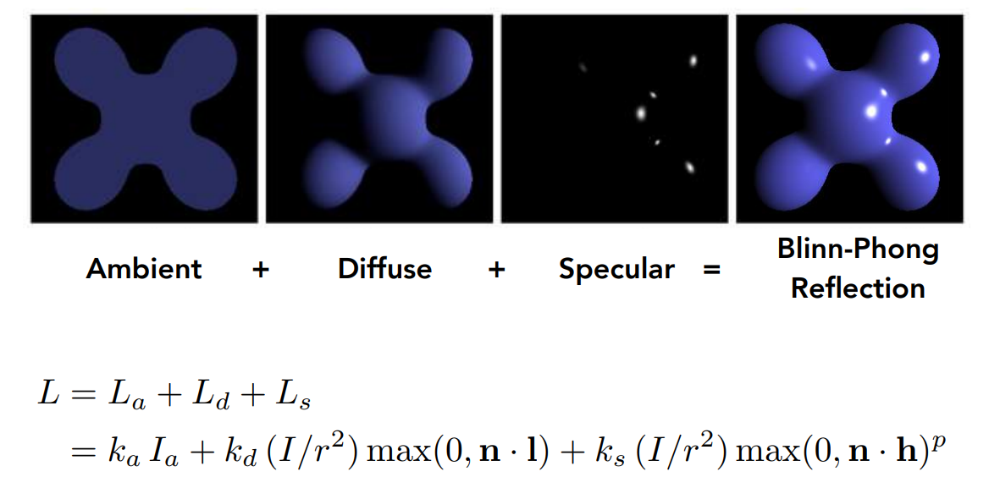

[TOC]

# 七、着色1：Blinn-Phong反射模型

> **Shading**：着色
>
> 1. 对不同物体，定义不同材质，从而与光线产生不同作用
>
> 局部性：
>
> 1. 只考虑自己的属性，不考虑与其他物体的存在
> 2. 因此，没有阴影

## 7.1	反射模型的输入

## 7.2	光照的能量传递关系

1. 余弦定理：单位面积接收到的光的能量占比为`cos θ`，`θ`为光照方向与平面法线的夹角

   

2. 设光源的能量为`I`，光源与表面的距离为`r`，则到达表面的能量为$\frac{I}{r^2}$

   

## 7.3	漫反射 Diffuse Reflection

$$
L_d=k_d\frac{I}{r^2}max(0,\vec{n}·\vec{l})
$$

1. $L_d$：漫反射光照
2. $k_d$：漫反射系数，通常为物体的颜色
3. $I/r^2$：到达该点的能量
4. $max(0,\vec{n}·\vec{l})$：该点接收到的能量
5. 由于漫反射到四面八方的能量均相同，因此没有$\vec{v}$的事情

## 7.4	镜面反射&高光项 Specular Reflection

> 接近镜面反射时，会出现高光

$$
L_s=k_s\frac{I}{r^2}max(0,\vec{n}·\vec{h})^p
$$

1. $L_s$：镜面反射光照
2. $k_s$：镜面反射系数，通常为白色
3. $I/r^2$：到达该点的能量
4. $max(0,\vec{n}·\vec{l})$：该点接收到的能量
5. $p$：为了让高光的区域足够小，需要将夹角余弦进行幂操作

## 7.5	环境光 Ambient Term

> 假设所有点接收到的环境光均相同

$$
L_a=k_aI_a
$$

1. $L_a$：环境光
2. $k_a$：环境光系数，通常为物体颜色
3. 环境光通常为一个常量，保证没有地方是黑的

## 7.6	Blinn-Phong反射模型

$$
\begin{aligned}
L &= L_a+L_d+L_s\\
  &= k_aI_a+k_d\frac{I}{r^2}max(0,n·l)+k_s\frac{I}{r^2}max(0,n·h)^p
\end{aligned}
$$

