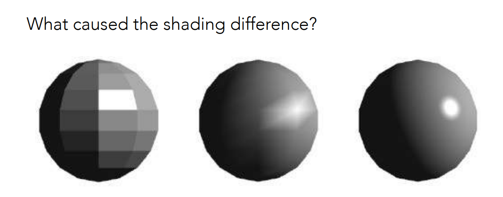
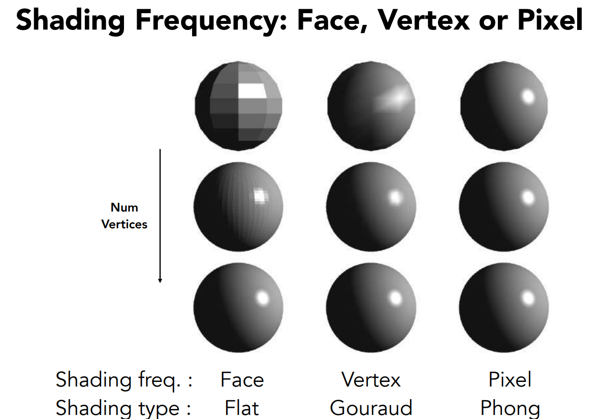
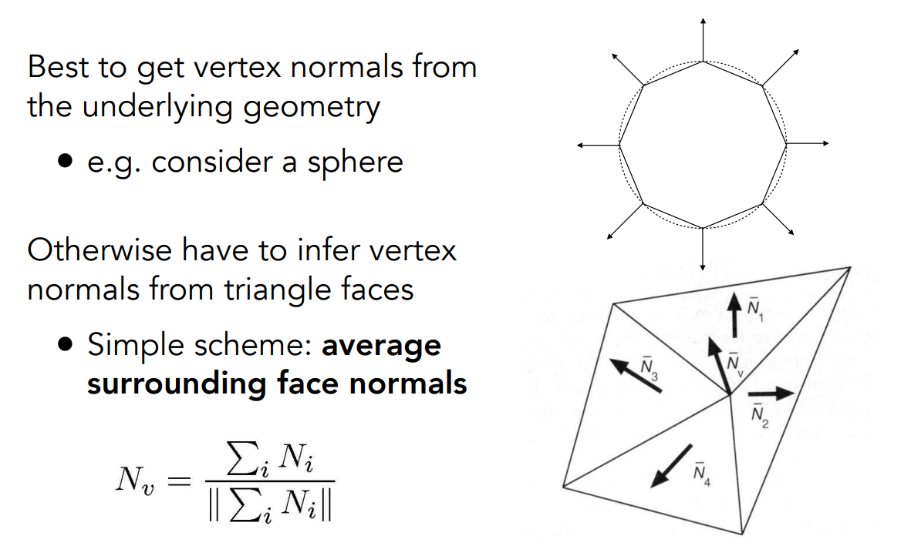
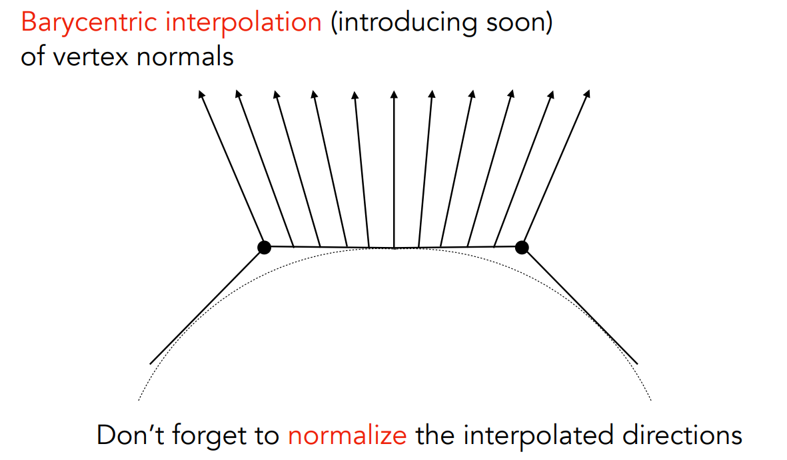
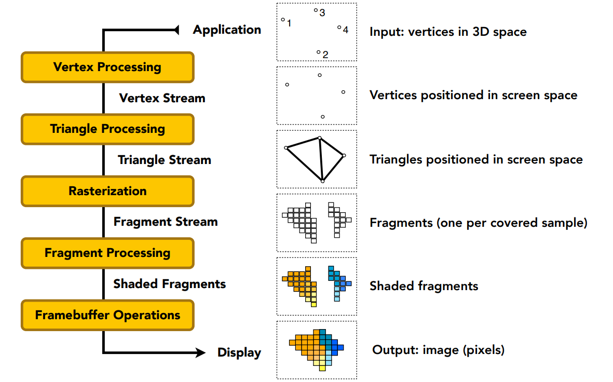
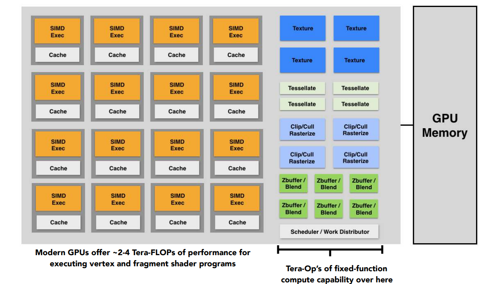
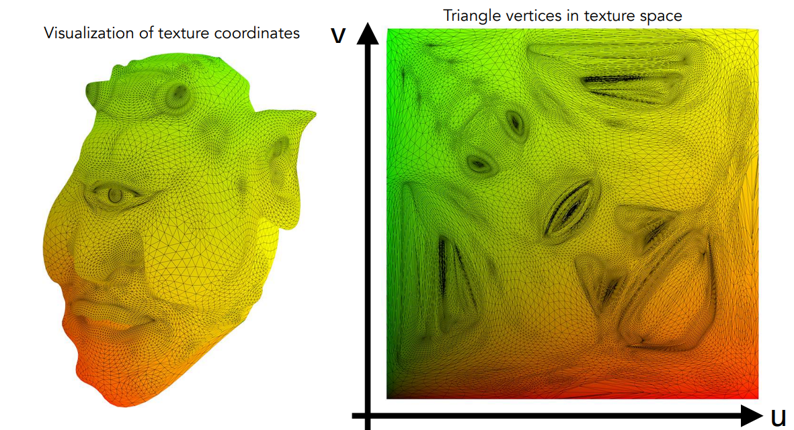
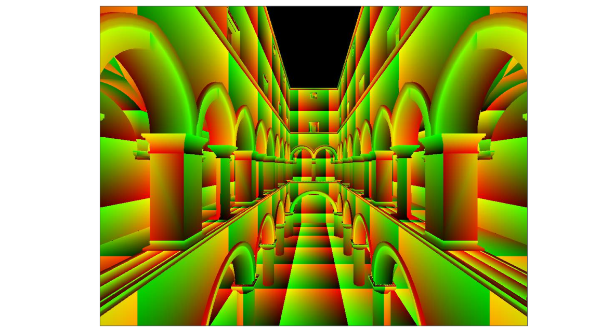
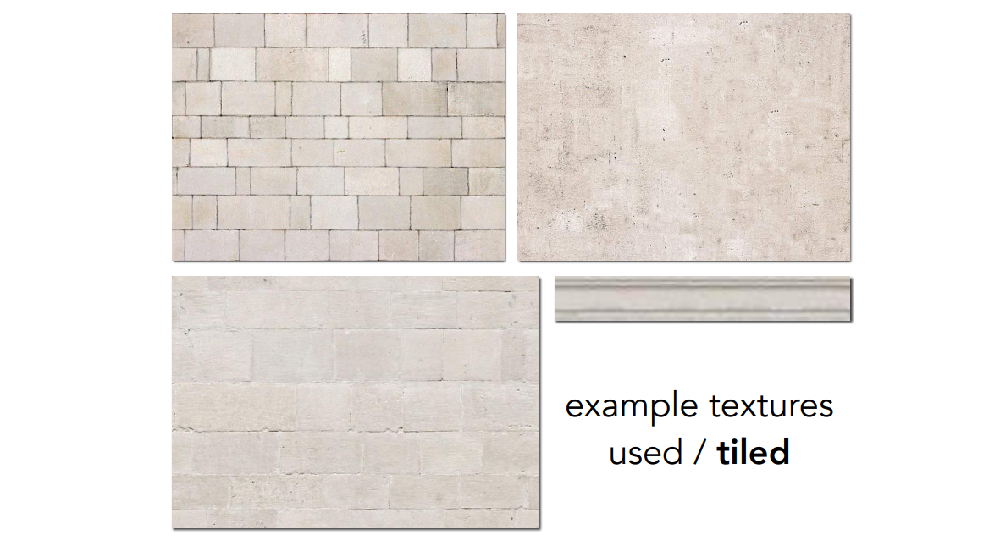

[TOC]

# 八、着色2：着色频率&实时渲染管线

## 8.1	着色频率

1. 着色频率即为：将结果应用到哪些平面上
   1. 左1：应用到每个三角面上，**Flat Shading**
   2. 左2：应用到每个顶点上，**Gouraud Shading**
   3. 左3：应用到每个像素上，**Phong Shading**

### 8.1.1	计算顶点法线

> 将与该顶点相关的所有面的法线，做加权平均，权重为三角形面积

$$
N_v=\frac{\sum_i N_i}{|\sum_i N_i|}
$$

### 8.1.2	计算像素法线

> 使用重心坐标，对相邻两个顶点的法线进行插值

## 8.2	实时渲染管线

1. 输入：3维空间中的若干个点
2. **Vertex Processing**：将3维空间的点，投影到屏幕空间上
   1. Model, View Projection变换
   2. 着色、纹理映射
3. **Triangle Processing**：形成屏幕空间上的三角形
4. **Rasterization**：通过光栅化，将三角形绘制到屏幕上
   1. 对三角形是否覆盖进行采样
5. **Fragment Processing**：对像素进行着色
   1. Z-Buffer
   2. 着色、纹理映射
6. **Framebuffer Opreations**：将三角形拼装成图像

## 8.3	Shader程序

1. 对每一个顶点/像素，Shader均会执行一次
2. 顶点着色器：对顶点操作
3. 片段着色器、像素着色器：对像素操作，确定当前像素是什么颜色

## 8.4	GPU

1. 是整个图形管线的硬件实现：如光栅化、投影
2. 有一部分是可编程的：即着色器
3. GPGPU：通用GPU计算，可以完成各种各样的GPU计算
4. 是一个高度并行化的多核处理器

## 8.5	纹理映射

1. 根本作用：定义3维物体上任何一个点的属性

2. **纹理**：任何一个3维物体的表面都是2维的，因此可以和一张图有一个一一对应的关系，这张图即为纹理

   1. 将3维物体上的每一个三角形的顶点，映射到纹理图像上
      1. 由美工完成
      2. 自动化：参数化模型

3. UV坐标系：即纹理坐标的坐标系，通常范围为[0~1] × [0~1]

   

4. 不同的位置可以映射到同一个位置上

   

5. 好的纹理：纹理的上下左右可以无缝衔接，称为**tiled textures**

   