[TOC]

# 九、着色3：纹理的应用

## 9.1	重心坐标 Barycentric Coordinates

为什么需要插值

1. 我们的很多操作是定义在**顶点**上的
2. 我们需要在**三角形**内获得平滑的值

插值什么内容

1. 纹理坐标、颜色、法线

怎么做插值

1. 重心坐标

### 9.1.1	重心坐标是什么

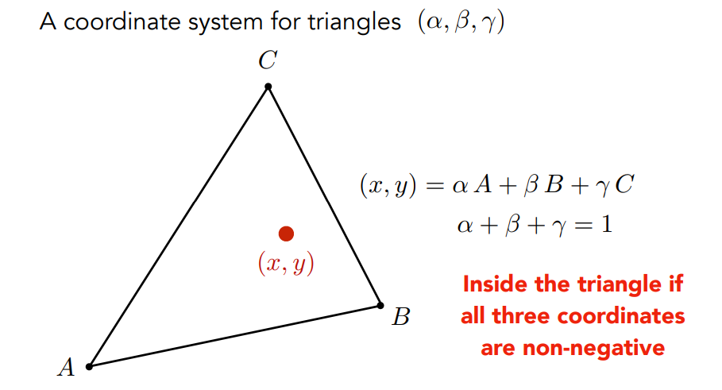

1. 定义在三角形上：三角形**所在平面**的任意一个点的坐标，都可以用三个顶点坐标的线性组合表示，且$\alpha+\beta+\gamma=1$

   1. $(x,y)=\alpha A+ \beta B + \gamma C$，可以得到一个坐标$(\alpha,\beta,\gamma)$
   2. 如果在**三角形内**，则$\alpha,\beta,\gamma$均为**非负**的

2. 求$\alpha,\beta,\gamma$：通过面积计算

   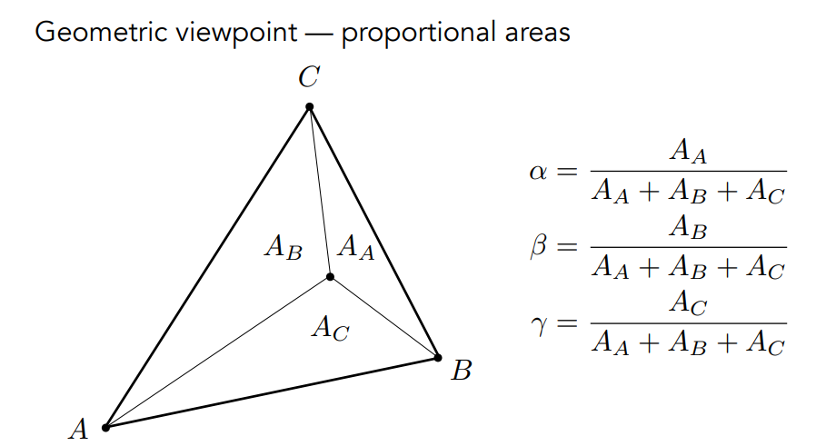

3. 三角形的**重心**：分成的三个三角形面积相等

   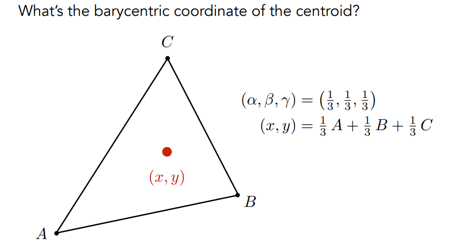

4. 使用公式计算：

   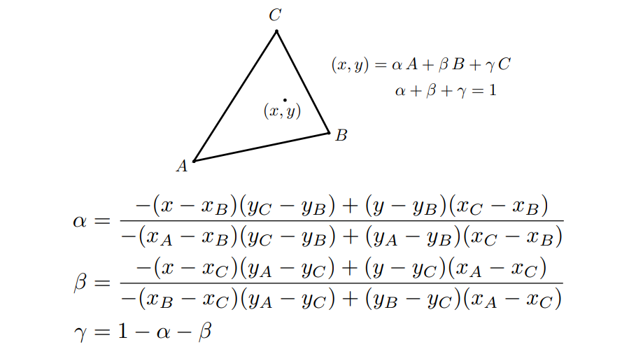

### 9.1.2	重心坐标插值

**注意：投影后，重心坐标可能会改变，因此插值三维属性，应该使用三维坐标**

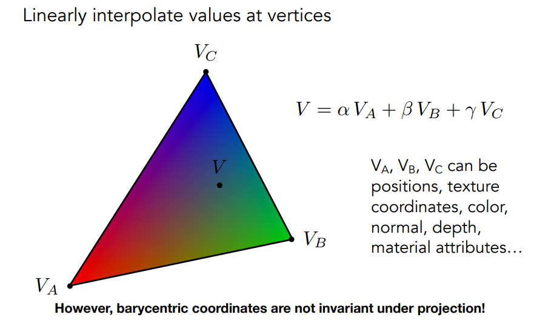

## 9.2	纹理的基础应用

### 9.2.1	简单纹理映射：漫反射颜色

对每一个屏幕中的采样点$(x,y)$：

1. 通过重心坐标插值，计算$(x,y)$对应的纹理坐标$(u,v)$
2. 得到纹理中，$(u,v)$所在点的颜色，记为`texcolor = texture.sample(u,v)`
3. 将该采样点的颜色，设置为`texcolor`

### 9.2.2	纹理放大：双线性插值 Bilinear interpolation

> 像素**pixel** <=> 纹理元素**texel**，纹理需要放大时，多个pixel会对应到同一个texel上

> 纹理过小：失真
>
> 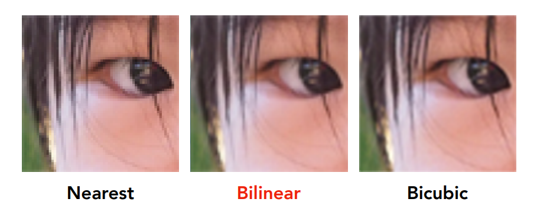

1. 找到临近的四个点
2. 计算水平距离`s`和垂直距离`t`，均为`[0,1]`之间的值
3. 定义线性插值操作：$lerp(x,v_0,v_1)=v_0+x(v_1-v_0)$，$x$为`[0,1]`之间的值
4. 进行**两次线性插值**操作：
   1. 水平方向：$u_0=lerp(s,u_{00},u_{10}),u_1=lerp(s,u_{01},u_{11})$
   2. 垂直方向：$f(x,y)=lerp(t,u_0,u_1)$

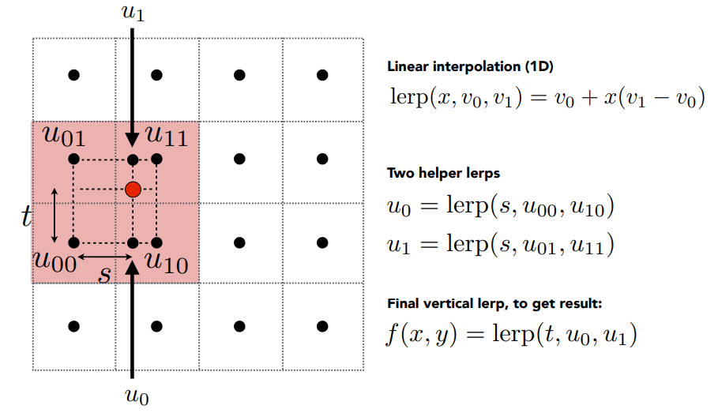

### 9.2.3	纹理缩小

> 纹理过大：远处摩尔纹，近处锯齿
>
> 1. 远处，一个像素覆盖了纹理上的很大一块区域，因此会存在走样
>
> 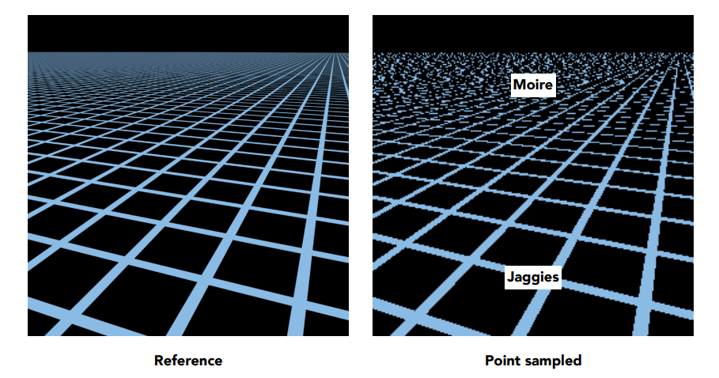

#### 9.2.3.1	Mipmap

**Mipmap**：允许做**快速、近似、正方形**的范围查询

1. 每一层均将上一层缩小到原来的一半

   1. 预处理纹理
   2. 多了1/3的存储量

   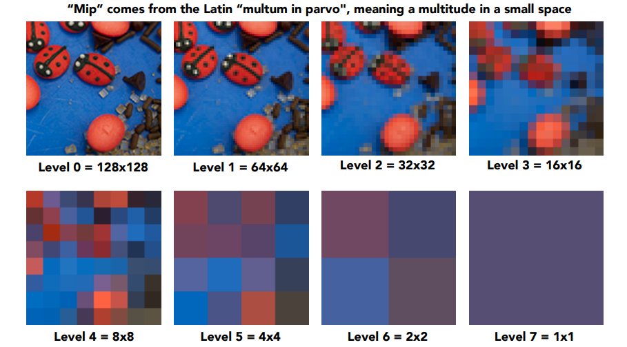

2. 计算某个像素对应到纹理的正方形区域

   1. 将屏幕上的某个像素点`p1`及其两个邻居`p2,p3`对应到纹理上的三个点`t1,t2,t3`
   2. 在屏幕上，`p1`与`p2`的距离为`1`，`p1`与`p3`的距离为`1`
   3. 在纹理中，`t1`与`t2`的距离为`L1`，`t1`与`t2`的距离为`L2`
   4. 取`L=max(L1,L2)`，则该像素在纹理空间上对应的正方形区域为，以`t1`为中心的`L×L`的区域

   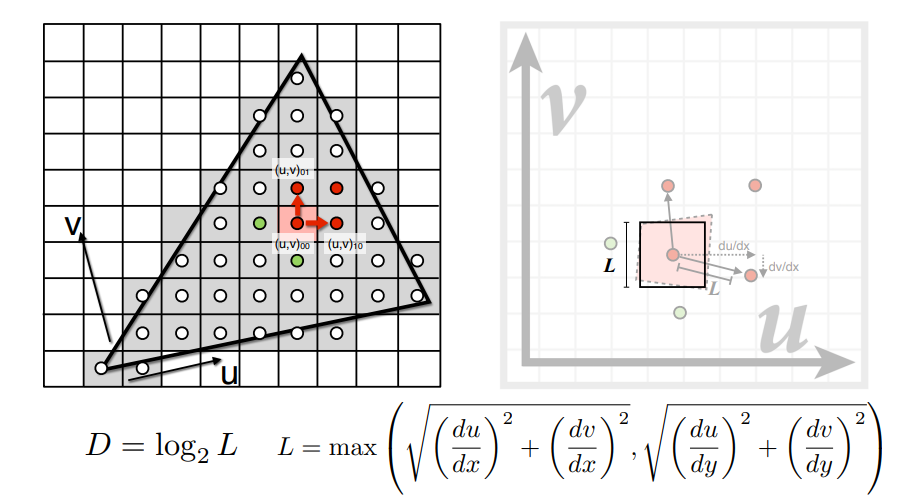

3. 计算正方形区域的平均值

   1. 假设正方形为`1×1`，则可以直接在`0`层中获得该区域的平均值
   2. 假设正方形为`4×4`，则可以直接在`1`层中获得该区域的平均值
   3. 因此，我们可以在第$D=log_2L$层中获取该区域的平均值
   4. 如果$log_2L$不是整数，则可以通过**线性插值**，获得该区域的平均值
   5. 每一层的查询，使用了一次**双线性插值**，最后又进行了一次**线性插值**，因此称为**三线性插值**

   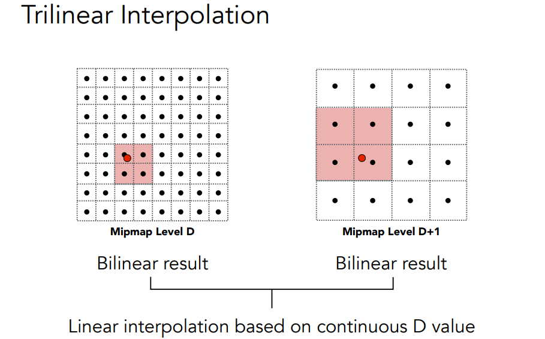

4. 缺点：在远处会完全模糊**overblur**

#### 9.2.3.2	各向异性过滤

**Anisotropic Filtering**：各向异性过滤，对矩形的区域快速查询平均值

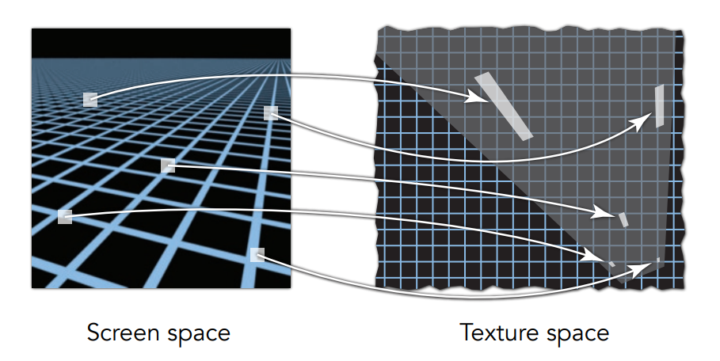

1. 各向异性过滤：水平、竖直压扁，开销为原本的3倍
2. EWA过滤：将图像分为一个个的椭圆

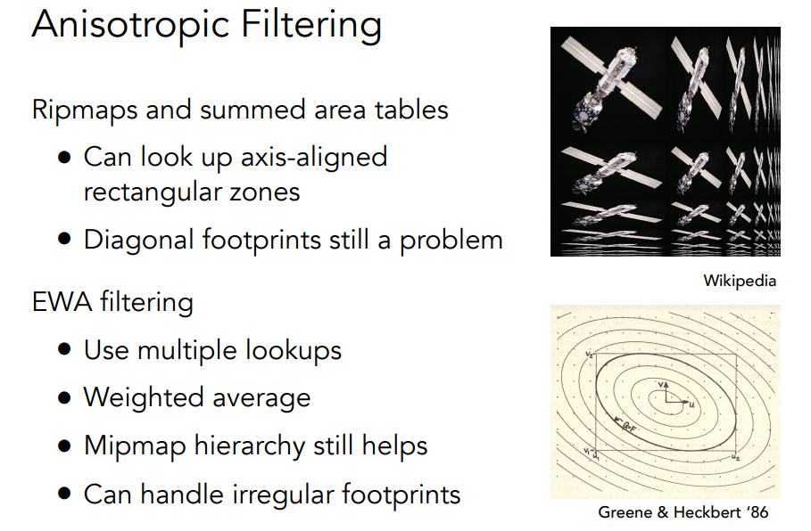

## 9.3	纹理的其他应用

现代GPU中，纹理的本质：是一块内存区域，且可以进行范围查询

### 9.3.1	环境贴图 Environment Map

1. 环境贴图：即为空间中的某个点，向上下左右前后六个方向，所能接收到的光
2. 可以通过环境贴图，进行光照计算，进而实现环境光渲染
3. 基本假设：环境光来自无限远处，只记录环境光的方向信息
4. 可以使用**Spherical Map**或者**Cube Map**表示

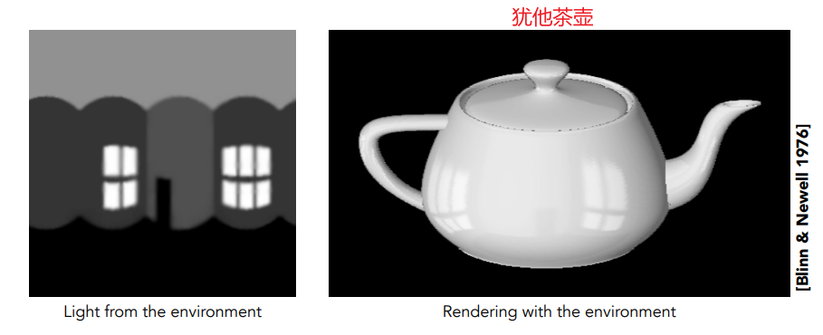

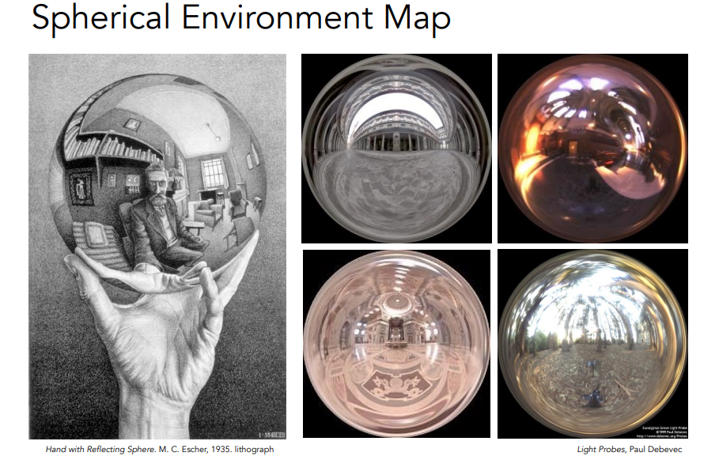

> 由于立方体的**各个面都是均匀**的，因此能很好的避免天空球的**极点消失**现象
>
> 1. 天空盒只记录方向信息
> 2. 需要先判断某个方向是属于哪一个面上的

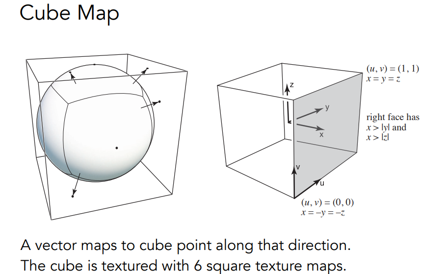

### 9.3.2	凹凸贴图 & 法线贴图

1. 凹凸贴图：定义某个点的相对高度(沿法线移动的距离)，从而改变周围像素的法线方向
2. 法线贴图：定义某个点的法线

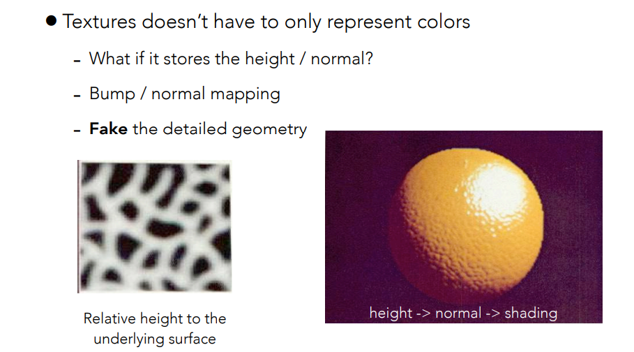

> 计算修改后的法线

1. 一维贴图，修改像素的法线：**flatland**

   1. 设原来的表面法线`n(p)=(0, 1)`
   2. 计算梯度：`dp=c*[h(p+1)-h(p)]`
   3. 则切线为：`(1,dp)`
   4. 因此更改后的法线为：`n(p)=(-dp, 1).normalized()`

   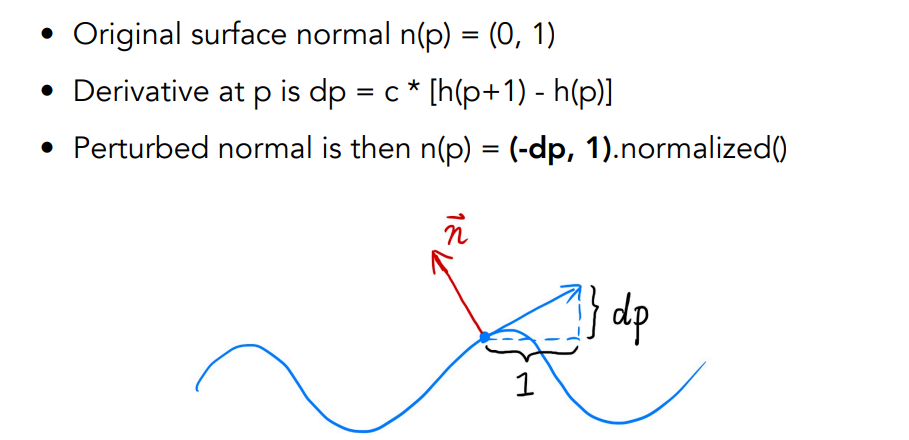

2. 二维贴图，修改像素的法线：**局部坐标系下**

   1. 设原来的表面法线`n(p)=(0, 0, 1)`
   2. 计算梯度：`dp/du=c1*[h(u+1)-h(u)]`，`dp/dv=c2*[h(v+1)-h(v)]`
   3. 因此更改后的法线为：`n(p)=(-dp/du, -dp/dv ,1).normalized()`

### 9.3.3	位移贴图 Displacement Mapping

1. 与凹凸贴图类似，但是会直接**更改三角形顶点的位置**
2. 要求原有模型的三角形比较细，要求模型的三角形顶点之间的间隔，比纹理之间的间隔小

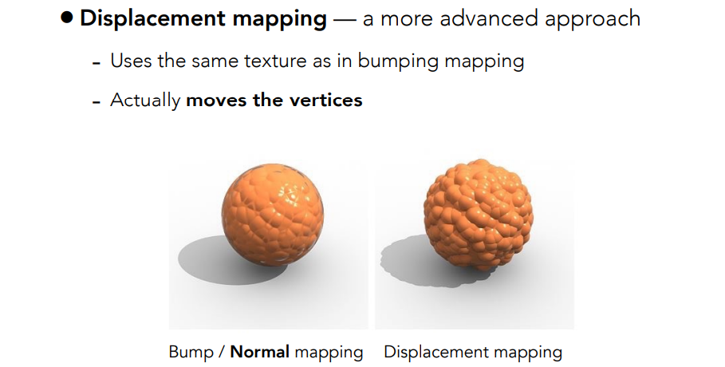

### 9.3.4	三维纹理

1. 定义一个三维空间的噪声函数，可以得到三维空间中，任意一个点的属性

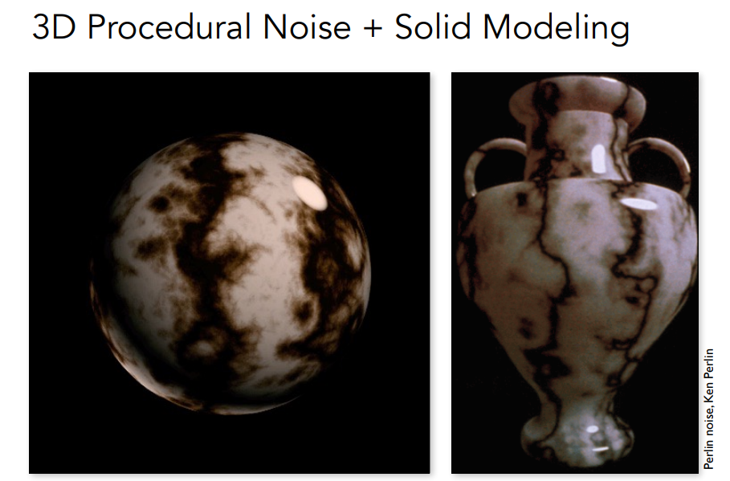

### 9.3.5	保存预处理的数据

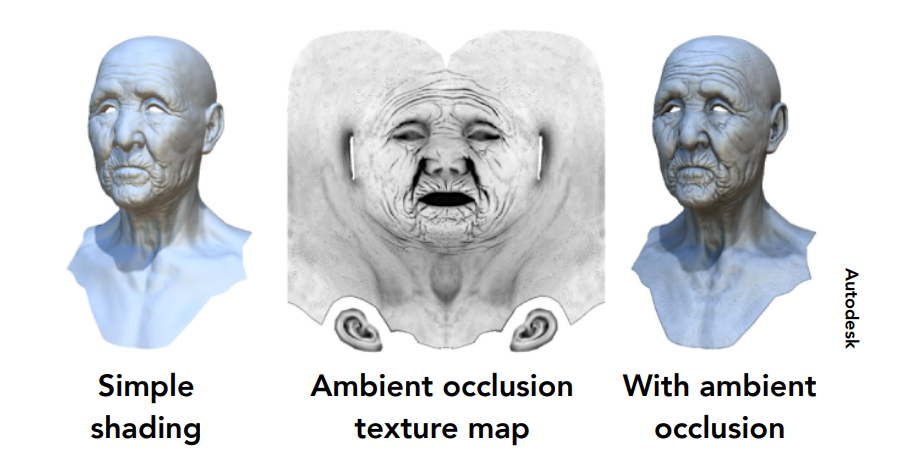

### 9.3.6	三维纹理 & 体积渲染

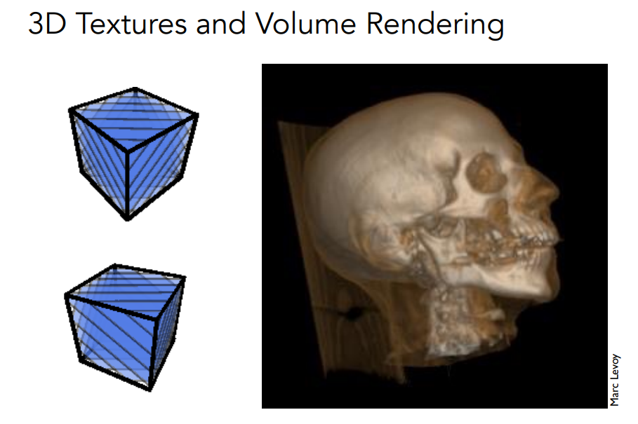
