[TOC]

# VirtualBox挂载

```shell
sudo mount -t vboxsf Share share_dir
```

# 第1课	Overview of Computer Graphics

1.   **光栅化**：将三维空间的几何形体显示在屏幕上
2.   **实时**：每秒钟能够生成30幅画面/30帧/30fps；否则称为离线

# 第2课	Review of Linear Algebra

## 2.1	向量点乘

### 2.1.1	定义

$$
\begin{aligned}
\vec{a}·\vec{b}&=||\vec{a}||*||\vec{b}||*\cos\theta \\
			   &=x_a*x_b+y_a*y_b+z_a*z_b\\
\end{aligned}
$$

### 2.1.2	性质

1.   $\vec{a}·\vec{b}=\vec{b}·\vec{a}$
2.   $\vec{a}·(\vec{b}+\vec{c})=\vec{a}·\vec{b}+\vec{a}·\vec{c}$
3.   $(k\vec{a})·\vec{b}=\vec{a}·(k\vec{b})=k(\vec{a}·\vec{b})$

### 2.1.3	应用

1.   计算夹角：$\cos\theta=\frac{\vec{a}·\vec{b}}{||\vec{a}||*||\vec{b}||}$

     

2.   计算投影：$||\vec{b}_⊥||=||\vec{b}||\cos\theta$，$\vec{b}_⊥=(||\vec{b}||\cos\theta)\ \hat a$

     

3.   将$\vec{b}$在$\vec{a}$方向分解：$\vec{b}=\vec{b}_⊥+(\vec{b}-\vec{b}_⊥)$

     

4.   向量之间的方向

     1.   $\vec{a}$与$\vec{b}$方向基本一致：$\hat{a}·\hat{b} > 0$，越接近1，夹角越接近0°
     2.   $\vec{a}$与$\vec{b}$方向基本相反：$\hat{a}·\hat{b} < 0$，越接近-1，夹角越接近180°
     3.   $\vec{a}$与$\vec{b}$垂直：=$\hat{a}·\hat{b}$

     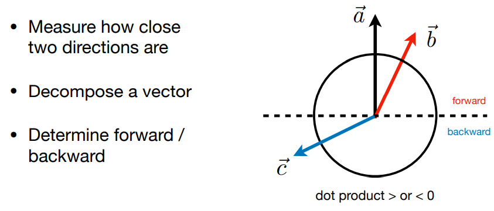

## 2.2	向量叉乘

### 2.2.1	定义

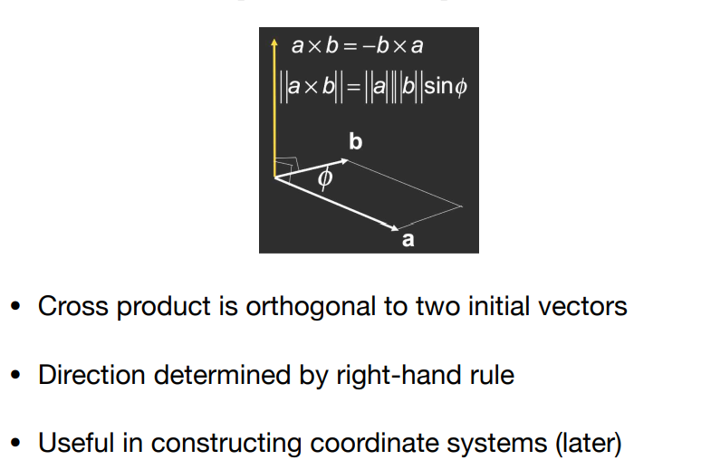

大小：$||\vec{a}×\vec{b}||=||\vec{a}||*||\vec{b}||*\sin\theta$

方向：右手螺旋定则，四指方向为$\vec{a}$旋转到$\vec{b}$，拇指方向为$\vec{a}×\vec{b}$的方向

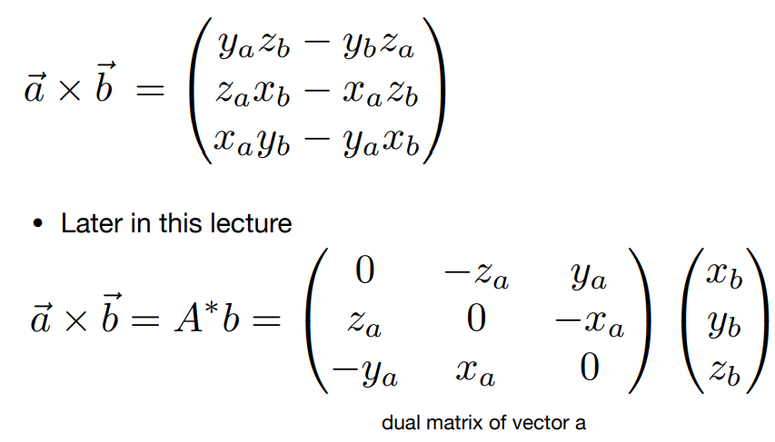

### 2.2.2	性质

性质：$\vec{a}×\vec{b}=-\vec{b}×\vec{a}$

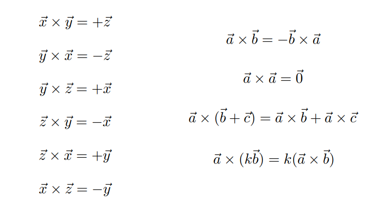

### 2.2.3	应用

1.   判断左右：假设$\vec{a}、\vec{b}$均在XY平面上

     1.   $\vec{b}$在$\vec{a}$的左侧：$Z_{\vec{a}×\vec{b}}>0$
     2.   $\vec{b}$在$\vec{a}$的右侧：$Z_{\vec{a}×\vec{b}}<0$

     

2.   判断内外：假设ABCP四点共面

     1.   P在▲ABC的内部：若ABC逆时针排列，则都在左面；若ABC顺时针排列，则都在右面
          1.   $\vec{AP}在\vec{AB}的左面$
          2.   $\vec{BP}在\vec{BC}的左面$
          3.   $\vec{CP}在\vec{CA}的左面$
     2.   P在▲ABC的外部：上述三个条件有一个不符合

     

## 2.3	正交基/坐标系 

正交基：Orthonormal Bases 

坐标系：Coordinate Frames

### 2.3.1	定义

1.   $\vec{u}、\vec{v}、\vec{w}$均为单位向量
2.   $\vec{u}、\vec{v}、\vec{w}$两两垂直
3.   $\vec{w}=\vec{u}×\vec{v}$


## 2.4	矩阵

### 2.4.1	矩阵乘法

1.   定义：设$A[m][n]*B[n][p]=C[m][p]$，则$C[i][j]=\sum_{k=1}^n A[i][k]*B[k][j]=\{A的第i行\}·\{B的第j列\}$
2.   性质：
     1.   没有交换律
     2.   有结合律：$(AB)C=A(BC)$
     3.   有分配律：$A(B+C)=AB+AC$，$(A+B)C=AC+BC$

### 2.4.2	矩阵转置

1.   定义：将行列互换

     

2.   性质：$(AB)^T=B^TA^T$

### 2.4.3	单位矩阵&矩阵的逆

1.   单位矩阵：

     

2.   逆矩阵的定义：$AA^{-1}=A^{-1}A=I$

3.   逆矩阵的性质：$(AB)^{-1}=B^{-1}A^{-1}$

### 2.4.4	矩阵&向量点乘/叉乘


# 第3课	Transform

## 3.1	2D Transform

### 3.1.1	Scale缩放变换


### 3.1.2	Reflectin翻转


### 3.1.3	Shear切变

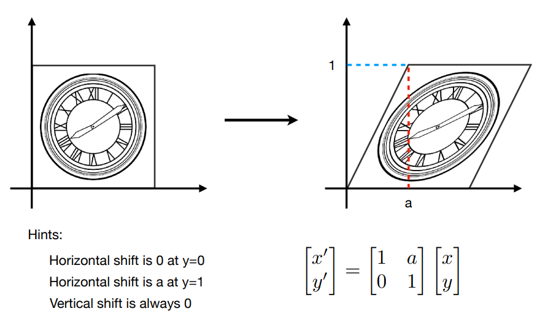

### 3.1.4	Rotate旋转(默认 绕原点 逆时针 旋转)

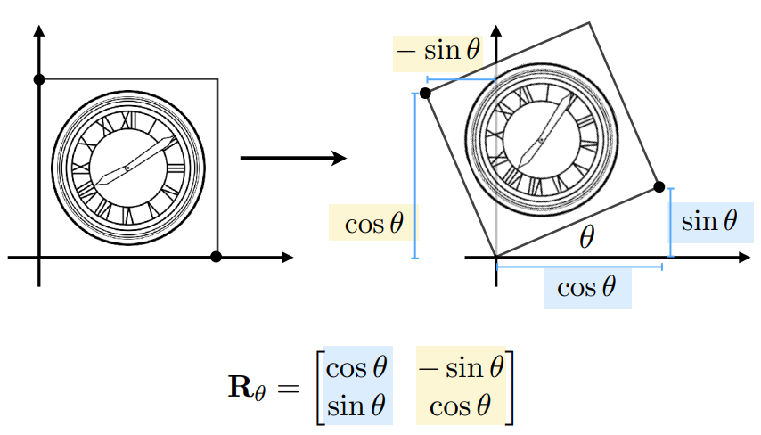

### 3.1.5	Linear Transform线性变换=矩阵

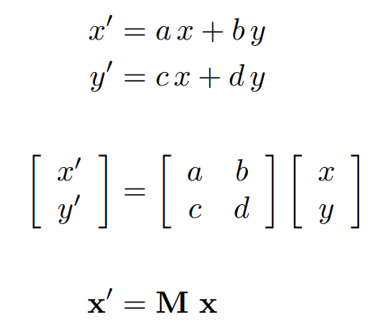

## 3.2	Homogeneous coordinates齐次坐标

### 3.2.1	Translation平移变换$\notin$线性变换

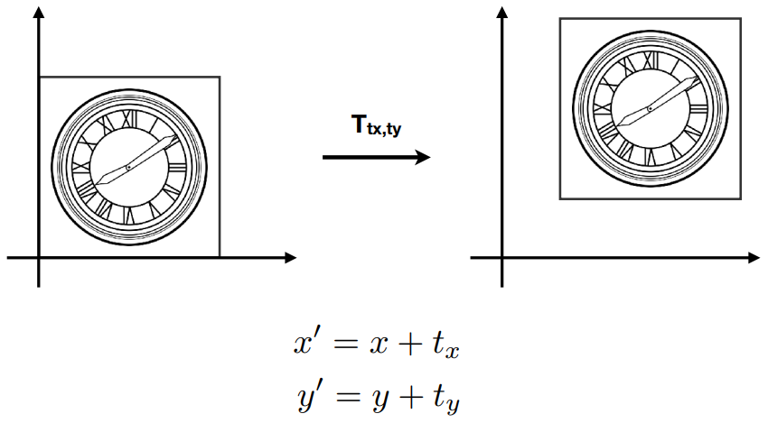

矩阵表示：


### 3.2.2	齐次坐标

添加一个维度

1.   2维点：$(x,y,1)^T$
2.   2维点的补充形式：$(x,y,w)^T$与$(\frac{x}{w},\frac{y}{w},1)^T$等价
3.   2维向量：$(x,y,0)^T$

对于两者第3个坐标的解释：

1.   点的第三维为0，向量的第三维为1，可以满足向量的平移不变性
2.   且可以满足以下性质
     1.   vector + vector = vector
     2.   point - point = vector
     3.   point + vector = point
     4.   point + point = 两个point的中点

### 3.2.3	Affine Transformation仿射变换


### 3.2.4	2D Transformation


### 3.2.5	Inverse Transform逆变换

逆变换 <==> 乘变换矩阵的逆矩阵

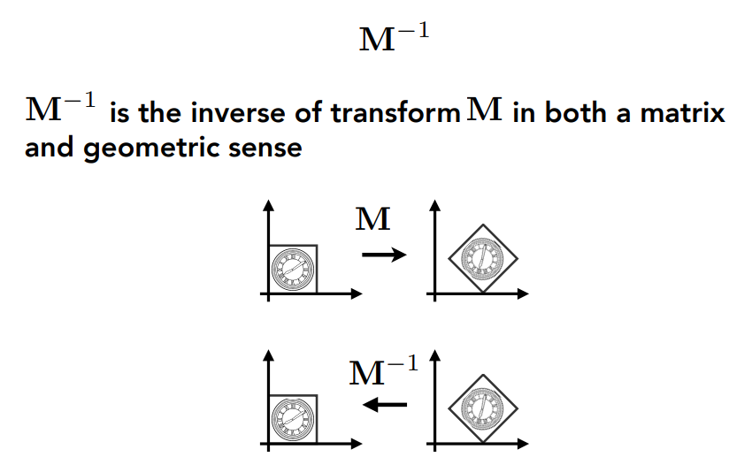

## 3.3	Composing Transforms变换的组合

### 3.3.1	举例

1.   复杂变换可以有简单变换组合而成
2.   简单变换的顺序是很有必要的 <==> 矩阵乘法不满足交换律

变换的目标：

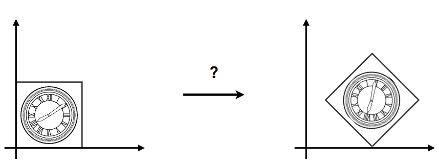

变换的方法：先平移后旋转 or 先旋转后平移

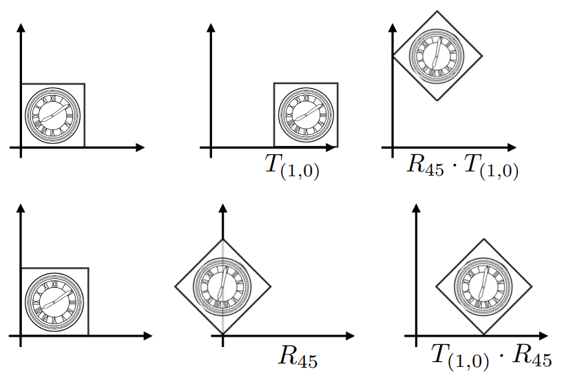

矩阵表示：**从右到左**进行矩阵乘法


### 3.3.2	多个变换

假设有一系列仿射变换$A_1,A_2,A_3...$

1.   可以用矩阵乘法表示：

     

2.   可以先计算$A_n...A_2·A_1$，再与列向量相乘

     1.   一个3*3的矩阵可以表示任意的变换

### 3.3.3	变换的分解

以C点为中心进行旋转$\alpha$度：$T(\vec{c})·R(\alpha)·T(\vec{-c})$

1.   先将图形按照$\vec{-c}$的方向进行平移：$T(\vec{-c})$
2.   然后绕原点旋转$\alpha$度：$R(\alpha)$
3.   然后将图形按照$\vec{c}$的方向进行平移：$T(\vec{c})$


# 第4课	Transform Cont

## 4.0	有关旋转的补充

$$
R_{\theta}=
\left(
\begin{matrix}
\cos\theta & -\sin\theta \\ 
\sin\theta & \cos\theta
\end{matrix}
\right) \\

R_{-\theta}=
\left(
\begin{matrix}
\cos\theta & \sin\theta \\ 
-\sin\theta & \cos\theta
\end{matrix}
\right)
=R_{\theta}^T \\

R_{-\theta}=R_\theta^{-1}
$$

正交矩阵：$R^T=R^{-1}$

## 4.1	3D Transformations

### 4.4.1	齐次坐标

1.   3维点：$(x,y,z,1)^T$
2.   3维点的补充形式：$(x,y,z,w)^T$与$(\frac{x}{w},\frac{y}{w},\frac{z}{w},1)^T$等价
3.   3维向量：$(x,y,z,0)^T$

### 4.4.2	Affine Transform


变换的顺序：先**线性变换**，后加**平移**量

#### 4.4.2.1	缩放


#### 4.4.2.2	平移


#### 4.4.2.3	旋转

##### 4.4.2.3.1	绕坐标轴旋转

1.   绕X轴：X不变，YZ旋转

     

2.   绕Y轴：Y不变，ZX旋转

     

3.   绕Z轴：Z不变，XY旋转

     

##### 4.4.2.3.2	绕任意过原点的轴旋转：罗德里格旋转公式

1.   绕任意轴旋转

     1.   将任意轴方向的旋转，分解为绕X、Y、Z轴的旋转：$R_{x,y,z}(\alpha,\beta,\gamma)=R_x(\alpha)R_y(\beta)R_z(\gamma)$
     2.   $\alpha,\beta,\gamma$也被称为欧拉角

2.   **Rodrigues’ Rotation Formula罗德里格旋转公式**

     1.   向量**v** 绕过原点的轴**n** 旋转**$\alpha$**角，向量**I**为向量**v**方向的单位向量

     

3.   推导思路：
     1.   **v**与**n**垂直时，$\vec{v'}=\cos\alpha*\vec{v}+\sin\alpha*(\vec{n}×\vec{I})$

     2.   **v**与**n**不垂直时，将**v**分解为 垂直于**n**的向量**v~⊥~** 和平行于**n**的向量**v~∥~**
          1.   $\vec{v_∥'}=\vec{v_∥}=|\vec{v}|*cos<\vec{v},\vec{n}>=\vec{v}·\vec{n}·\vec{n}$
          2.   $\vec{v_⊥}=\vec{v}-\vec{v_∥}=\vec{v}-\vec{v}·\vec{n}·\vec{n}$
          3.   $\vec{v_⊥'}=\cos\alpha*\vec{v_⊥}+\sin\alpha*(\vec{n}×\vec{v_⊥})$
          4.   综上可得：$\vec{v'}=\vec{v_∥'}+\vec{v_⊥'}=\cos\alpha*\vec{v}+(1-\cos\alpha)*\vec{v}·\vec{n}·\vec{n}+\sin\alpha*(\vec{n}×\vec{v})$

     3.   矩阵形式：$\vec{v'}=\cos\alpha*\vec{v}+(1-\cos\alpha)*\vec{v}·\vec{n}·\vec{n}+\sin\alpha*(\vec{n}×\vec{v})$$

          ​						$=[\cos\alpha*\vec{I}+(1-\cos\alpha)*\vec{n}·\vec{n}^T+\sin\alpha*(\vec{n}×\vec{I})]·\vec{v}$

4.   绕过任意轴**n** 旋转**$\alpha$**角

     1.   先将轴平移至过原点
     2.   然后旋转
     3.   最后平移回去

## 4.2	View/Camera Transformation 视图/相机变换

### 4.2.1	什么是视图变换

1.   与照相类比：**MVP**变换
     1.   找一个好的地方、人物排列 ==> 模型变换 **model** transformation
     2.   找一个好的角度放置摄像机 ==> 视图变换 **view** transformation
     3.   拍照                                       ==> 投影变换 **projection** transformation

### 4.2.2	定义Camera

1.   位置Position：$\vec{e}$
2.   往哪看Look-at/gaze direction：$\vec{g}$
3.   向上方向Up direction：$\vec{t}$

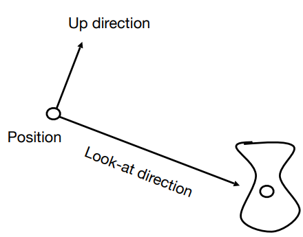

### 4.2.3	关键点

1.   只要 摄像机 与 物体 的相对位置一样，所看到的图形就是一样的

     

2.   将摄像机永远放在一个标准的位置

     1.   Position：原点
     2.   Up direction：Y轴
     3.   Look-at direction：-Z轴

3.   当相机变换时，将物体随着相机变换

### 4.2.4	将相机移动到标准位置

1.   方法

     1.   将$\vec{e}$平移到原点
     2.   旋转 $\vec{g}$ 到**-Z**的方向
     3.   旋转 $\vec{t}$ 到**Y**的方向
     4.   旋转 $\vec{g}×\vec{t}$ 到**X**方向

2.   矩阵表示：设$M_{view}=R_{view}T_{view}$

     1.   将$\vec{e}$平移到原点

          

     2.   旋转 $\vec{g}$ 到**-Z**、 $\vec{t}$ 到**Y**、$\vec{g}×\vec{t}$ 到**X**：考虑逆矩阵

          

### 4.2.5	总结

1.   将物体与相机一起旋转
2.   将相机变换到标准位置：
     1.   Position：原点
     2.   Up direction：Y轴
     3.   Look-at direction：-Z轴
3.   这一步也被称为**ModelView Transformation**

## 4.3	Projection Transformation

1.   Orthographic Projection 正交投影：不存在近大远小
2.   Perspective Projection 透视投影：存在近大远小，平行线不再平行

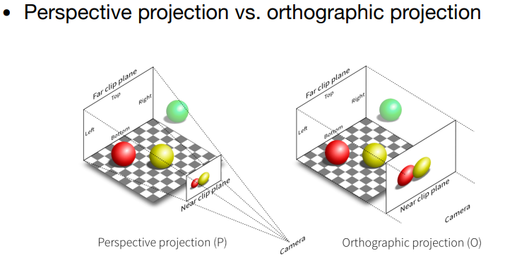

### 4.3.1	Orthographic Projection 正交投影

1.   方法：将一个立方体$[l, r]×[b, t]×[f, n]$映射到标准立方体$[-1, 1]^3$上

     1.   首先，通过**平移**操作，将立方体的中心移到原点
     2.   然后，通过**缩放**操作，将立方体缩放为标准立方体
     3.   立方体的定义：X轴$[l,r]$；Y轴$[b,t]$；Z轴$[f,n]$
     4.   变换之后，物体一定会有拉伸 

     

2.   变换矩阵

     1.   先平移到原点，再缩放到2

     $$
     M_{ortho}=
     \left(
     \begin{matrix}
     \frac{2}{r-l} & 0 			  & 0   		  & 0 \\
     0 			  & \frac{2}{t-b} & 0   		  & 0 \\
     0 			  & 0 			  & \frac{2}{n-f} & 0 \\
     0 			  & 0 			  & 0   		  & 1 \\
     \end{matrix}
     \right)
     
     \left(
     \begin{matrix}
     1 & 0 & 0 & -\frac{r+l}{2} \\
     0 & 1 & 0 & -\frac{t+b}{2} \\
     0 & 0 & 1 & -\frac{n+f}{2} \\
     0 & 0 & 0 & 1 \\
     \end{matrix}
     \right)
     
     =
     \left(
     \begin{matrix}
     \frac{2}{r-l} & 0 			  & 0   		  & -\frac{r+l}{r-l} \\
     0 			  & \frac{2}{t-b} & 0   		  & -\frac{t+b}{t-b} \\
     0 			  & 0 			  & \frac{2}{n-f} & -\frac{n+f}{n-f} \\
     0 			  & 0 			  & 0   		  & 1 \\
     \end{matrix}
     \right)
     $$

### 4.3.2	Perspective Projection 透视投影

#### 4.3.2.1	如何进行透视投影


1.   首先，定义从相机点向外的两个平面**n、f**，**f**平面要比**n**平面大
2.   此时就相当于**f**平面上的点全部投影到**n**平面上
3.   投影方法
     1.   先将**Frustum**挤成**Cuboid**(n->n，f->f)：$M_{persp->ortho}$
          1.   近平面永远不变
          2.   远平面的Z值永远不变
          3.   远平面的中心点永远不变
     2.   再进行一次正交投影：$M_{ortho}$

#### 4.3.2.2	计算矩阵$M_{persp->ortho}$

1.   思路：找到变换后的点$(x',y',z')$与原来的点$(x,y,z)$的对应关系

2.   从YZ平面上看，$y'=\frac{n}{z}*y$

     1.   同理，$x'=\frac{n}{z}*x$

     

3.   齐次坐标表示

     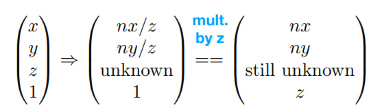

4.   矩阵表示

     1.   
     2.   

5.   对于矩阵的第三行(对于Z值)，有以下性质

     1.   在近平面上的点，Z值不变

          1.   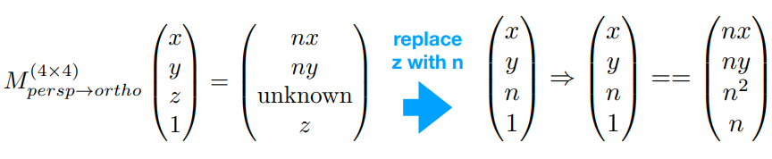
          2.   
          3.   

     2.   在远平面上的点，Z值不变

          1.   这里取中心点$(0,0,f)$
          2.   

     3.   根据两个等式，可以解出$A,B$

          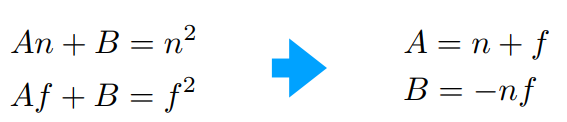

6.   综上
     $$
     M_{persp \rightarrow ortho}=
     \left(
     \begin{matrix}
     n & 0 & 0   & 0 \\
     0 & n & 0   & 0 \\
     0 & 0 & n+f & -nf \\
     0 & 0 & 1   & 0 \\
     \end{matrix}
     \right)
     $$
     
7.   最后，再进行正交投影：$M_{persp}=M_{ortho}M_{persp->ortho}$

$$
M_{persp}=
\left(
\begin{matrix}
\frac{2}{r-l} & 0 			  & 0   		  & -\frac{r+l}{r-l} \\
0 			  & \frac{2}{t-b} & 0   		  & -\frac{t+b}{t-b} \\
0 			  & 0 			  & \frac{2}{n-f} & -\frac{n+f}{n-f} \\
0 			  & 0 			  & 0   		  & 1 \\
\end{matrix}
\right)

\left(
\begin{matrix}
n & 0 & 0   & 0 \\
0 & n & 0   & 0 \\
0 & 0 & n+f & -nf \\
0 & 0 & 1   & 0 \\
\end{matrix}
\right)

=

\left(
\begin{matrix}
\frac{2n}{r-l}	& 0 			 & -\frac{r+l}{r-l} & 0 \\
0 				& \frac{2n}{t-b} & -\frac{t+b}{t-b} & 0  \\
0 				& 0				 & \frac{n+f}{n-f}	& -\frac{2nf}{n-f} \\
0 				& 0				 & 1				& 0 \\
\end{matrix}
\right)
$$

#### 4.3.3.3	对于不在近/远平面上的点

$$
\left(
\begin{matrix}
n & 0 & 0   & 0 \\
0 & n & 0   & 0 \\
0 & 0 & n+f & -nf \\
0 & 0 & 1   & 0 \\
\end{matrix}
\right)

\left(
\begin{matrix}
x \\
y \\
z \\
1 \\
\end{matrix}
\right)
=

\left(
\begin{matrix}
nx \\
ny \\
(n+f)z-nf \\
z \\
\end{matrix}
\right)

==>
\left(
\begin{matrix}
\frac{n}{z}x \\
\frac{n}{z}y \\
(n+f)-\frac{nf}{z} \\
1 \\
\end{matrix}
\right)
$$

1.   近平面上的点$(z=n)$
     1.   $z'=(n+f)-\frac{nf}{n}=n$
     2.   $z'=z$
2.   远平面上的点$(z=f)$
     1.   $z'=(n+f)-\frac{nf}{f}=f$
     2.   $z'=z$
3.   不在近/远平面上的点$(f<z<n)$
     1.   $z'=(n+f)-\frac{nf}{z}$
          1.   设$n=1,f=-1,z=0.5$，则$z'=2$
          2.   设$n=1,f=-1,z=-0.5$，则$z'=-2$
     2.   可得：若$z<0$，则$z'$更靠近**远平面$f$**；若$z>0$，则$z'$更靠近**近平面$n$**
