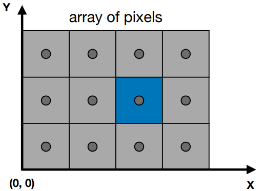
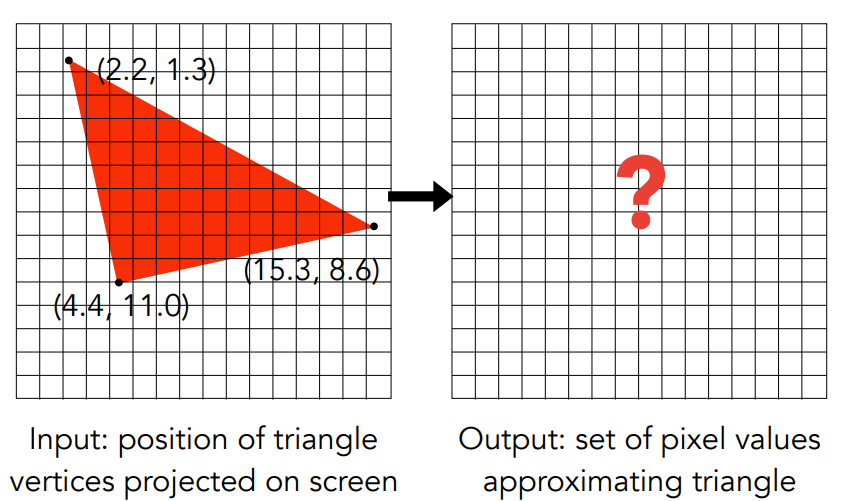
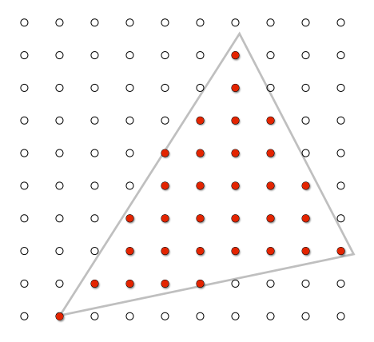
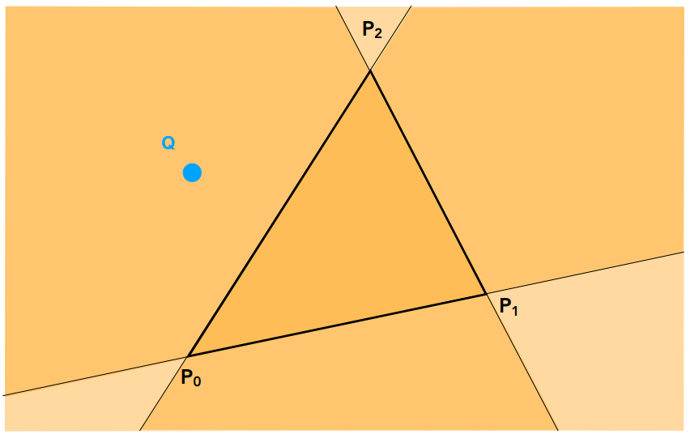
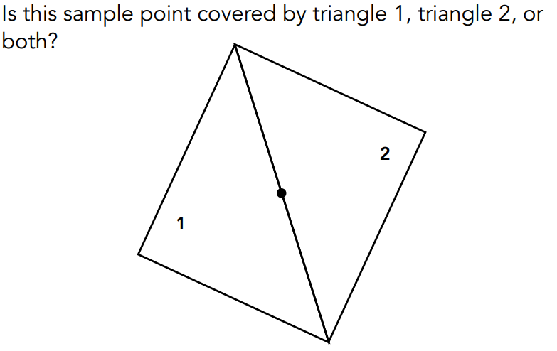
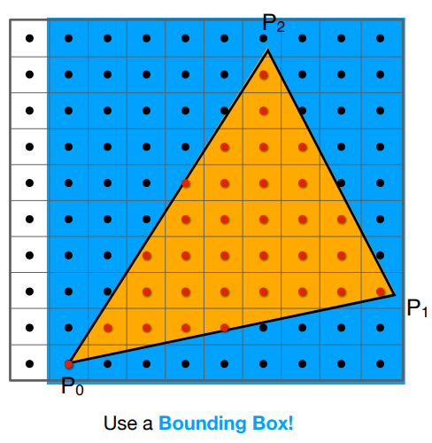
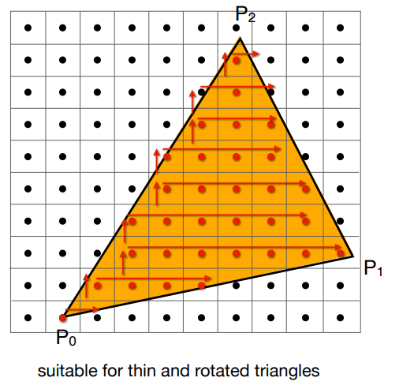

[TOC]

# 第5课	Rasterization 1（Triangle）

## 5.1	Perspective Projection 透视投影


1.   Aspect ratio纵横比=$\frac{width}{height}$

2.   field-of-view视野(fovY)：从摄像机所在位置出发，连接屏幕宽的两个中点，两条线所夹的角度

3.   从**fovY**和**Aspect**推出**l, r, b, t**

     

4.   定义一个视锥，需要

     1.   垂直的可视角度
     2.   宽高比

## 5.2	Canonical Cube to Screen 规范立方体=>屏幕

### 5.2.1	屏幕的定义

1.   像素点形成的二维数组

2.   数组的大小：分辨率**resolution**

3.   是一个典型的光栅成像设备**raster display**

     1.   在德语中，raster == screen
     2.   rasterize == drawing onto the screen

4.   Pixel像素：FYL，picture element的缩写

     1.   在本节课中，一个像素就是一个小的立方体，有着一个固定的颜色
     2.   颜色是红、绿、蓝的组合

5.   屏幕空间**screen space**

     

6.   像素的坐标

     1.   由一个整数坐标**(x,y)**表示，范围为**(0,0) ~ (width-1, height-1)**
     2.   像素的中心在**(x+0.5, y+0.5)**
     3.   屏幕的范围为**(0, 0) ~ (width, height)**

### 5.2.2	视口变换：$[-1,1]^2 \rightarrow [0,width]×[0,height]$

1.   先忽略Z

2.   变换XY坐标（视口变换**Viewport Transform**）：$[-1,1]^2 \rightarrow [0,width]×[0,height]$
     $$
     M_{viewport}=
     \left(
     \begin{matrix}
     \frac{width}{2}	& 0					& 0	& \frac{width}{2} \\
     0				& \frac{height}{2}	& 0	& \frac{height}{2} \\
     0				& 0					& 1	& 0 \\
     0				& 0					& 0	& 1
     \end{matrix}
     \right)
     $$

3.   

### 5.2.3	三角形的性质

1.   最基础的多边形
2.   任何多边形都可以拆分车呢个三角形
3.   一定是一个平面
4.   可以很好的定义内部外部
5.   在三角形的顶点处插值的定义明确的方法（重心插值）

### 5.2.4	三角形 => 像素



#### 5.2.4.1	方法1：Sampling采样法

1.   在每一个采样点，查询函数的值

2.   也就是函数离散化的过程

     ```c++
     for(int x = 0; x < xmax; x++)
         output[x] = f(x);
     ```

3.   定义一个函数：**inside(t, x, y)**
     $$
     inside(t,x,y)=\left\{
     \begin{matrix}
     1 & (x,y)在三角形t内\\
     0 & (x,y)不在三角形t内
     \end{matrix}
     \right.
     $$

     ```c++
     for(int x = 0; x < xmax; x++)
         for(int y = 0; y < ymax; y++)
             image[x][y] = inside(tri, x+0.5, y+0.5);
     ```

     

4.   **inside(t, x, y)**函数的实现方法（已知点与三角形共面，如何判断一个点是否在三角形内）**叉乘**

     1.   按照$P_0,P_1,P_2$的顺序进行叉乘$\vec{P_0P_1}×\vec{P_0Q},\vec{P_1P_2}×\vec{P_1Q},\vec{P_2P_0}×\vec{P_2Q}$，三者的Z的正负性相同

          

     2.   边界情况：可以不做处理 or 特殊处理，在本课中，可以默认都在/都不在三角形内

     

5.   三角形的包围盒**Bounding Box**：只需要考虑包围盒内的像素

     1.   这里是轴向的包围盒，因为只有XY平面的

          

6.   也可以对每行计算 最左像素 和 最右像素

     

# 第6课	Rasterization 2（Antialiasing and Z-Buffering）