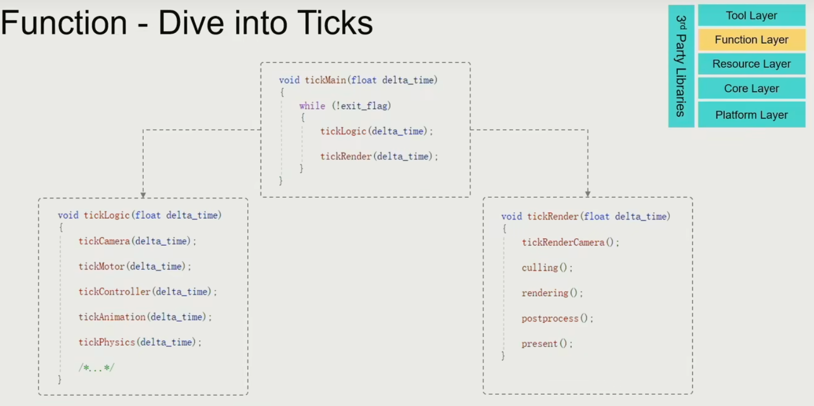
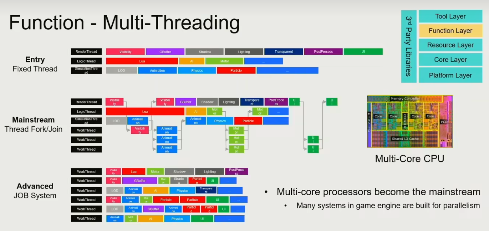
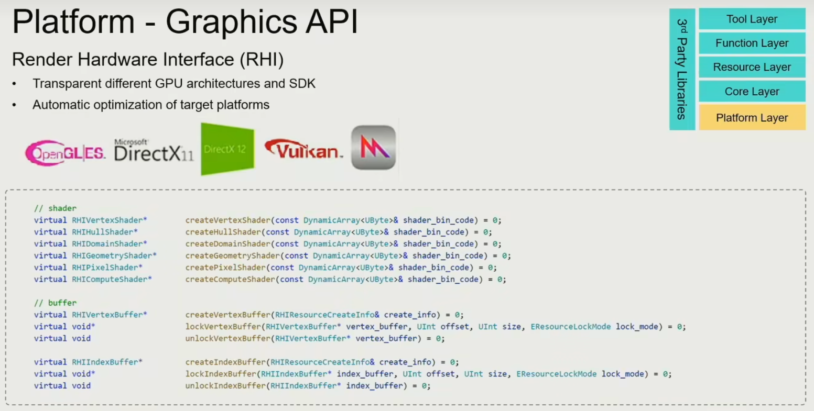

[TOC]

# 二、引擎架构分层与整体pipeline

## 2.1	游戏引擎分层简介 5+1

1. 工具层**Tool Layer**：各种编辑器
2. 功能层**Function Layer**：让游戏Visible(渲染)、Movable(物理系统)、Playable(状态机&人机交互)
3. 资源层**Resource Layer**：各种数据文件，如图形、几何、声音、视频、场景等等
4. 核心层**Core Layer**：引擎的工具箱，如内存管理、容器分配、数学运算等等
5. 平台层**Platform Layer**：隐藏不同平台的不同接口

第三方库文件**3nd Party Libraries**，与各个层都会有关系

## 2.2	资源层

1. 将各种资源文件，转化成引擎统一的格式，如**.uasset**
2. 这一步会将很多冗余信息清除，将文件的格式转化为GPU可以高效绘制的格式
3. 还需要生成一些资源文件，用于表示不同资源文件之间的关联
4. 需要负责管理所有资产的**生命周期**：垃圾回收GC、延迟加载

## 2.3	功能层

1. 每经过一个**Tick**，会将整个游戏的逻辑和渲染运行一遍
2. **tick**会分为两个步骤：**tickLogic()** => **tickRender()**
   1. **tickLogic()**：对世界的模拟，如输入输出、物理系统、碰撞检测
   2. **tickRender()**：对世界的渲染
3. 功能层是整个引擎中最多的部分，会跟具体游戏有关联
4. 功能层的某些模块既可以当作是引擎的模块，也可以当作是游戏的模块，如：相机的移动

多线程计算：

## 2.4	核心层

1. 数学库：
   1. 为了提高效率，因此会在核心层中，重写数学库
   2. 如用SIMD实现矩阵乘法
2. 数据结构和容器：
   1. 也是为了提高效率，因此会在核心层中，重写数据结构，而不是直接使用STL容器
3. 内存管理
   1. 游戏引擎会提前申请一大块内存，由引擎管理
   2. 三个原则：尽可能将数据放到一起、按顺序访问数据、一次申请/释放一整块数据
4. 一般来说，核心层的代码质量最高，轻易不会修改

## 2.5	平台层

1. 掩盖掉不同平台之间的差异

   1. 文件的路径

   2. 图形学API：用Render Hardware Interface(RHI)隐藏起来

      

   3. 硬件架构

2. 平台层的好坏影响了游戏在不同平台上的性能优劣

## 2.6	工具层

允许所有人用引擎创建游戏

1. 保证工具层展示的结果和最终游戏的结果是一样的
2. 以开发效率为优先，而不是以运行效率为优先

DCC：Digital Content Creation

1. 将其他工具产生的数字资产，转化为引擎统一的数字资产

## 2.7	为什么要分层架构

1. 降低问题的复杂度，让每一层只需要考虑自己的任务
   1. 越底层的东西越不会轻易改变
   2. 越往上，越灵活；越往下，越稳定
2. 要先将问题划分为不同层次的任务，然后再进行开发
3. 只允许上层调用下层，下层不能调用上层
