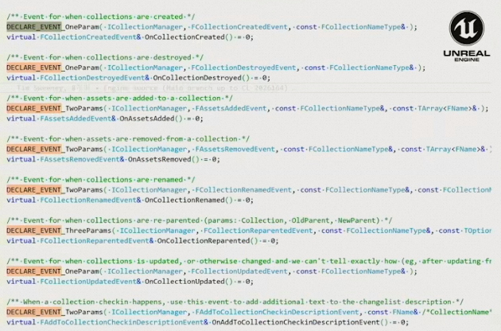
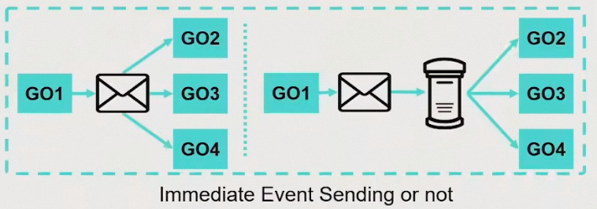
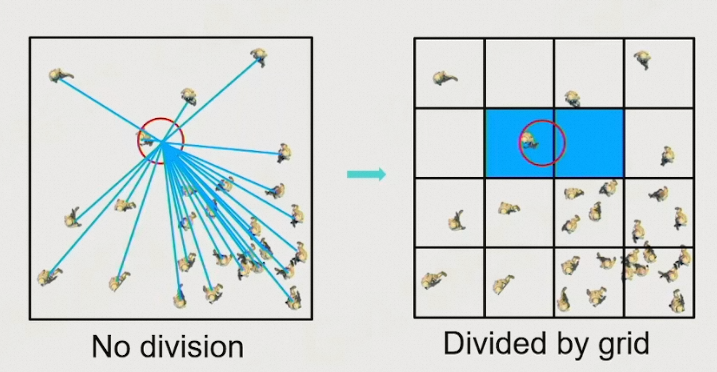
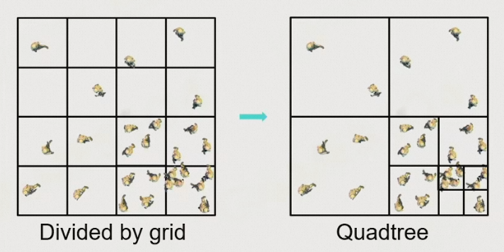
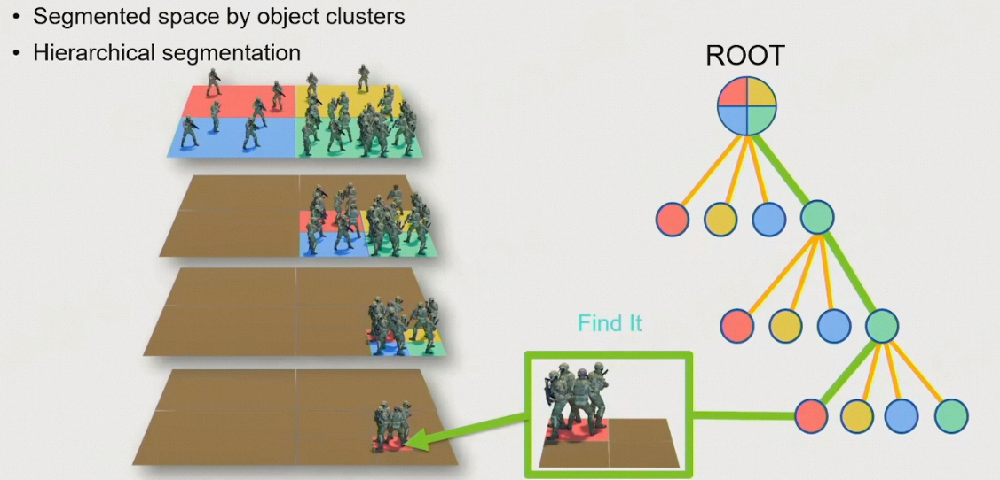
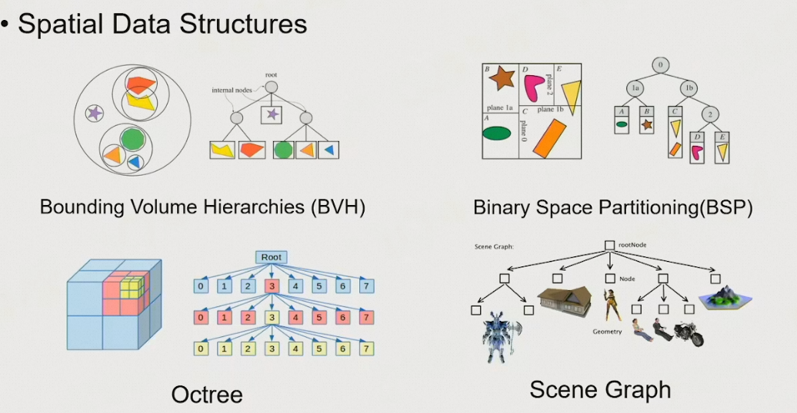

[TOC]

# 三、总览：如何构建游戏世界

## 3.1	Event机制

实现不同对象之间的交互：

1. unity：

   ```c#
   using UnityEngine;
   public class Example : MonoBehavior{
       void Start(){
           gameObject.SendMessage("ApplyDamage", 0.5);
       }
   }
   public class Example2 : MonoBehavior{
       public void ApplyDamage(float damage){
           Debug.Log(damage);
       }
   }
   ```

2. unreal：

   

为了确保时序的严格一致，所有GO要将消息发送给邮局，然后再由邮局在下一个tick的时候发送给不同的GO

1. 精彩回放：将每个人的输入保存下来，回放时重新跑一遍



## 3.2	场景管理

当场景中的GO过多时，将世界划分为层级结构，每个GO仅与临近格子的GO交互









## 3.3	GO的绑定

先进行父节点的tick，然后再进行子节点的tick

## 3.4	Q&A

### 3.4.1	如果一个tick时间过长怎么办

1. 比如一个爆炸，瞬间产生了与非常多的GO的交互
2. 此时我们可以将这些GO分批处理，在相邻的几帧分别处理，从而降低某一帧的计算量

### 3.4.2	空气墙和其他GO有什么区别

1. 空气墙通常是很简单的几何体，如平面、长方体、参数曲面之类的，不会导入复杂mesh表示。
2. 对于引擎而言，实际上没有太大区别

### 3.4.3	tick时，渲染线程和逻辑线程怎么同步

1. tick一般分为两大步：tick_logic、tick_render，分别使用不同的线程计算
2. tick_logic负责不同GO之间的交互，tick_render负责准备一些数据，如渲染相关的数据
3. 一般是先tick_logic，然后再进行tick_render

### 3.4.4	空间划分如何处理动态物体

1. 通常就是树的插入与删除
2. 一般而言，做引擎的时候会实现两三种经典的空间划分算法，供具体的游戏选择

### 3.4.5	物理和动画相互影响时怎么处理

1. 通常是插值的方法
2. 在刚刚受击的时候，动画的位移影响大一点，越到后面越小
3. 将动画的位移给到物理系统，让物理系统根据动画和物理进行模拟