[TOC]

# 四、游戏引擎中的渲染实践

## 4.1	渲染流水线

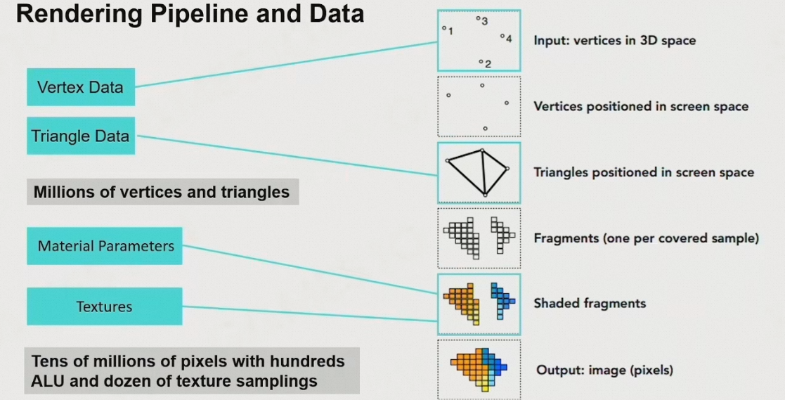

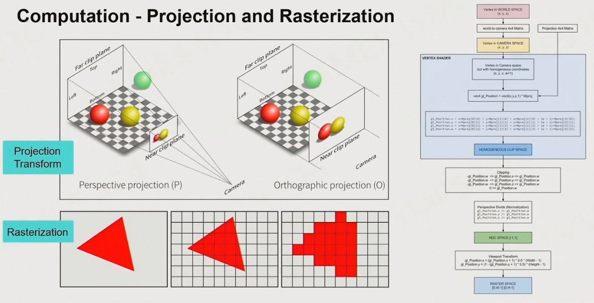

## 4.2	可渲染物体 Renderable

shader代码也是Renderable，因为在渲染的时候，数据会和shader代码一起送往GPU，GPU根据shader代码绘制模型数据

### 4.2.1	Mesh Render Component

1. 游戏世界中的所有东西都是一个Game Object
2. 只有当GO包含Mesh Render Component的时候，它才会被绘制到屏幕上

### 4.2.2	Renderable的组成

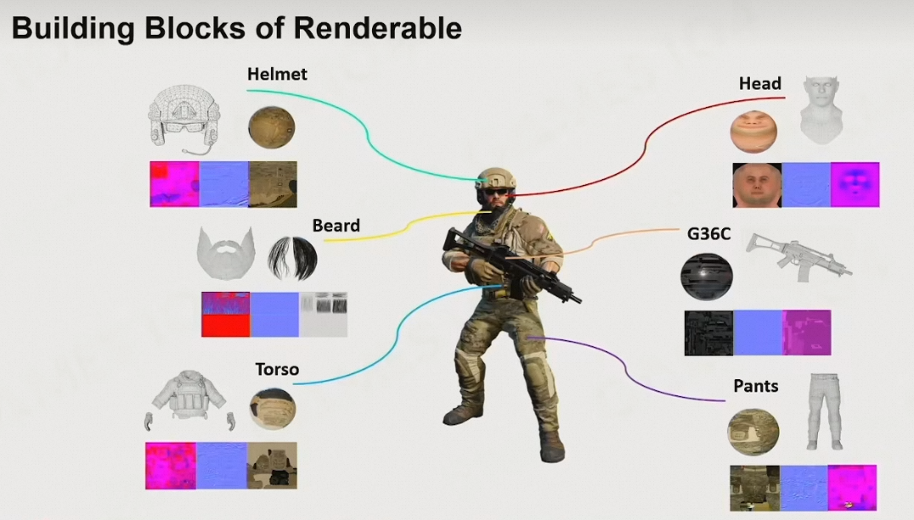

### 4.2.3	Mesh Primitive

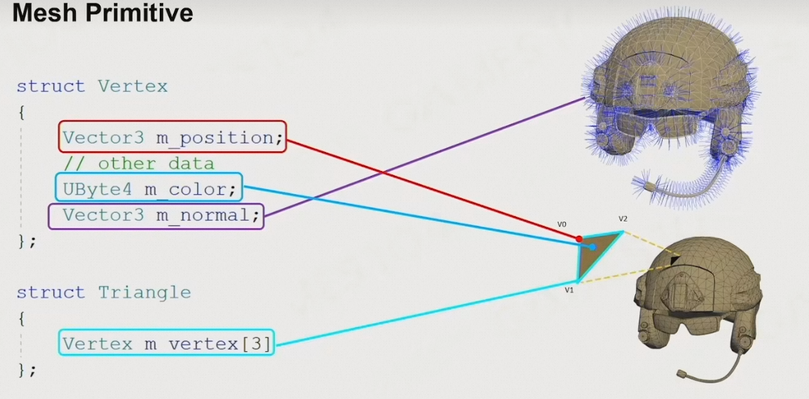

### 4.2.4	Vertex和Index缓存

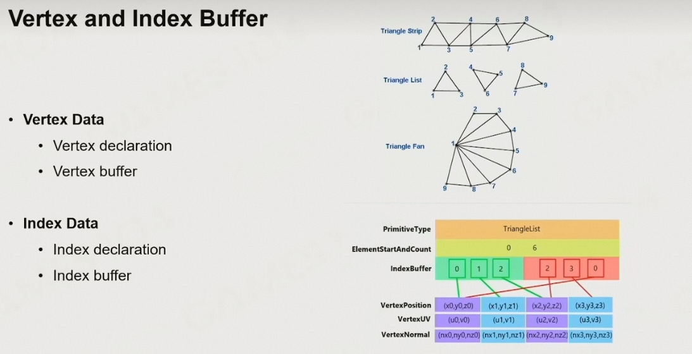

### 4.2.5	Mesh划分

1. 整个mesh存储在一个大的buffer
2. 每个submesh的数据连续存储在buffer中的一小部分

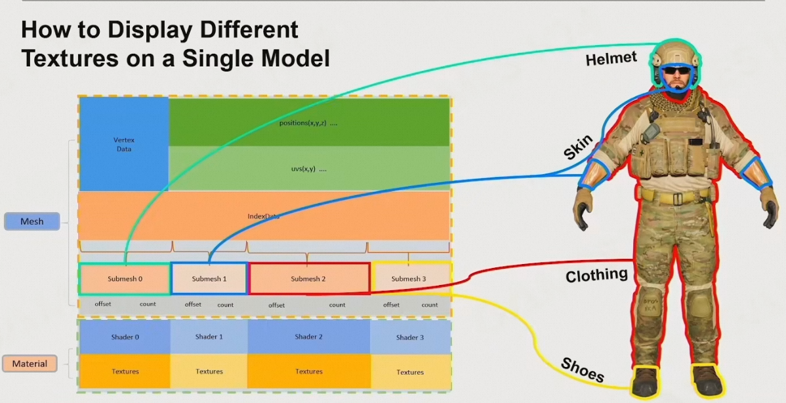

### 4.2.6	Resource Pool

1. 将mesh、shader、texture分类存放在不同的地方

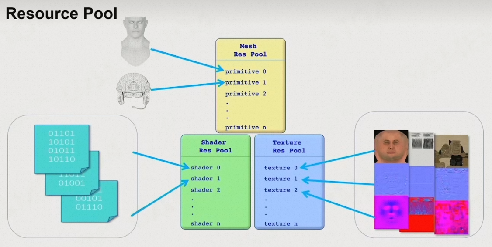

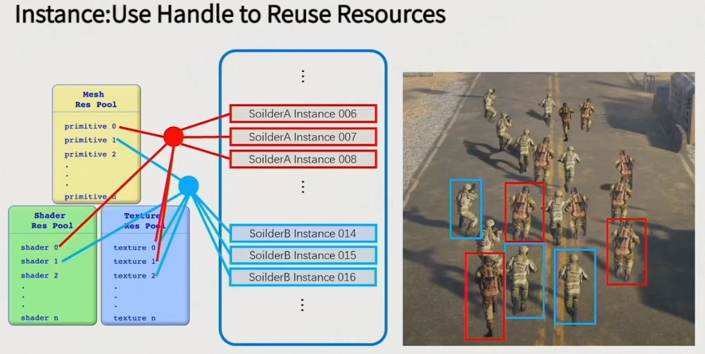

### 4.2.7	绘制时根据材质排序

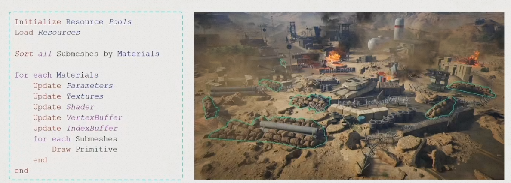

### 4.2.8	GPU Batch Rendering

同时绘制一批类似的物体

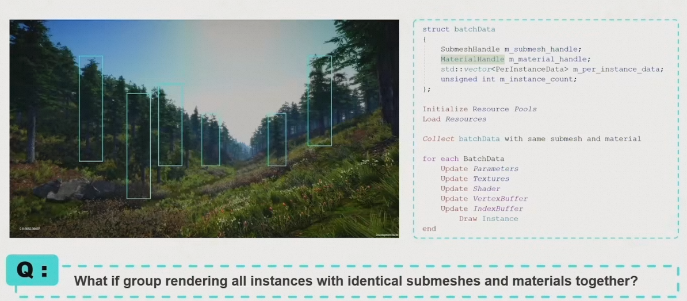

## 4.3	可见性裁剪

### 4.3.1	裁剪单个物体

1. 用视锥、包围盒裁剪单个物体

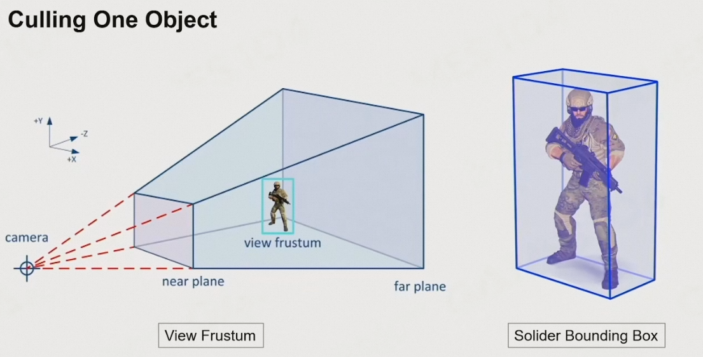

 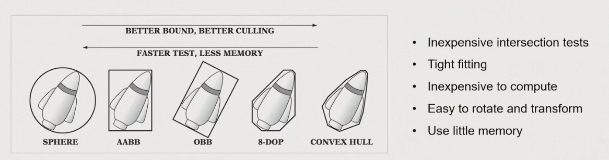

### 4.3.2	层次化视锥裁剪

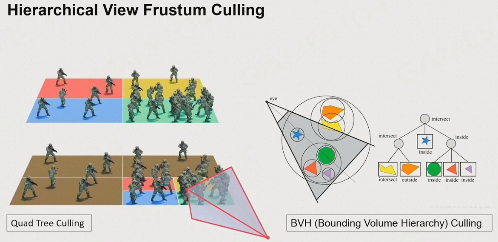

### 4.3.3	BVH的构建和插入

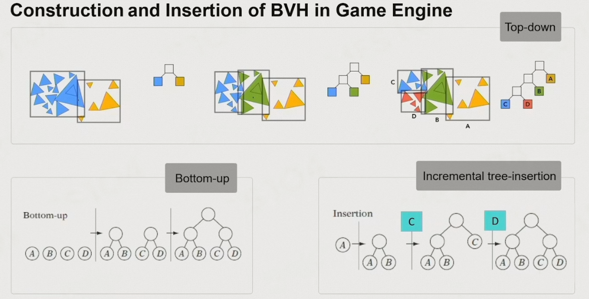

### 4.3.4	PVS：潜在可视集合

1. 将世界划分为不同的区域，只预加载PVS中的数据

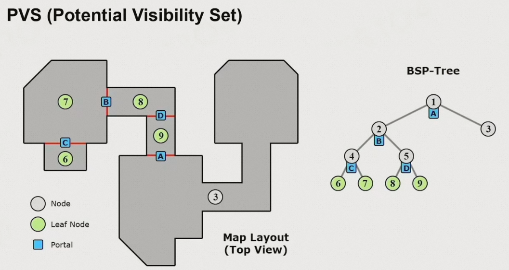

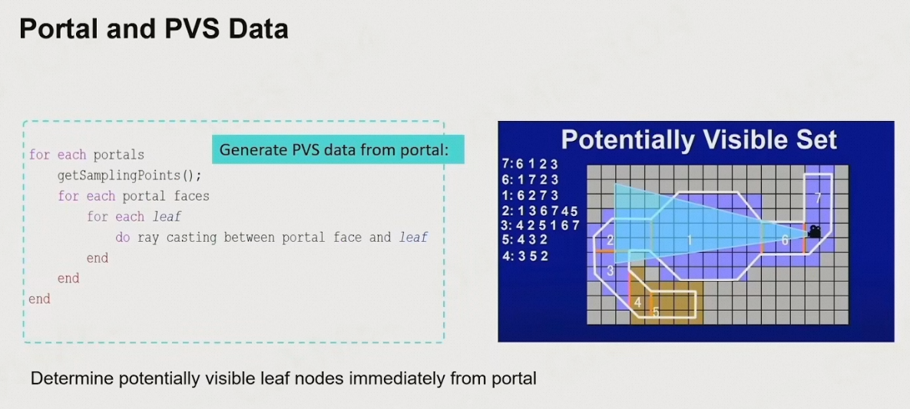

### 4.3.5	GPU Culling

1. 让GPU判断哪个物体可见，GPU返回一个bit，表示是否可见
2. GPU可以先绘制一次深度，通过深度判断是否可见

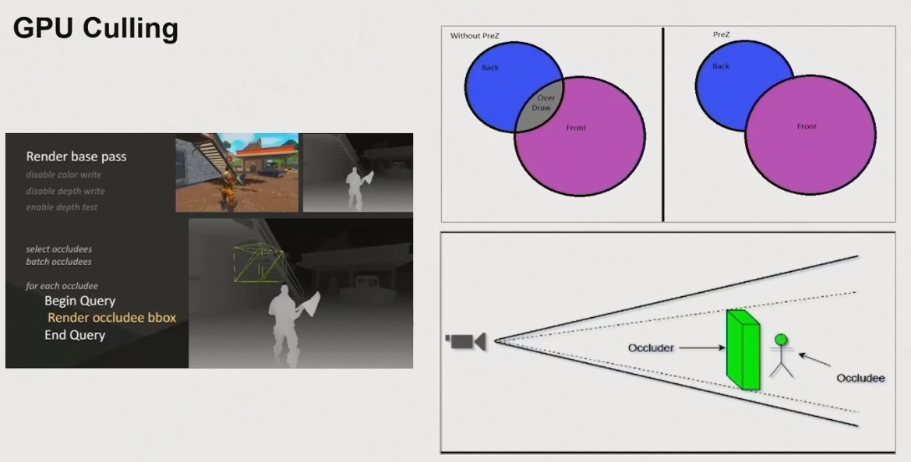

## 4.4	纹理压缩

1. 计算机压缩图片与纹理压缩图片不同，计算机压缩的图片无法支持随机访问，且读取时需要很大计算量
2. Block Compression：BC7
   1. 以4×4为基本块，记录最亮和最暗的颜色值，每个像素存储一个alpha值，表示这两个颜色通过当前比例混合，可以得到原像素值
   2. 计算消耗很低，可以进行实时压缩

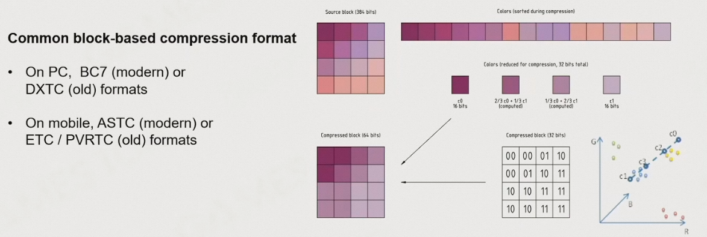

## 4.5	新的模型管线：Cluster-Based Mesh Pipeline

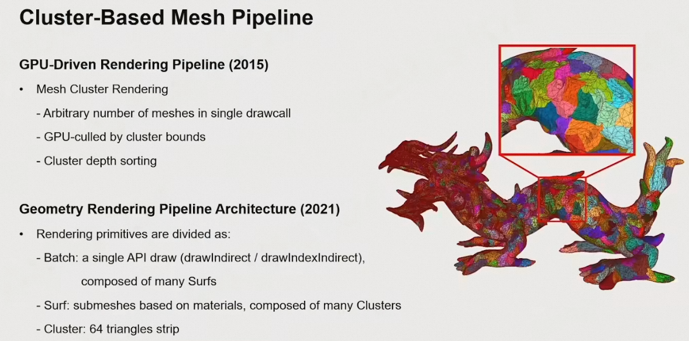

现代的游戏，模型精度越来越高，地图越来越大，数据量越来越多

1. 核心思想：将模型划分为小的**面片**，每个面片有固定的三角形数目(如32个/64个)，由GPU创建几何细节
2. 当面皮的包含的三角形数目固定之后，可以由GPU并行地生成细节
3. 用相同的算法，基于数据，凭空生成几何细节；并且根据距离相机的远近，选择精度
   1. GPU处理最高效的，就是相同的一个个小块
4. 可以基于面皮，进行可视性裁剪

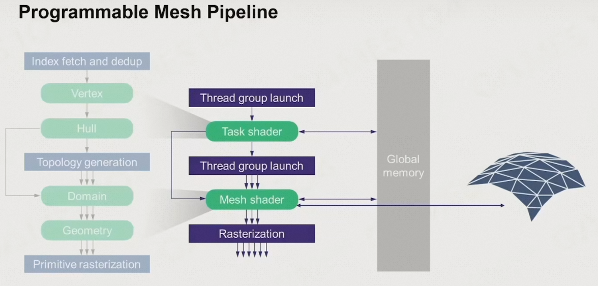

1. UE的Nanite技术就是基于这个思想，进行开发的

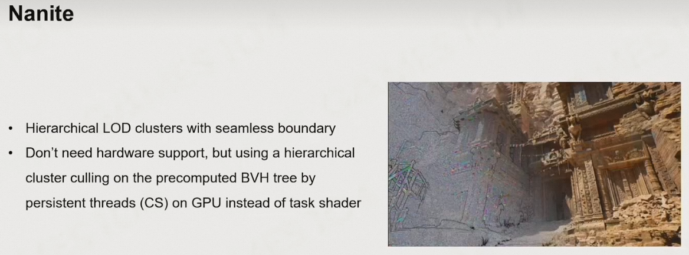

## 4.5	总结

1. 游戏引擎的设计，与现代显卡的架构及其相关
2. 游戏引擎的核心问题，就是mesh、模型、材质这些数据之间的关系
3. 在绘制的时候，尽可能通过运算，把需要绘制的物体减到越少越好
4. 越来越多复杂的运算，从CPU移到了GPU，从而减轻CPU的负担