[TOC]

# 六、渲染：地形、大气、云的渲染

## 6.1	地形的几何

### 6.1.1	Heightfield

### 6.1.3	两个优化的准则

1. FOV越窄，三角形划分越密集

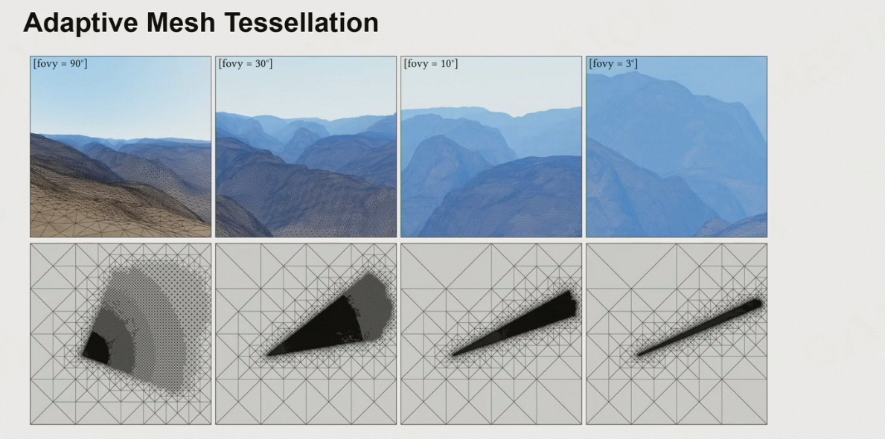

2. 和ground truth在屏幕上的误差不要超过一个像素

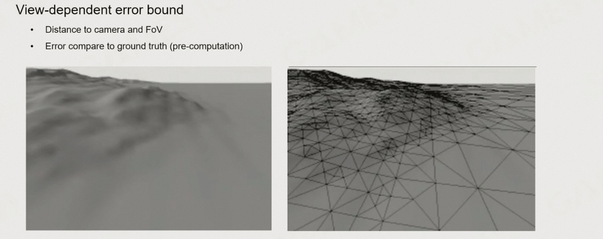

### 6.1.4	基于三角形的剖分

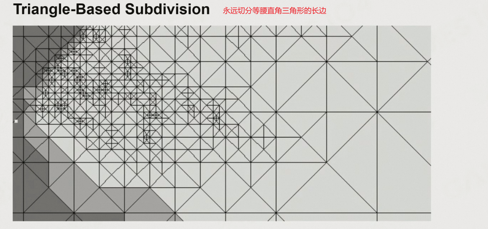

**T-Junctions**

1. 问题：当两个相邻的三角形在同一个边上，这个三角形没有切分这条边，而相邻三角形切分了(高度会随之变化)，会导致地形上有个裂缝
2. 解决方法：如果发现边上有邻居对相邻边的切分更密集，则当前三角形也需要将该边切分，直到与邻居的切分数相同

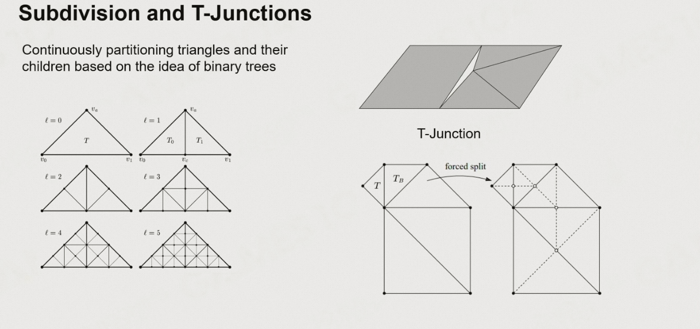

### 6.1.5	基于四叉树的切分

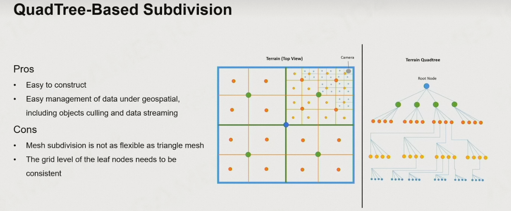

解决T-Junctions的问题：**Stitching吸附**

1. 将划分更密集的那个三角形的中心，对齐到更稀疏的三角形上
2. 即划分出了一个面积为0的三角形

### 6.1.6	基于不规则三角形的绘制 TIN

通过顶点简化，减少三角形的数目

优点：

1. 通常情况下，三角形的数目更少

缺点：

1. 地形的三角形难以在渲染的时候调整

### 6.1.7	基于GPU的曲面细分(Tessellation)

DirectX12开始支持Mesh Shader

1. 在给定Mesh Shader之后，Mesh Shader会生成一小块meshlit(一小片顶点&三角形)，顶点&三角形如何插值、如何凸包由shader控制

### 6.1.8	Real-Time Deformable Terrain

如果所有顶点的位置都可以在runtime动态调整，则可以让地形产生动态效果

1. 在人物的周边生成一个terrain deformable的texture，将这上面的脚印记录在texture上
2. 当移动的时候，texture跟着角色走，但是要保持数据一致性
3. 由于地形数据是实时细分出来的，就可以根据texture添加一些offset
4. 还要注意更新地形的碰撞

### 6.1.9	Non-Heightfield Terrain

地形不止有起伏，还有悬崖山洞之类的物体

#### 6.1.9.1	在Terrain中开一个洞

1. 可以在设置顶点位置的时候，判断一下这个顶点是否在洞中
2. 如果在洞中，则将其位置设为NaN
3. GPU在看到位置为NaN的顶点后，不会绘制用到这个顶点的所有物体
4. 然后再通过加一个山洞的模型，避免地形上的zigzag条纹显示出来

#### 6.1.9.2	地形体素化表达

1. 将地形表示为三维空间，三维空间中的每个点存一个权重值，表示这个位置是否有物质、物质的密度
2. 通过Marching Cubes方法，找到等值面，切分立方体，形成一个水密的三角面片集，把形状表达出来

## 6.2	地形的材质

### 6.2.1	Texture Splatting

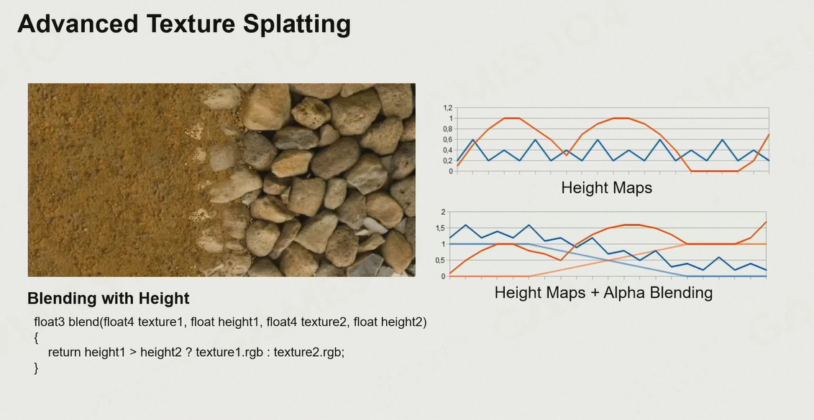

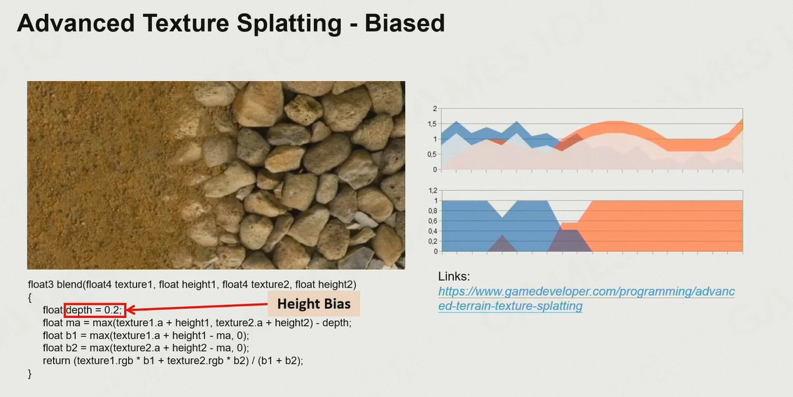

1. 每个材质存储Base Color、Normal、Roughness、Height四种贴图
2. 再存储一张混合贴图，每个channel表示一种贴图的权重，通过笔刷设置不同材质的权重
3. 在过渡的时候，如果需要混合两种材质，则根据height对权重进行调整，height高的权重下降慢
   1. 缺点：由于是01切换，当相机移动的时候，会有很多抖动，导致分界线过硬
   2. 解决方法：添加一个bias，当两者高度差<bias的时候，用权重进行插值

### 6.2.2	在Texture Array中采样

1. 将地表的多种材质存储为一个数组，每次采样仅会采样其中一个材质
2. 混合的时候，根据位置、权重、index，判断采样哪种材质，采样的权重是但多少

### 6.2.3	Displacement Mapping

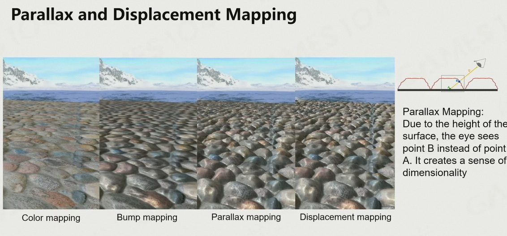

### 6.2.4	Expensive Material Blending

1. 每一次进行纹理采样，都需要采样8个点，进行7次插值
2. 一个点有几种材质进行混合，就需要在上述基础上乘几
3. 而这些采样的数据在内存中的不同地方，address的不停跳跃会非常浪费时间
4. 事实上，我们看到的地形仅有地形的一部分，其他部分都会被裁剪掉

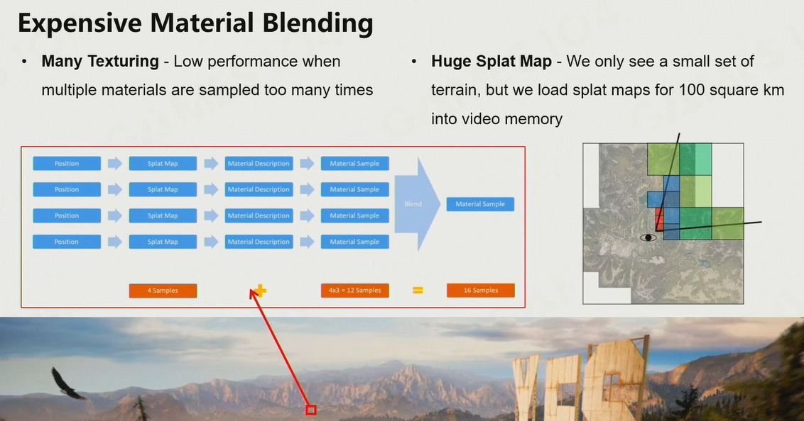

### 6.2.5	Virtual Texture

核心思想：将用到的东西装载到内存中

1. 将纹理分为不同块，分块数满足2的幂次
2. 然后根据分块对纹理建立Mipmap
3. 绘制时，只将看到的纹理LOD层加载到内存

### 6.2.6	浮点数精度溢出

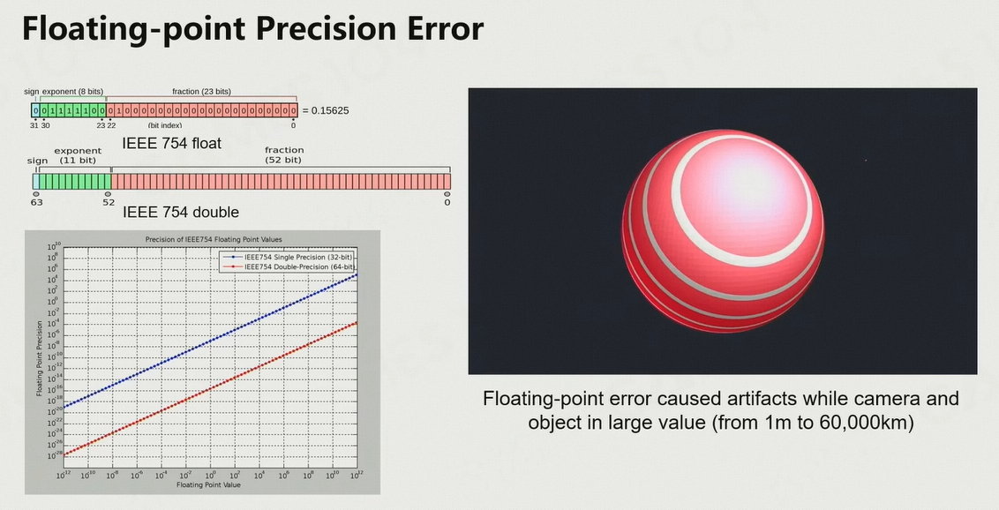

1. 当摄像机&地形的全局坐标很大(如1km)，而地形上的物体与地形距离很近(如0.5m)的时候，远处的地形与物体就会由于精度问题产生抖动

2. 解决方法：
   1. 将相机的位置强行设置为0，地形的位置坐标根据相机的位置设置，此时两者使用到的坐标都不会很大，就可以保证小数点后的精度了
      1. 修改前：地形位置1000010m、物体位置1000010.5m、相机位置1000000m
      2. 修改后：地形位置10m、物体位置10.5m、相机位置0m
   2. 也可以将整个大型关卡切分为不同的小关卡，每个小关卡拥有自己的全局坐标系

## 6.3	植被道路贴花等

### 6.3.1	树木渲染

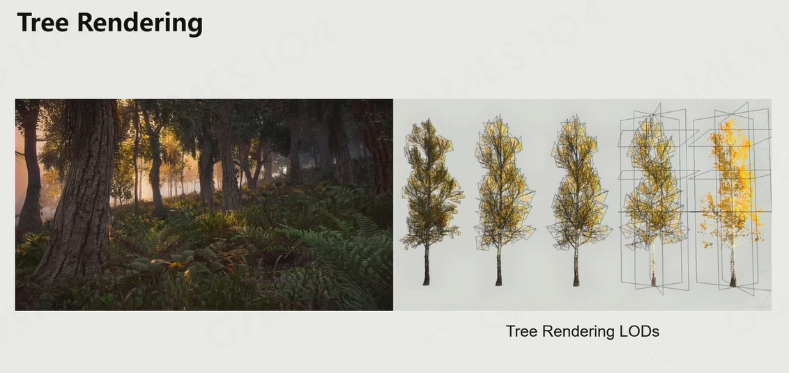

### 6.3.2	装饰物渲染 Decorator

### 6.3.3	道路和贴画渲染

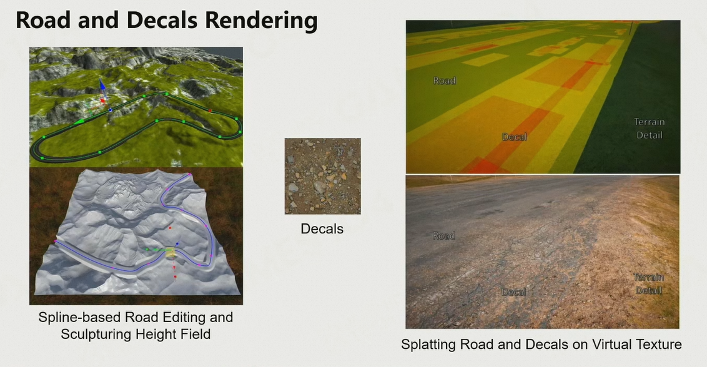

1. 将地形的纹理、道路的纹理、贴画的纹理全部放到Virtual Texture中，runtime的时候直接调用virtual texture即可
2. 计算的复杂度集中在bake中，runtime的时候只需要将纹理贴上去即可，开销很低

## 6.4	大气散射理论

### 6.4.1	Analytic Atmosphere Apperance Modeling

$$
F(\theta,\gamma)=(1+Ae^{\frac{B}{\cos\theta+0.01}})·(C+De^{E\gamma}+F\cos^2\gamma+G·\chi(H,\gamma)+I\cos^{\frac{1}{2}}\theta) \\
L_\lambda=F(\theta,\gamma)·L_{M\lambda}
$$

优点：

1. 便于计算

缺点：

1. 只能在地表
2. 参数是写死的，无法自由的更改

### 6.4.2	Participating Media

空气是由两种粒子构成的：

1. 各种气体分子：如N2、O2、CO2
2. 气溶胶：空气中的灰尘形成的小的气溶胶分子

### 6.4.3	光与Participating Media的交互：Radiative Transfer Equation (RTE)

1. 吸收：$-\sigma_\alpha L(x,\omega)$
2. 散射：$-\sigma_sL(x,\omega)$
3. 自发光：$\sigma_\alpha L_e(x,\omega)$
4. 其他气体分子的影响：$\sigma_s\int_{S^2}f_p(x,\omega,\omega')L(x,\omega')d\omega'$

### 6.4.4	Volume Rendering Equation (VRE)

1. **Transmittance 通透度**：在M点看到的东西，由多少会保留到在P点看到的东西，是路径积分的结果
2. **scattering function 散射方程**：从M点到P点，叠加的其他粒子的效果

### 6.4.5	大气的实际物理

1. 太阳光由不同波长的光组成
2. 大气由两种粒子构成：
   1. 气体分子：直径小于光的波长
   2. 气溶胶分子：直径接近于光的波长

#### 6.4.5.1	散射

- 瑞利散射：介质尺寸 << 光波长
  - 光在四面八方几乎均匀的散射
  - 波长越短(蓝光)散射越厉害，波长越长(红光)散射越不明显
- 米氏散射：介质尺寸 ≈ 光波长
  - 有一定的方向性，沿光的方向散射会更强
  - 对波长不敏感

- **瑞利散射**：当粒子的直径远小于光的波长的时候，光会均匀散射，波长越短散射越明显

   - $\lambda$：光的波长
   - $\theta$：观察方向与光方向的夹角
   - $h$：海拔高度

   > 1. Scattering Coefficient：当给定海拔高度$h$、空气密度的时候$\rho(h)$，这一项就是常数
   > 2. Phase Function：仅与观察角有关

   

   

- **米氏散射**：当粒子的直径接近或大于光的波长的时候，光的散射会有方向性，且对波长不敏感

   - $\lambda$：光的波长
   - $\theta$：观察方向与光方向的夹角
   - $h$：海拔高度
   - $g$：几何参数，由艺术家调整

   > 1. Scattering Coefficient：当给定海拔高度$h$、空气密度的时候$\rho(h)$，这一项就是常数
   > 2. Phase Function：引入一个参数Geometry Parameter，用于模拟这一形状
   >    1. 当$g=0$时，退化为瑞利散射
   >    2. 当$g>0$时，表示正向的米氏散射
   >    3. 当$g<0$时，表示往光线相反的地方散射得越多

   

   

#### 6.4.5.2	吸收

1. O3：吸收红光、橙光、黄光
2. CH4：吸收红光
3. 假设大气中的O3、CH4均匀分布

### 6.4.6	单次散射 & 多次散射

### 6.4.7	Ray Marching

1. 沿着一条视线，均匀地采很多点，把沿途的效果一步一步地积分起来

## 6.5	实时大气渲染

### 6.5.1	Transmittance LUT $(\mu,r)$

1. 选择一个海拔高度为$h$的点，在当前海拔高度存储两个值
   1. 视线和天顶之间的夹角为$\theta$，用$\cos\theta$进行参数化表达
   2. 从当前点$X_v$出发，沿视线方向走到大气层的边界，与边界的交点为$B$
2. 此时，我们可以计算出整个大气层的通透度，即：$T(X_v → B)$
3. 假设在远处有一个物体在点$X_m$处发出光，则该处的光到达当前点$X_v$的通透度为：$T(X_v→X_m)=\frac{T(X_v→B)}{T(X_m→B)}$
4. 此时，我们可以通过一个简单的二维方程，通过除法，即可表达原先的四维方程

### 6.5.2	Single Scattering LUT $(v,\mu_s,\mu,r)$

1. 视线方向：$\theta$
   1. 选择一个海拔高度为$h$的点$X_v$，朝着一个方向去看，此时可以得到天顶角$\theta$
   2. 由于大气层是个球，因此有了起点和方向，即可得知$B$与$X_v$的距离
2. 太阳到天顶的角度为：$\eta$
3. 视线与太阳之间的夹角：$\phi$
4. 如果大气层各项同性，则只需要存储$(\theta,\eta,\phi)$对应的散射，即可得到某个点看向太空中的点的Single Scattering
5. 再沿着高度$h$进行采样，即可得到一个四维表，可以将其存储到3D Texture Array中

### 6.5.3	计算Multi Scattering

1. 将Single Scattering照亮的点，通过Transmittance进行多次积分，即可得到Multi Scattering
   1. 通常只做3~4次

### 6.5.4	缺点

1. 预计算的计算量很大（使用RayMarching的方法进行预计算）
2. 场景变化后，需要重新计算：如天空忽然开始下雨，设计场景时更改参数的值
3. 实时计算时，需要做很多次高维表查值，导致时间开销较大

### 6.5.5	Production Friendly Quick Sky and Atmosphere Rendering

假设：在空气中的散射是低频的，对空气中的一个分子，来自于不同方向的散射在各向分布都是同样的

从而会导致每个分子的多次散射，实际上是一个等比衰减，比例可以通过计算两次&三次散射得到

由于每一帧都要计算LUT，因此可以假设太阳位置不变、角色位置不变，从而可以删除两维

## 6.6	云的渲染

### 6.6.1	云的类型

### 6.6.2	Billboard Cloud

通过大量2D图片的混合，实现云的效果

### 6.6.3	Volumetric Cloud Modeling

#### 6.6.3.1	Weather Texture

1. 云的随机分布
2. 云的厚度：0~1的值

让云飘起来：对Weather Texture进行平移

让云产生变化：对Weather Texture进行扰动

#### 6.6.3.2	Noise Function

Perlin噪声：在多项式时间内产生棉花絮之类的效果

Worley噪声：形成泡泡絮的效果

#### 6.6.3.3	Cloud Density Model

1. 基础的云是柱状的，需要添加噪声优化效果
2. 先用低频噪声，删除一部分
3. 在添加高频的细节
4. 从而可以模拟数学上的分形效果

#### 6.6.3.4	Rendering Cloud by Ray Marching

1. 从相机发送射线，判断是否能打到云上
   1. 开始时步长较大
2. 一旦与云相交，就缩小步长，在每一个点计算大气的通透和散射
   1. 由于云的通透度很低，因此可以做大量假设，简化渲染方程
3. 天空中的云实际上是GPU中的一个3D纹理，通过Ray Marching的方法解析该纹理的结果

